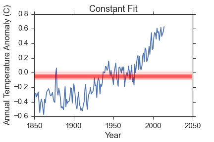
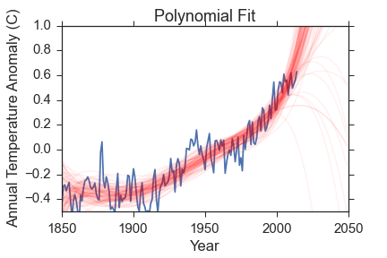
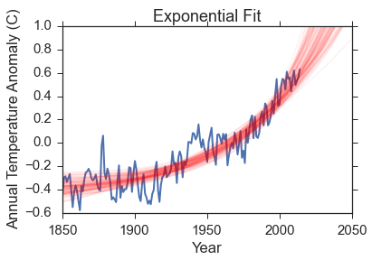
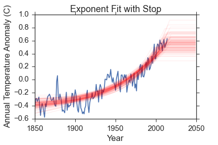
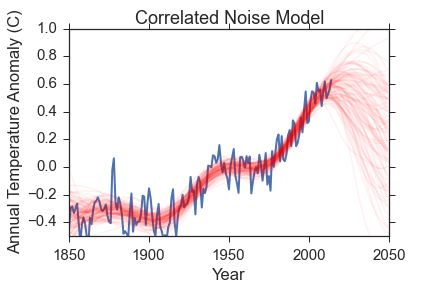
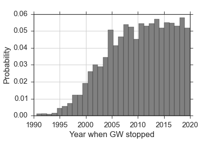

Title: On Bayesian Model Comparison and Climate Change
date: 2015-07-06 05:00
comments: true
Category: Bayesian Methods
Tags: Model Comparison, Political
Slug: climate-change
Author: Kevin Gullikson

## Or: Is there really a pause in global warming?
A common criticism made by climate change skeptics is that there has not been any warming in the last several years. They claim that since the CO$_2$ abundance is still increasing, the lack of increasing temperatures proves that CO$_2$ *cannot* be driving the temperature change.

Let's take a look at the data. For this project, I will be using the [Berkeley Earth compilation](http://berkeleyearth.org/data/) of global average surface temperatures and ocean temperatures. The data go back to 1880 and, unlike other compilations I have found, include an uncertainty in the temperature anomaly as well as just the value. The data from the [Goddard Institute for Space Studies](http://data.giss.nasa.gov/gistemp/), which is more commonly used but does not include uncertainties, is almost identical to the values I use.

Here is the last 15 years.

Indeed, there is really not much warming, and it certainly appears to be constant. But only looking at the last 15 years is silly! Here is the data since 1880, which is as far back as the temperature estimates go. In the full data, I am showing the uncertainty in the temperature anomaly in each year with a colored band. Basically, any temperature anomaly that falls within the band is consistent with the measurements we have.

This data shows a few things really clearly.

  1. The global average temperatures have *definitely* increased since 1900 or so.
  2. The values are high correlated. What I mean by that is that temperatures in a given year are related to temperatures in previous years. The most obvious example of that is the plateau from about 1940-1970, which was [likely caused](http://www.newscientist.com/article/dn11639-climate-myths-the-cooling-after-1940-shows-co2-does-not-cause-warming.html#.VZlUi63InK4) by increased aerosols from industrial activity and volcano eruptions.
  3. The apparent turnover at recent times is dubious, precisely because of the correlated temperatures.
  
The rest of this post will focus on leveraging some heavy statistical machinery on the last point to answer the following question:

** "Does the data support the hypothesis that temperatures have stopped increasing in the last 1-2 decades?" **

#Bayesian Model Selection
If you don't want to get into too much math, just skip to "The Models" now. If you want some details on bayesian model selection, then read on. The statistical machinery I will use here is bayesian model selection. It centers on Bayes' equation:

$$
P(\theta|D, M) = \frac{P(D|\theta, M) P(\theta|M)}{P(D|M)}
$$

In words, Bayes' equation says that the probability of a set of model parameters ($\theta$), given the data we have (D) and the model we choose (M), is equal to the probability of the data given the parameters and the model, times the probability of the parameters, and divided by the probability of the data under the model. The individual terms in Bayes' equation are:

<ul>
  <li> Posterior Probability Function: \(P(\theta|D, M)\) </li>
  <li> Likelihood Function: \(P(D|\theta, M)\) </li>
  <li> Prior Probability: \(P(\theta|M)\) </li>
  <li> Bayesian Evidence: \(P(D|M)\) </li>
</ul>
 
The likelihood function is a measure of how far away the value predicted by the model is from the data. Model parameters that predict the value far from what it actually is have low probability while parameters that predict values close to the data have high probability. A typical function for this is the gaussian likelihood that compares each data point ($x_i, y_i, \sigma_i$) to what the model predicts:

$$
P(D|\theta, M) = \prod_i \frac{1}{\sqrt{2\pi\sigma_i^2}} e^{-0.5(y_i - M(x_i, \theta))^2 / \sigma_i^2}
$$

The prior probability function uses information we already have to adjust the probability of the given model parameters. I could do whole posts about the prior function, and other people have, but for this project I will exclusively use flat, uninformative priors.

In many applications where we only care about the best parameter values, the bayesian evidence is completely ignored since it is a constant for a given dataset and model, and is difficult to calculate. However, it is very important for choosing which model best describes the data so I will focus on it a bit more. Here is the evidence in its full glory:

$$
P(D|M) = \int P(D|\theta, M)P(\theta|M)d^N\theta
$$

Basically, the bayesian evidence is a weighted sum of the likelihood function over the entire possible parameter space. The nice thing is that it mathematically implements [Occam's razor](https://en.wikipedia.org/wiki/Occam's_razor) since models with more parameters but equal predictive capability will have a larger parameter space, which means a lot more space with low likelihood, and so the evidence decreases. However, adding parameters that significantly improve the predictive capability of the model will *increase* the evidence even though the parameter space increases. This is exactly why bayesian evidence is used to determine which model best describes the data, and is why I will be using it here. 

#The Models
I will try out five different models for the data and compare the bayesian evidence for each.

 - A constant model with one parameter ($\Delta T_0$).
 - A fifth-order polynomial given by $\Delta T = c_0 + c_1t + c_2t^2 + c_3t^3 + c_4t^4 + c_5t^5$ with parameters $\theta_{M_2} = c_0, c_1, c_2, c_3, c_4, c_5$
 - An exponential growth model given by $\Delta T = \Delta T_0 + e^{f(t-t_0)}$ with parameters $\theta_{M3} = \Delta T_0, f, t_0$
 - An exponential growth model with a stopping time at which $\Delta T$ becomes constant. It has parameters $\theta_{M4} = \Delta T_0, f, t_0, t_{stop}$
 - A correlated noise model. This one is very different from the other models in that it assumes the temperature anomaly is 0 at all times, and that the variation we see is just because of the correlated noise. I accomplish this using [gaussian processes](https://en.wikipedia.org/wiki/Gaussian_process), and using the excellent [george](https://github.com/dfm/george) code. These are a complicated beast and I don't want to spend too much time talking about them; just suffice it to say that they model the noise properties in a nice way. There are two parameters for this: the characteristic scale of the data ($\tau$) and the noise amplitude ($A$).

 The first two models are there mostly for demonstration purposes, as we will see below. The exponential model comes from looking at the data and recognizing that it looks like a very noisy exponential growth. The last two are different models that assume that either the global temperatures were rising but are not anymore, or that the temperature changes we have seen are merely a result of noise. 
 
The evidence calculation is very computationally difficult for most algorithms, but I will be using the [MultiNest algorithm](http://arxiv.org/abs/0809.3437) that is designed specifically for bayesian evidence calculation. There is a nice Python wrapper to the algorithm [here](https://github.com/JohannesBuchner/PyMultiNest). For any interested parties, I have a [wrapper](https://github.com/kgullikson88/General/blob/a0803368154b18e4e051e35b77b1a2eb41e51dc1/Fitters.py#L947) to *that* that makes this whole model comparison thing easier and a bit more "pythonic". I did all of this analysis in a ipython notebook [here](https://github.com/kgullikson88/Ipython_Notebooks/blob/master/Climate_Data_multinest.ipynb), and you can see how I use my wrapper there.

# The Fits and Bayesian Evidence
Here is a visual representation of the fits. The data is in blue, and I have removed the uncertainties for clarity. Check back above to remind yourself how big the errors are though! The red lines are 100 samples from the posterior probability function. Remember, the posterior probability function gives us what parameters are most compatible with the data so the spread in red lines tells you something about the range of reasonable parameters. Small values indicate that the row model is favored over column models, while large values indicate that the column model is favored over the row model (e.g. the polynomial model is favored over the constant model because the value in the polynomial row and the constant column is very small). 

<table width="100%" border="0" cellspacing="0" cellpadding="0">
  <tr>
    <td></td>
    <td></td>
  </tr>
  <tr>
    <td></td>
    <td></td>
  </tr>
    <td></td>
</table>

The constant model is very obviously bad and was chosen to be so to demonstrate how bayesian evidence works. The polynomial fit reproduces the data much better, but so does the exponential fit that has 3 fewer parameters. 

Let's take a look at the bayesian evidence for each of the three first models. Since the multinest algorithm numerically calculates the evidence, it has some uncertainty that I also quote. Also note that the values quoted here are actually *$log(evidence)$* rather than just the evidence (that makes it computationally more stable).

 - Constant model evidence: $34.11 \pm 0.02$
 - Polynomial model evidence: $55.01 \pm 0.01$
 - Exponential model evidence: $101.7 \pm 0.1$
 
So the evidence lines up very well with both the visual quality of the fits and Occam's razor: The constant model has only one parameter, but very poor predictive power. The polynomial model has high predictive power, but a very large parameter space. The exponential growth model has the best of both worlds, and has the highest evidence. 

So now that we know that the bayesian evidence gives results that line up with intuition, what does it say about the final models I have tested (exponential growth that has recently stopped and correlated noise)? The evidence for those models are:

 - Exponential model with GW stop evidence: $100.76 \pm 0.06$
 - Correlated Noise model: $77.24 \pm 0.03$
 
Now, the actual values are not as important as their *ratio*, so lets take a look at the ratio of each model to every other model in the table below. I will convert to actual evidence instead of log(evidence) so that we can really compare how much the data favors one model over the other.

<table class="tg">
  <col width="120">
  <col width="120">
  <col width="120">
  <col width="120">
  <col width="150">
  <col width="150">
  <tr>
    <th class="tg-031e"></th>
    <th class="tg-031e">Constant</th>
    <th class="tg-031e">Polynomial</th>
    <th class="tg-031e">Exponential</th>
    <th class="tg-031e">Exponential-Stop</th>
    <th class="tg-031e">Correlated Noise</th>
  </tr>
  <tr>
    <td class="tg-031e">Constant</td>
    <td class="tg-031e">1</td>
    <td class="tg-031e"></td>
    <td class="tg-031e"></td>
    <td class="tg-031e"></td>
    <td class="tg-031e"></td>
  </tr>
  <tr>
    <td class="tg-031e">Polynomial</td>
    <td class="tg-031e">\(8 \times 10^{-10}\)</td>
    <td class="tg-031e">1</td>
    <td class="tg-031e"></td>
    <td class="tg-031e"></td>
    <td class="tg-031e"></td>
  </tr>
  <tr>
    <td class="tg-031e">Exponential</td>
    <td class="tg-031e">\(4.5 \times 10^{-30}\)</td>
    <td class="tg-031e">\(5 \times 10^{-21}\)</td>
    <td class="tg-031e">1</td>
    <td class="tg-031e"></td>
    <td class="tg-031e"></td>
  </tr>
  <tr>
    <td class="tg-031e">Exponential-Stop</td>
    <td class="tg-031e">\(10^{-29}\)</td>
    <td class="tg-031e">\(10^{-20}\)</td>
    <td class="tg-031e">\(2.5 \pm 0.3\)</td>
    <td class="tg-031e">1</td>
    <td class="tg-031e"></td>
  </tr>
  <tr>
    <td class="tg-031e">Correlated Noise</td>
    <td class="tg-031e">\(10^{-19}\)</td>
    <td class="tg-031e">\(2 \times 10^{-10}\)</td>
    <td class="tg-031e">\(4 \times 10^{10} \)</td>
    <td class="tg-031e">\(10^{10} \)</td>
    <td class="tg-031e">1</td>
  </tr>
</table>

The constant and polynomial models are terrible. The correlated noise model has a very low evidence as well; that is because the noise model is really flexible and can fit pretty much anything. The data supports the hypothesis of an exponential model by many orders of magnitude over anything else I've tested. The exponential and exponential-stop models are very comparable; the data favors the simpler model by a factor of $\sim 2.5$, but that is not really enough of a difference to reject either model. What I can say is:

**"The data strongly favor a model where global temperatures are rising exponentially, and do not favor a model where temperatures have stopped warming."**

There is one final thing to look at: what year does the data suggest global warming stopped under that model? Here is a histogram of samples from the posterior probability function for that parameter:

The model prefers very recent years, which means most of the predicted temperature anomalies are identical to the simple exponential model. In fact, many of the samples have the warming trend stopping *in the future*, where **all** of the model-predicted temperatures are the same as in the simpler model. If the warming trend had truly stopped, this model would have been able to pick when the trend stopped to within a few years. The fact that the posterior probability function is roughly flat for the last decade, coupled with the fact that the bayesian evidence does not favor the stopping model, tells me that it is a poor model for the data. 

Please stop saying that global warming has stopped, and feel free to send this to anyone who thinks it has!
