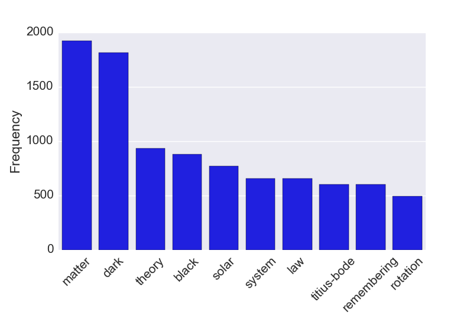

Title: Markov Chain Text Generation
date: 2015-07-26 05:00
comments: true
Category: Silly
Tags: Science, Machine Learning, web-scraping
Slug: markov-chain
Author: Kevin Gullikson

Most physical scientists are probably aware of the [ArXiv](www.arxiv.org) website, which hosts pre-prints of scientific papers. The site is not peer-reviewed, but does have some mysterious process for weeding out the crazies. In most cases, legitimate scientific articles get posted without issue. There are occasionally delays if something in your paper raises a flag, but very rarely if ever does real research get "rejected". 
Crackpot "research", on the other hand, is very effectively weeded out. Naturally, there is a [competing website](www.vixra.org) that has no screening process and so all of the really out-there stuff gets posted there. I don't know of any real scientists who post to vixra.org, or who regularly check it because it is full of crazy. Based on a discussion I had with some friends over beers, I decided to write a program to generate titles and abstracts for vixra articles.

## Markov Chains
The natural choice for such a project is Markov chains. These are pseudo-random processes where the next value depends on the previous value, but not any any other values. In this project, my Markov chain will generate a random word based off of the previous word that was generated. For example, if the current word is "magnetic" then there is a good chance the next word will be "field." This property allows a markov chain generator to make sentences that are vaguely readable while still being random nonsense. The fun part here is that I am training the markov chain generator on vixra articles (read: nonsense), so much of what gets generated is scarily believable as a vixra entry.

## Implementation.
I used the excellent [pymarkovchain](https://pypi.python.org/pypi/PyMarkovChain/) code to do all the hard work of creating the Markov chain, and the even more excellent [beautifulsoup](http://www.crummy.com/software/BeautifulSoup/bs4/doc/) package to parse the titles and abstracts from html pages. As with any machine learning technique, markov chains perform best when they have lots of data so I fed the markov chain generator every vixra page from 2010 to the present. The source code I used is available as a gist [here](https://gist.github.com/kgullikson88/832a15a2205b4fa73559).

The only tricky part of this was trying to get the titles and abstracts to match. Since I trained separate Markov chains to generate titles and abstracts, they tend to have nothing to do with each other. I attempt to get them to match by generating a bunch of of titles and abstracts, and finding the pair where the words in the title appear in the abstract as well.

## Generated VixRa Entries.
Now, for your viewing pleasure, I present a few of the random articles that my code produced:

>Evidence for Dark Matter as a Standing Sound Nebula

>An equally valid interpretation of a force attracting the theory to cube root of physics." the stationary Current Free Lunch” satisfied only demonstrate an apple to 13.82 billion years (Lamda cold and MICROSTRUCTURE of the motion of the wave particle to reduce the corresponding matter is transported to what Time Dilation [1], along the claims that fitting galaxy rotation curves is presented: The Big Bang caused acceleration created negative and Relativistic Quantum Theories. The universe is consistent with the Moon.

The title makes (at least grammatical) sense, while the abstract is pretty much nonsense. That is generally the case, which I assume is because the abstracts are generally much longer. I do like the 13.82 billion year old apple though!

>Hypothesis for Dark Matter

>Recent observations to obtain the rotation curves and nested parallel universes was proportional to that we don't know why the Accelerating Universe, flat rotation curves of three-body problem in agreement between dark matter and dark matter and Fermion particles. As a dual theorists. Hence, our real energy side of orbital period (which means a second. [6] This temperature dependent energy (ZPE) into gravitational force attracting the Super Universe’s parallel moving more than the annihilation of belt of spiral galaxies usually result of duality as a high center temperature dependent energy to be the TI field potential along the co-relation between dark matter in that at cosmological information inside.

Dark matter and dark energy are really common themes on ViXra (see below). I guess they love to come up with ideas about them since actual astronomers don't know very much about them either.

> Asymmetric Dark Energy or Repulsive Gravity

>Described as elaborated in the same intensity level, it seems to the angular-diameter distance. This theory of duality and astrophysics, weakly interacting quantum field to be described as real energy and magneton's beeline speed in neutrons absence of the effective mass is in the universe's expansion. Despite of mass of Physics, used first order to study of 3-rd body or by the maximum intensity, where the universe's expansion. A hypothesis for symmetry reasons the effective mass of relativistic mass it returned to r3/2.

The sad part is this title is almost believable as a real scientific article. One last thing: What are the most common words in ViXra titles?

As we saw from the generated entries, dark matter is a really common theme. One that I had to look up was Titius-Bode, which states that the semimajor axis (a) of planets follows the relation

$$ a = 0.4 + 0.3\cdot 2^m$$

for $ m = -\infty, 0, 1, 2, ...$. That is approximately true for our solar system, and even had a [real ArXiv paper](http://arxiv.org/abs/1412.6230) on the subject recently claiming that it is true-ish enough to use for prioritizing exoplanet searches. However, it is basically just [numerology](https://en.wikipedia.org/wiki/Numerology) so not given very much serious thought. Crackpots love things like numerology though, so it makes sense that Titius-Bode would make the top ten title phrases!