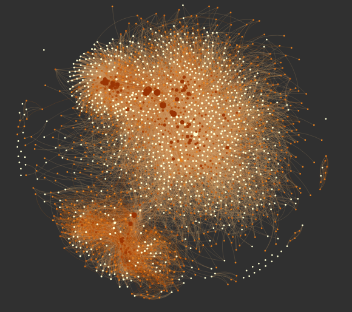

Title: PyPi Dependency Analysis
date: 2016-02-12 05:00
comments: true
Category: Visualization
Tags: Python, web-scraping
Slug: pypi-analysis
Author: Kevin Gullikson


If you use the Python programming language, you have probably run the command

```bash
pip install [package]
```

at some point. What you may not know is the magic happening behind the scenes. The `pip` command
is connecting to the [Pypi server](https://pypi.python.org/pypi) and searching for the package you want. 
Once it finds that package, it downloads and runs a special python file titled `setup.py`, which contains a 
bunch of metadata for the package. 

Knowing this, I decided to see what I could learn from the metadata available in the `setup.py` file for 
every package on the Pypi server. There are a few things that are conceivable:

- Parse all of the dependencies from every package. By dependencies I mean other python packages that the given package relies on.
- Parse the package description, and try to do something fun with it. Maybe I will write a [Markov chain text generator](http://kgullikson88.github.io/blog/markov-chain.html) at some point to generate python package names and descriptions. Another more interesting thing would be to analyze the description with some natural language processing algorithm
- Tally up the version strings for each of the packages, and find weird ones/outliers.

I might visit the other options in a later post, but here I will be looking at the dependencies. This post 
focuses on a programming language, and will necessarily be more technical than the other ones. Nonetheless, I tried
to make it accessible to everyone, and explain clearly what I am doing. If you don't care about the nitty gritty of 
how I figured out the dependencies, skip to the "Dependency Analysis" section.

## Parsing Package Dependencies

The first thing I needed to do was just figure out what the
dependencies of a given package are. That turned out to be way harder than it has any right to be. The 
command

```bash
pip show [package]
```

gives a bunch of metadata for the given package, including everything it requires to run, but **it only 
works if you have the package installed!** I am not about to install every package on pypi on my or anyone 
else's computer, so had to look for a more hacky way to do this. It turns out [Olivier Girardot](
https://ogirardot.wordpress.com/2013/01/05/state-of-the-pythonpypi-dependency-graph/) did a similar project 
a few years back, so I took his code as a starting point. 

The first thing I did was download every package on pypi, and extract the `setup.py` file and any file or directory with the word 'requirement' in it.

```python
def extract_package(name, client=xmlrpclib.ServerProxy('http://pypi.python.org/pypi')):
    for release in client.package_releases(name):
        outdir = 'packages/{}-{}/'.format(name, release)
        doc = client.release_urls(name, release)
        if doc:
            url = None
            for d in doc:
                if d['python_version'] == 'source' and d['url'].endswith('gz'):
                    url = d['url']
            if url:
                req = requests.get(url)
                if req.status_code != 200:
                    print("Could not download file {}".format(req.status_code))
                else:
                    #print(outdir)
                    ensure_dir('{}'.format(outdir))
                    with open('/tmp/temp_tar', 'w') as tar_file:
                        tar_file.write(req.content)
                    with open('/tmp/temp_tar', 'r') as tar_file:
                        return _extract_files(tar_file, name=outdir)

for package in packages:
    extract_package(package, client)
```

The first step left me with a bunch of directories that contain all the metadata for every pypi package. Next, I used a slightly modified version of the [requirements-detector](https://github.com/landscapeio/requirements-detector) package to parse out the requirements. The package does the following:

1. Search the `setup.py` file for an `install_requires` keyword, and attempt to parse package names out of that.
2. If step one fails, search any file with the word 'requirement' in it, and look for things that look like python requirements
3. Failing *that*, search any file that ends with '.txt' in any directory that contains the word 'requirement' for stuff that looks like python requirements.
4. Output the requirements found to a text file

Of the $\sim 74000$ packages on pypi, I was able to parse requirements for 20522. The remaining packages probably do require other packages, but the `setup.py` file is written in such a way that it was difficult to parse. Leaving those out probably biases the result in some complex way, but I am sick of munging so let's move on to the fun part.

## Dependency Analysis

Now that I have all of the dependencies for (many of) the packages on the pypi server, I want to see what I can learn. The first thing I do is make a network graph of dependencies (click on the image for an interactive version):

<a href="http://kgullikson88.github.io/blog/Javascript/PypiGraph/Requirements_clipped/network/index.html">
  
</a>

The network graph visualizes how python packages depend on each other. Each point (or node, in graph-theory speak) represents a python package,
and each line (or edge) represents that one of the packages depends on the other. This is actually a directed graph, in that it makes sense to say things like "astropy depends on numpy, but not the other way around".

Comparing this network graph to the version that Olivier Girardot made a few years ago, we immediately see
that the python ecosystem has grown tremendously and become much more connected. in fact, the network I show here
is much smaller than the data I have, because I removed any package with $< 10$ connections. The bulk of the network is
centered on the [`requests`](http://docs.python-requests.org/en/master/) module, indicating the python is largely useful for interacting with the internet. 

The clump near the bottom of the graph is caused the [`zope` framework](http://zope.org/). While giving a short talk at a python meetup, I learned that `zope` was an early web framework. It is similar to the more modern and well-known [`django` library](https://www.djangoproject.com/).

## Network Statistics

The graph is pretty and very fun to play with, but what can we actually learn from it? 

### Package Importance

First up: What are the most important packages? It turns out there is not a unique way to answer this question. The first way to answer this is with what is called "node centrality". This basically asks what nodes have the most connections. The PageRank algorithm, which is one of the ways Google ranks websites to decide what to show you, is related to node centrality. The next two figures show the top 10 nodes by degree (the number of connections they have) and by PageRank:


Both measures give more or less the same answers, and they agree well with intuition. The `requests` library is the most important node, followed by `django`. The `numpy` and `cython` packages are largely for scientific computing, another major component of the python ecosystem.

We can also try to determine important packages with the concept of "betweenness centrality". The idea here is to find the shortest path between every two nodes in the network. The betweenness centrality of a node is the fraction of these shortest paths that pass through the node. A good example is the airport network: Lots of planes pass through major hubs on the way to their destination, so they have high betweeness centrality. Here is the top ten by this metric:


This way of measuring important packages gives very different packages. There are lots of packages relating to testing frameworks and documentation, which are not really run-time dependencies that I care about. This just goes to show that different ways to measure important packages can give very different answers! I favor the node centrality estimates for this network, since it gives answers that line up better with my intuition.

### Development Communities

Alright we have a list of important packages, but can we go further and ask what distinct communities exist in python? This is much more difficult, and is related to the NP-complete [Clique Problem](https://en.wikipedia.org/wiki/Clique_problem). The general solution to these problems is very slow: in big-O notation it is $O(a^n)$ where $a$ is a constant set by the specific algorithm. With $\sim 26000$ nodes in my network, that is completely intractable. Luckily, a lot of people have been working on this kind of problem with much bigger data (facebook, Google, etc). It turns out there is a dendrogram-based approach that works well for this network. The algorithm is described in detail [here](http://arxiv.org/abs/0803.0476), and is implemented in the [`community`](https://pypi.python.org/pypi/python-louvain/0.3) code. Here's how it works:

1. Start with all nodes in their own communities
2. For each node, test if the "modularity" increases by putting it into the same community as one of its neighbors (one of the nodes it is connected to). If so, combine the two nodes into a community
3. Continue until no more gain is found for any single nodes.
4. Make a new network where each node is now the communities found in the above set.
5. Repeat steps 1-4 many times, until the modularity no longer increases.

We can visualize the network and the communities this algorithm finds with an adjacency matrix:


In this figure, both the x- and y-axes are the nodes (packages). The intersection between nodes is colored with a black dot if there is an edge
between the nodes. The communities that we found are the set of large squares going down the diagonal of the matrix. The bigger the square, the more packages exist in that community. The "darker" the square, the more completelly connected that community is (i.e. very dark communities indicate that every package in that community depends on almost every other package in the community).

I have labeled the top ten biggest communities, and found the most important packages in the community with the PageRank algorithm. Here is what I found for each labeled community. Keep in mind that I don't use the majority of these packages, so I might be a little bit off when describing what the packages do!

1. This community is centered on the `flask` and `bottle` packages. These are both web server frameworks, and provide an easy way to set up a web server. 
2. This community has a lot of roughly equally-important nodes, which include `redis`, `tornado`, and `pyzmq`. I'm not really sure what unifies these all - I know `tornado` and `pyzmq` are both required by ipython/jupyter notebooks, but those packages are not in this community.
3. This is the pydata community, and the one I am most familiar with. It is dominated by `numpy`, with smaller contributions from `scipy`, `matplotlib`, and `pandas`. 
4. This community has lots of testing and documentation packages. 
5. This is by far dominated by the `django` package, a very powerful framework for generating dynamic websites.
6. This community is dominated by `requests`, as well as a few other tools for web interface/scraping.
7. This community is dominated by the `distribute` package, but really it is the zope community that I described above. This is the only community that was visually distinguishable in the network graph.
8. I think this community is focused on static website development and configuration. There are strong showings from the `pyyamml` and `jinja2` packages.
9. This community looks like it contains small but useful utilities: `argparse`, `decorator`, `pyparsing` have strong showings.
10. This one has a pretty large variety of packages as far as I can tell. The most important package in this community is `sqlalchemy`, which is a python interface to SQL queries.


## Degree Distribution

The last thing I will look at is a global property of the network: the distribution of how many edges there are for each node (how many packages each package depends on).


This is a power-law distribution, indicating that there are a few packages that many many things depend on, but most packages only have a few others that depend on them. We could have guessed this shape from the node centrality measures, which also look like power laws. What does a power-law degree distribution tell us about the graph? A likely explanation is a "rich get richer" scenario: packages that already have lots of stuff that uses them show up high on google search results, and so new package developers use them too. For example, almost all scientists use the `matplotlib` plotting package, and so their code all requires matplotlib. A much smaller set of python programmers use, for example, the `bokeh` library for plotting. The reason is likely simply because matplotlib is the first google result for "python plotting". This interpretation is supported by the fact that the most important packages tend to be fairly old; they have had more time to accumulate a critical mass of users.


## Downloads

The package dependency data is available as a csv file here:

 - [dependency data](Downloads/PypiDependencies/requirements.csv)

The analysis was done with a series of jupyter notebooks, which you can download here:

- [Fetching pypi dependency data](Downloads/PypiDependencies/PyPi_Metadata.ipynb)
- [Parsing requirements into csv file](Downloads/PypiDependencies/Parse_requirements.ipynb)
- [Network Analysis](Downloads/PypiDependencies/PyPiAnalyzer.ipynb)