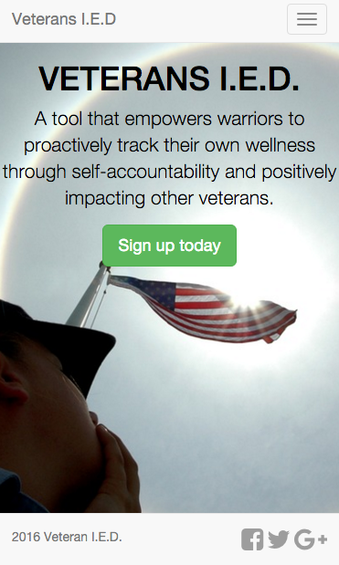
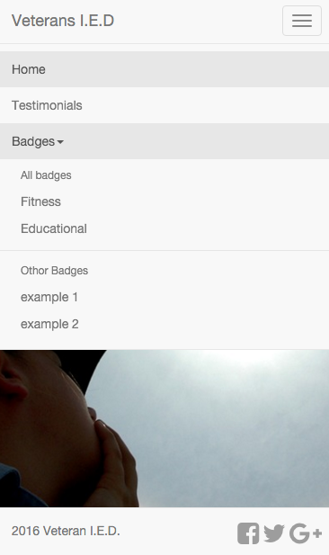

Title: VA BrainTrust Hack Day
date: 2016-02-21 05:00
comments: true
Category: Hacking
Tags: web-design, hackday
Slug: va-hackday
Author: Kevin Gullikson

Last weekend, I took part in the [VA BrainTrust Hack Day](http://www.blogs.va.gov/VAntage/25909/va-hosting-simultaneous-hackathons-in-san-francisco-austin/), a 2-day event where teams in Austin and San Francisco worked with mentors and veterans to try to solve three big problems facing veterans with mild traumatic brain injury (mTBI) and post-traumatic stress disorder (PTSD):

1. Improve access to care for Veterans faced with mTBI + PTSD
2. Identify opportunities for improved diagnostics.
3. Develop improved experiences for rehabilitation and community reintegration.

 My Group
============

The group I was in, naturally team name "Awesomesauce", consisted of two python programmers (me and James Meiding), one high school senior html guru (Zach Col) and his mother (Eusebia Ulloa), 3 veterans (Keeshaun Coffey and Mike Rials from the [Center for Brain Health](http://www.brainhealth.utdallas.edu/), and [Christina Angeline](www.linkedin.com/in/christinaangeline)), and a local entrepeneur (William Negley). 

The veterans in our group pointed out that much of the imagery surrounding PTSD is very negative - just try google image searching PTSD! We therefore wanted to make sure that our product focused on positive imagery and used positive reinforcement techniques to help veterans reintegrate into civilian society. We built a website called Veterans Impacting Every Day (Veterans I.E.D.) that does two main things:

1. Provide a community where Veterans can post videos or essays describing their process of reintegration, and what worked for them. These do not need to be people who suffered from mTBI or PTSD, but certainly can be! 
2. Provide a positive feedback mechanism to help veterans reintegrate into society. We use a series of badges that veterans can earn for things like "Earn a job" and "Go to College". Each badge consists of a series of small, bite-sized subtasks that the veteran can complete. Each badge and subtask completed shows up on the veteran's user profile page.

We implemented the website with the `django` python framework. This framework allows you to define a series of classes that describe things that will eventually go in a database which the user interactions update. The classes we have are

- User: We extended the base User class in `django` to include what tasks and badges they have finished, and what testimonials they have made.
- Badge: This class includes the name of the badge, its broad category, and the subtasks that it includes. 
- Task: This class describes what to do to complete the subtask.
- Testimonial: This class is mostly just a youtube link.

Here is what the end product looks like:

 Other Groups in Austin
========================

- **Home**: A marketplace to find:
  
    - local healthcare providers for vets
    - hobby/interest groups
    - Safe places in the city (churches, community centers, etc. Designated by the user from a list)
Home also integrates with facebook and twitter.

- **Your6**: A web platform to connect veterans, who can stay anonymous. It has a bulletin board to post jobs, articles, etc, and a chat for real-time interaction. 

- **Empower VR** had two pitches:
    
    1. Virtual Reality scene to look at while having problems related to PTSD/mTBI. Idea is to help them calm down.
    2. Exposure therapy. Virtual reality scenes of things like going to down a narrow hallway in a school. These things cause stress to some people who suffer from PTSD, so it creates a safe way to experience their triggers and get used to them.

- **Olympic Convoy**: Taking a bunch of vets to the Olympics (by car). 

- **Cloud9**: Made an app that veterans can use to fill out forms and interact with healthcare agencies. Mood tracker, pulls biometric data from wearables.

- **Gray Matter**: Sleep disturbance is a common problem with TBI/PTSD, and insomnia leads to increased PTSD symptoms. Their solution was a smart mouthguard to wear at night that prevents tongue biting during seizures and collects/visualizes sleep data. 

- **I am**: Need to keep people in treatment (~60% drop out). Created a treatment retention score based on their symptoms and missed appointments (similar to credit score). Clinicians can use to evaluate patients and find troubled people. 

- **One of 100**: Developed an app that learns your activity habits (physical and mental and social activity). 

Who won?
========

- 3rd Place: AwesomeSauce (us!)
- 2nd Place: Gray Matter
- 1st Place: Home

This was a great experience; I learned a lot about veterans issues and the django framework and got to interact with a lot of talented and motivated people. I will not be involved in the project anymore, but it is being carried on mostly by Mike and Keeshaun. I hope it leads to real improvement in veteran reintegration!
