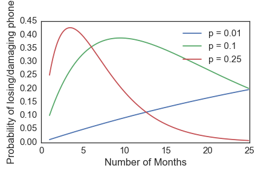
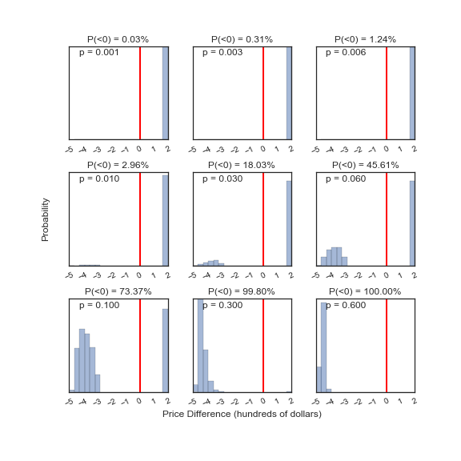

Title: Should I buy phone insurance?
date: 2016-10-21 05:00
comments: true
Category: Hacking
Tags: probability
Slug: phone-insurance
Author: Kevin Gullikson

Ah, the question everybody guesses at: is phone insurance worth it? As Mark Watney would say:

Phone insurance generally comes with a monthly premium and a deductable, which we will call $r$ and $D$, respectively. If I buy insurance, the *expected cost* to me is then:

$$ E(\mathrm{cost\ with\ insurance}) = rn + pD $$

where $p$ is the probability of losing or damaging the phone at some point in a two year contract period, and n is the number of months I go before losing or damaging the phone. In non-mathspeak, the equation says
"The average cost of insurance is the amount you have paid in so far (the rate times the number
of months you have made it), plus the average replacement cost (the probability of losing/damaging your phone times
the deductable)." Likewise, the expected cost if I *don't* buy insurance is:

$$ E(\mathrm{cost\ without\ insurance}) = pC $$

where C is the phone cost. Now, let's throw in some numbers and see what happens. For Verizon with a Samsung Galaxy S7:

- $r = 7.15$ for the base insurance rate (excluding extended warranty and such)
- $D = 200$ is the deductible.
- $C = 670$ is the total phone cost.

Here is an interactive widget to demonstrate the impact that all of the factors have, as a function of the number of months you go before losing/damaging your phone. If the green line is below the blue line for at least half
of the range, you should forego insurance!

<head>
    <meta charset="utf-8">
    <title>Expected Cost with and without insurance</title>

<link rel="stylesheet" href="https://cdn.pydata.org/bokeh/release/bokeh-0.11.1.min.css" type="text/css" />
<link rel="stylesheet" href="https://cdn.pydata.org/bokeh/release/bokeh-widgets-0.11.1.min.css" type="text/css" />

</head>
<body>

<script type="text/javascript">
        Bokeh.$(function() {
        var docs_json = {"3ca054a2-ab90-43ea-8cfd-05c56aa6ee89":{"roots":{"references":[{"attributes":{"plot":{"id":"6d50f9bd-fdc3-4690-adab-49800b41e3ad","subtype":"Figure","type":"Plot"}},"id":"5221d05a-2816-4e0a-a567-c8b4e2f2ef2a","type":"WheelZoomTool"},{"attributes":{"plot":{"id":"365e78da-2082-4639-83b7-8a9101b3a842","subtype":"Figure","type":"Plot"}},"id":"105c9b56-ae81-49d5-906b-f8a275782c4c","type":"ResizeTool"},{"attributes":{"below":[{"id":"da3ca3f1-6728-4f59-9975-63a5e37f7827","type":"LinearAxis"}],"left":[{"id":"25c06464-8d12-495b-a9f4-38f24bdd500c","type":"LinearAxis"}],"plot_height":400,"plot_width":800,"renderers":[{"id":"da3ca3f1-6728-4f59-9975-63a5e37f7827","type":"LinearAxis"},{"id":"92c7d2cc-d052-401e-90f3-24cc00fadd5d","type":"Grid"},{"id":"25c06464-8d12-495b-a9f4-38f24bdd500c","type":"LinearAxis"},{"id":"98dc3663-fa6a-4007-8c3c-45426ef76d22","type":"Grid"},{"id":"8d81df6d-31ce-47d1-a7ad-6e5e004e7f8d","type":"BoxAnnotation"},{"id":"5f32dfe0-c5a4-4a01-9e4c-1b3d2d2112fe","type":"Legend"},{"id":"2c7484a0-2d8e-44bf-8d23-0ed448110dfb","type":"GlyphRenderer"},{"id":"09e62a10-5efa-4d3d-aa81-d49fdba1154c","type":"GlyphRenderer"}],"tool_events":{"id":"10bc9686-0287-4a27-9bd5-01e402383db5","type":"ToolEvents"},"tools":[{"id":"f89df515-a9b6-46a2-9f53-7823aeecb7b0","type":"PanTool"},{"id":"fa287270-d17e-4f14-b50e-d308702cae1c","type":"WheelZoomTool"},{"id":"b14e3ba3-cc9c-4c05-a176-b70de4f7f5ff","type":"BoxZoomTool"},{"id":"49660f9b-e1d3-4159-8538-91c72b21058b","type":"PreviewSaveTool"},{"id":"ed5b44aa-f1ea-435e-8379-559f176e41e1","type":"ResizeTool"},{"id":"82b51f7a-6fa7-44fe-97f7-4efe82fa5c86","type":"ResetTool"},{"id":"0f20a9a6-e39c-4411-9140-12d058af3df5","type":"HelpTool"}],"x_range":{"id":"ea96fad8-9bcb-40ea-95de-bbcba70f5136","type":"DataRange1d"},"y_range":{"id":"e9d1a991-c97c-4d3a-afcb-047716f96efb","type":"DataRange1d"}},"id":"f78910ca-0c6e-4785-8f5c-92ecb84b2e1c","subtype":"Figure","type":"Plot"},{"attributes":{},"id":"ed6daf32-6a03-4cb5-9a73-60af52c569bf","type":"BasicTickFormatter"},{"attributes":{"plot":{"id":"6c312c5e-2168-4376-b473-85707f80984a","subtype":"Figure","type":"Plot"}},"id":"5751c31b-fd8d-404a-820c-3f27b49d895c","type":"ResetTool"},{"attributes":{"line_alpha":{"value":0.1},"line_color":{"value":"#1f77b4"},"line_width":{"value":3},"x":{"field":"n"},"y":{"field":"cost_without"}},"id":"363b110d-b75f-470d-9ab9-a4395065fe44","type":"Line"},{"attributes":{"line_alpha":{"value":0.1},"line_color":{"value":"#1f77b4"},"line_width":{"value":3},"x":{"field":"n"},"y":{"field":"cost_with"}},"id":"4295bce5-3fd1-4c6c-bdfc-ea8c3cb3f6f3","type":"Line"},{"attributes":{"callback":{"id":"fd672c2e-0a7a-4fa3-8092-fe41409cc79a","type":"CustomJS"},"end":20,"title":"Monthly Rate","value":7.1},"id":"aac6cdf5-8d9c-40b4-93c6-6923b377df71","type":"Slider"},{"attributes":{},"id":"fbc569a3-1723-4a87-b814-bca291c14190","type":"BasicTickFormatter"},{"attributes":{"callback":{"id":"53a7d7e6-1f47-4fec-b003-8e314afa0e22","type":"CustomJS"},"step":0.01,"title":"Probability of Loss","value":0.1},"id":"f506d377-9d20-4a3b-a95a-4a45a8b7113c","type":"Slider"},{"attributes":{"callback":null},"id":"203cf6a9-55fb-480b-9871-d14dd9ed060d","type":"DataRange1d"},{"attributes":{"plot":{"id":"365e78da-2082-4639-83b7-8a9101b3a842","subtype":"Figure","type":"Plot"}},"id":"c65b336c-5ab9-47a0-a5dc-941ae9205124","type":"PreviewSaveTool"},{"attributes":{"below":[{"id":"744c8d78-73fd-411d-abe8-c438f57f8134","type":"LinearAxis"}],"left":[{"id":"30fae7f9-e376-40b2-a987-962882f758b9","type":"LinearAxis"}],"plot_height":400,"plot_width":800,"renderers":[{"id":"744c8d78-73fd-411d-abe8-c438f57f8134","type":"LinearAxis"},{"id":"aa69416f-4593-4932-ad02-994ae8515661","type":"Grid"},{"id":"30fae7f9-e376-40b2-a987-962882f758b9","type":"LinearAxis"},{"id":"ead8a6bf-0869-41d9-bd0a-221e6bc468aa","type":"Grid"},{"id":"64652421-0932-47a6-97aa-56daa6d771ec","type":"BoxAnnotation"},{"id":"3f7b0b87-722e-4bc0-a5e5-35dd62a0301f","type":"Legend"},{"id":"21dce742-5148-4d3a-b260-de1493af210f","type":"GlyphRenderer"},{"id":"d9edee2a-6c7a-4c5e-85f2-73db22a48b32","type":"GlyphRenderer"}],"tool_events":{"id":"13e3890a-e829-4471-aa56-f37606437792","type":"ToolEvents"},"tools":[{"id":"a22d68ba-00ce-4cd1-ba6b-ff3eb8a7432d","type":"PanTool"},{"id":"1407cabc-5035-486a-bf70-190aa822a410","type":"WheelZoomTool"},{"id":"def710f6-800e-4405-a341-fc581aa87438","type":"BoxZoomTool"},{"id":"f1bd1db7-83db-46bf-9ce1-95173f415094","type":"PreviewSaveTool"},{"id":"0fe961f2-f6d5-4760-9a47-ca2429086685","type":"ResizeTool"},{"id":"8290fefa-1d64-4991-8e7d-4e142e6316cf","type":"ResetTool"},{"id":"a1aa561e-8528-4ece-be6d-3684fac0b76f","type":"HelpTool"}],"x_range":{"id":"f72ec047-ce8b-402c-80fa-8cb7e8bd1221","type":"DataRange1d"},"y_range":{"id":"dba5b0ac-ea4c-4f27-9043-d2ae94ba3a73","type":"DataRange1d"}},"id":"7d54631f-1483-4b33-8f18-06e10a46f30c","subtype":"Figure","type":"Plot"},{"attributes":{"axis_label":"Expected Cost ($)","formatter":{"id":"216b5a71-eda9-4ff1-bf31-e64e090ceb2f","type":"BasicTickFormatter"},"plot":{"id":"bb68574f-55a2-4cad-b2a6-924e4fdc5534","subtype":"Figure","type":"Plot"},"ticker":{"id":"0bfe62c6-8027-436b-bf2f-0c5ca09b3e5a","type":"BasicTicker"}},"id":"e8c70e78-5fce-4927-8c8a-2d3b0996998c","type":"LinearAxis"},{"attributes":{"line_alpha":{"value":0.1},"line_color":{"value":"#1f77b4"},"line_width":{"value":3},"x":{"field":"n"},"y":{"field":"cost_with"}},"id":"92751250-c776-4733-a8d1-2f460d543c42","type":"Line"},{"attributes":{"line_alpha":{"value":0.8},"line_color":{"value":"blue"},"line_width":{"value":3},"x":{"field":"n"},"y":{"field":"cost_with"}},"id":"cdd5f0e8-4343-44fc-bd59-b96c31b31c12","type":"Line"},{"attributes":{"line_alpha":{"value":0.1},"line_color":{"value":"#1f77b4"},"line_width":{"value":3},"x":{"field":"n"},"y":{"field":"cost_with"}},"id":"207ac3f9-46a2-430e-b5b1-af40a0cced9d","type":"Line"},{"attributes":{},"id":"f0b5d03b-ec39-4f33-9b80-fbaf685e6da8","type":"BasicTicker"},{"attributes":{"callback":null,"column_names":["D","r","cost_without","n","p","C","cost_with"],"data":{"C":[670,670,670,670,670,670,670,670,670,670,670,670,670,670,670,670,670,670,670,670,670,670,670,670],"D":[200,200,200,200,200,200,200,200,200,200,200,200,200,200,200,200,200,200,200,200,200,200,200,200],"cost_with":[27.150000000000006,34.300000000000004,41.45,48.6,55.75000000000001,62.900000000000006,70.05000000000001,77.2,84.35000000000001,91.50000000000001,98.65,105.8,112.95,120.10000000000001,127.25,134.4,141.55,148.70000000000002,155.85000000000002,163.00000000000003,170.15000000000003,177.3,184.45000000000005,191.6],"cost_without":[67.0,67.0,67.0,67.0,67.0,67.0,67.0,67.0,67.0,67.0,67.0,67.0,67.0,67.0,67.0,67.0,67.0,67.0,67.0,67.0,67.0,67.0,67.0,67.0],"n":[1,2,3,4,5,6,7,8,9,10,11,12,13,14,15,16,17,18,19,20,21,22,23,24],"p":[0.1,0.1,0.1,0.1,0.1,0.1,0.1,0.1,0.1,0.1,0.1,0.1,0.1,0.1,0.1,0.1,0.1,0.1,0.1,0.1,0.1,0.1,0.1,0.1],"r":[7.15,7.15,7.15,7.15,7.15,7.15,7.15,7.15,7.15,7.15,7.15,7.15,7.15,7.15,7.15,7.15,7.15,7.15,7.15,7.15,7.15,7.15,7.15,7.15]}},"id":"e610b0c5-b1e9-4cf7-9a10-307662824d40","type":"ColumnDataSource"},{"attributes":{"line_alpha":{"value":0.1},"line_color":{"value":"#1f77b4"},"line_width":{"value":3},"x":{"field":"n"},"y":{"field":"cost_without"}},"id":"84077af0-fd4d-42a9-94b9-59b9b56a47f5","type":"Line"},{"attributes":{},"id":"704abbeb-45f4-4ffc-9c43-5c4843c2285a","type":"BasicTicker"},{"attributes":{"plot":{"id":"6d50f9bd-fdc3-4690-adab-49800b41e3ad","subtype":"Figure","type":"Plot"}},"id":"ccafb435-6e2f-4276-bc12-33c332976718","type":"ResetTool"},{"attributes":{"plot":{"id":"713da9b7-6f85-43fb-bb40-1d0a76d089b2","subtype":"Figure","type":"Plot"},"ticker":{"id":"7069eb4a-1879-4a1a-957b-2f67de09bba7","type":"BasicTicker"}},"id":"3a0b7c79-8529-41a2-b28b-9e8956b0b50d","type":"Grid"},{"attributes":{},"id":"d21dcf13-d649-412b-904d-9f08c521b6ba","type":"BasicTickFormatter"},{"attributes":{},"id":"6d1467f9-100a-4c4d-8617-37f2baac4727","type":"BasicTickFormatter"},{"attributes":{"bottom_units":"screen","fill_alpha":{"value":0.5},"fill_color":{"value":"lightgrey"},"left_units":"screen","level":"overlay","line_alpha":{"value":1.0},"line_color":{"value":"black"},"line_dash":[4,4],"line_width":{"value":2},"plot":null,"render_mode":"css","right_units":"screen","top_units":"screen"},"id":"d993ed7f-2880-4206-b666-50b955276ee1","type":"BoxAnnotation"},{"attributes":{"callback":null,"column_names":["D","r","cost_without","n","p","C","cost_with"],"data":{"C":[670,670,670,670,670,670,670,670,670,670,670,670,670,670,670,670,670,670,670,670,670,670,670,670],"D":[200,200,200,200,200,200,200,200,200,200,200,200,200,200,200,200,200,200,200,200,200,200,200,200],"cost_with":[27.150000000000006,34.300000000000004,41.45,48.6,55.75000000000001,62.900000000000006,70.05000000000001,77.2,84.35000000000001,91.50000000000001,98.65,105.8,112.95,120.10000000000001,127.25,134.4,141.55,148.70000000000002,155.85000000000002,163.00000000000003,170.15000000000003,177.3,184.45000000000005,191.6],"cost_without":[67.0,67.0,67.0,67.0,67.0,67.0,67.0,67.0,67.0,67.0,67.0,67.0,67.0,67.0,67.0,67.0,67.0,67.0,67.0,67.0,67.0,67.0,67.0,67.0],"n":[1,2,3,4,5,6,7,8,9,10,11,12,13,14,15,16,17,18,19,20,21,22,23,24],"p":[0.1,0.1,0.1,0.1,0.1,0.1,0.1,0.1,0.1,0.1,0.1,0.1,0.1,0.1,0.1,0.1,0.1,0.1,0.1,0.1,0.1,0.1,0.1,0.1],"r":[7.15,7.15,7.15,7.15,7.15,7.15,7.15,7.15,7.15,7.15,7.15,7.15,7.15,7.15,7.15,7.15,7.15,7.15,7.15,7.15,7.15,7.15,7.15,7.15]}},"id":"51ccb61d-6cde-4fb0-86e3-40fb563fdbae","type":"ColumnDataSource"},{"attributes":{"axis_label":"Expected Cost ($)","formatter":{"id":"ac429d2c-5bf6-4a5a-a48e-32c4392a77ef","type":"BasicTickFormatter"},"plot":{"id":"6c312c5e-2168-4376-b473-85707f80984a","subtype":"Figure","type":"Plot"},"ticker":{"id":"a11b9ed6-a965-45b6-9de4-6cf2c895f3c7","type":"BasicTicker"}},"id":"af800515-0055-4ef5-8505-164f14ae3771","type":"LinearAxis"},{"attributes":{"line_alpha":{"value":0.1},"line_color":{"value":"#1f77b4"},"line_width":{"value":3},"x":{"field":"n"},"y":{"field":"cost_with"}},"id":"551b3a84-5884-436e-8c12-b4b75f6037b5","type":"Line"},{"attributes":{"plot":{"id":"7d54631f-1483-4b33-8f18-06e10a46f30c","subtype":"Figure","type":"Plot"},"ticker":{"id":"49e43be6-f2f9-400b-87a0-fd66918abe33","type":"BasicTicker"}},"id":"aa69416f-4593-4932-ad02-994ae8515661","type":"Grid"},{"attributes":{"children":[{"id":"64f098cb-1ad9-4df5-901f-6395f1f8ba08","type":"Slider"},{"id":"889eb331-4faa-4cb9-9168-fedf7961f0c8","type":"Slider"},{"id":"228a2be6-3176-4a32-8133-f9a13c5e362f","type":"Slider"},{"id":"515565de-1925-44b1-9cef-fe1face23326","type":"Slider"},{"id":"6c312c5e-2168-4376-b473-85707f80984a","subtype":"Figure","type":"Plot"}]},"id":"a3529621-6248-4772-ad66-3d1eb7a83c0d","type":"VBoxForm"},{"attributes":{"data_source":{"id":"d24db3d1-3436-4d6c-8ff1-6cfcf0734849","type":"ColumnDataSource"},"glyph":{"id":"9e1ad60f-5ef5-4664-86fc-4c870fdc09c3","type":"Line"},"hover_glyph":null,"nonselection_glyph":{"id":"a507a3e5-971c-4dc3-99b3-082454bd5c39","type":"Line"},"selection_glyph":null},"id":"71d0f091-cc78-4510-a3c7-10e0b0e943a7","type":"GlyphRenderer"},{"attributes":{"axis_label":"Months","formatter":{"id":"fab14b18-317b-44f4-beac-a7866f8f5cfa","type":"BasicTickFormatter"},"plot":{"id":"fb9c5a2a-636c-48ab-ac0d-6fdf7c7c6bdf","subtype":"Figure","type":"Plot"},"ticker":{"id":"76d026c9-8685-4b1a-9712-dd2ab552ca63","type":"BasicTicker"}},"id":"7c81288f-7281-45b6-a206-86768e009934","type":"LinearAxis"},{"attributes":{"below":[{"id":"b51386fd-43c6-4a84-9d08-86a8c5bb6408","type":"LinearAxis"}],"left":[{"id":"3497a42d-2841-42b3-9b8a-065e1133f6b0","type":"LinearAxis"}],"plot_height":400,"plot_width":800,"renderers":[{"id":"b51386fd-43c6-4a84-9d08-86a8c5bb6408","type":"LinearAxis"},{"id":"fecccb65-4765-403e-9d7e-c493dc3ce21f","type":"Grid"},{"id":"3497a42d-2841-42b3-9b8a-065e1133f6b0","type":"LinearAxis"},{"id":"9d4fb996-3c0a-414d-b060-31aba663163c","type":"Grid"},{"id":"79bb7e4d-8aca-4521-ac5c-074098d36e96","type":"BoxAnnotation"},{"id":"ddf154f3-c602-4c26-8249-edea2b096f53","type":"Legend"},{"id":"ebf7be7f-f6c3-4266-8ba1-e3cd872de320","type":"GlyphRenderer"},{"id":"c62f4f87-5779-46ec-a7f6-c7c7011c3507","type":"GlyphRenderer"}],"tool_events":{"id":"30b9ad1f-cc38-43ee-a13b-42d45f1ce72f","type":"ToolEvents"},"tools":[{"id":"47831e91-a2d3-4448-970f-7616a786e15d","type":"PanTool"},{"id":"6b0e1a94-bd59-455e-a1e1-ba0a79abc20a","type":"WheelZoomTool"},{"id":"5b380ee2-98f0-4e4e-a0be-72da26f0ec83","type":"BoxZoomTool"},{"id":"c65b336c-5ab9-47a0-a5dc-941ae9205124","type":"PreviewSaveTool"},{"id":"105c9b56-ae81-49d5-906b-f8a275782c4c","type":"ResizeTool"},{"id":"d53b22a0-8037-4fa9-9a8f-1393a9fe13e3","type":"ResetTool"},{"id":"c3843ab8-841c-48ee-8927-26040091f782","type":"HelpTool"}],"x_range":{"id":"68b9700a-b83e-4cd9-b5e1-056c2880d537","type":"DataRange1d"},"y_range":{"id":"38a4f74d-a23c-4768-836f-9c3e95fa2a09","type":"DataRange1d"}},"id":"365e78da-2082-4639-83b7-8a9101b3a842","subtype":"Figure","type":"Plot"},{"attributes":{"axis_label":"Expected Cost ($)","formatter":{"id":"fb184d1e-e10b-4f31-b64f-0d0ca4391748","type":"BasicTickFormatter"},"plot":{"id":"6d50f9bd-fdc3-4690-adab-49800b41e3ad","subtype":"Figure","type":"Plot"},"ticker":{"id":"d308d01a-0b38-4f69-bc48-cdf129f51ba7","type":"BasicTicker"}},"id":"87919b75-b933-462f-9e7a-3c2e2e5a39c4","type":"LinearAxis"},{"attributes":{"plot":{"id":"365e78da-2082-4639-83b7-8a9101b3a842","subtype":"Figure","type":"Plot"}},"id":"47831e91-a2d3-4448-970f-7616a786e15d","type":"PanTool"},{"attributes":{"line_alpha":{"value":0.8},"line_color":{"value":"green"},"line_width":{"value":3},"x":{"field":"n"},"y":{"field":"cost_without"}},"id":"dcbe175a-c695-4e3e-b4ac-e22b2611dd05","type":"Line"},{"attributes":{"plot":{"id":"d45cfa26-ac2b-4bb1-884b-a5d9f5187b3f","subtype":"Figure","type":"Plot"}},"id":"c04fcc6e-9759-41b0-adfb-ec028048576b","type":"PreviewSaveTool"},{"attributes":{"callback":null},"id":"9714895a-5077-46d7-9760-4b819c18c97b","type":"DataRange1d"},{"attributes":{"args":{"source":{"id":"5cbf652e-ce72-408a-9887-0cfa611bf92a","type":"ColumnDataSource"}},"code":"\n    var data = source.get('data');\n    var D = cb_obj.get('value')\n    n = data['n']\n    p = data['p'][1]\n    r = data['r'][1]\n    C = data['C'][1]\n    cost_with = data['cost_with']\n    cost_without = data['cost_without']\n    for (i = 0; i < n.length; i++) {\n        cost_with[i] = p*(r*n[i] + D) + (1-p)*r*n[i]\n        cost_without[i] = p*C\n    }\n    source.trigger('change');\n"},"id":"3f1eddaf-c51d-4f30-809b-afbbd5493e88","type":"CustomJS"},{"attributes":{"callback":{"id":"ae1a56c2-d028-4d64-b3a6-2d30e555a114","type":"CustomJS"},"step":0.01,"title":"Probability of Loss","value":0.1},"id":"64f098cb-1ad9-4df5-901f-6395f1f8ba08","type":"Slider"},{"attributes":{"plot":{"id":"f1629de2-4fe5-4007-a219-ad415effaade","subtype":"Figure","type":"Plot"}},"id":"583ab19c-7cab-4a73-a659-1e36988863b8","type":"PreviewSaveTool"},{"attributes":{"args":{"source":{"id":"fbd6ea17-0713-42ac-9741-bc414ffb8891","type":"ColumnDataSource"}},"code":"\n    var data = source.get('data');\n    var C = cb_obj.get('value')\n    n = data['n']\n    p = data['p'][1]\n    D = data['D'][1]\n    r = data['r'][1]\n    cost_with = data['cost_with']\n    cost_without = data['cost_without']\n    for (i = 0; i < n.length; i++) {\n        cost_with[i] = p*(r*n[i] + D) + (1-p)*r*n[i]\n        cost_without[i] = p*C\n    }\n    source.trigger('change');\n"},"id":"5b4e04fa-15c9-4429-9874-2dcf1427a245","type":"CustomJS"},{"attributes":{"plot":{"id":"d45cfa26-ac2b-4bb1-884b-a5d9f5187b3f","subtype":"Figure","type":"Plot"}},"id":"ae47ea9c-4f8c-4c17-9c79-69cb6290db96","type":"ResetTool"},{"attributes":{"dimension":1,"plot":{"id":"6c312c5e-2168-4376-b473-85707f80984a","subtype":"Figure","type":"Plot"},"ticker":{"id":"a11b9ed6-a965-45b6-9de4-6cf2c895f3c7","type":"BasicTicker"}},"id":"5a40d81b-b4d8-4243-9b80-70531398ff8c","type":"Grid"},{"attributes":{"data_source":{"id":"e610b0c5-b1e9-4cf7-9a10-307662824d40","type":"ColumnDataSource"},"glyph":{"id":"1fdf8410-e016-47f1-9ce6-885655dec9a1","type":"Line"},"hover_glyph":null,"nonselection_glyph":{"id":"592d5aab-852a-4a4a-8cc3-7bf033ea570a","type":"Line"},"selection_glyph":null},"id":"f599d264-7e7f-4b61-8f10-6f4335a59028","type":"GlyphRenderer"},{"attributes":{"axis_label":"Expected Cost ($)","formatter":{"id":"d397746c-6802-4900-aeed-356f672fec86","type":"BasicTickFormatter"},"plot":{"id":"f1629de2-4fe5-4007-a219-ad415effaade","subtype":"Figure","type":"Plot"},"ticker":{"id":"704abbeb-45f4-4ffc-9c43-5c4843c2285a","type":"BasicTicker"}},"id":"05be1569-b966-4a73-b17f-1120393e73cc","type":"LinearAxis"},{"attributes":{},"id":"363048bb-d818-45d7-bdfb-b9ad3a0bec1f","type":"BasicTickFormatter"},{"attributes":{"callback":null,"column_names":["D","r","cost_without","n","p","C","cost_with"],"data":{"C":[670,670,670,670,670,670,670,670,670,670,670,670,670,670,670,670,670,670,670,670,670,670,670,670],"D":[200,200,200,200,200,200,200,200,200,200,200,200,200,200,200,200,200,200,200,200,200,200,200,200],"cost_with":[27.150000000000006,34.300000000000004,41.45,48.6,55.75000000000001,62.900000000000006,70.05000000000001,77.2,84.35000000000001,91.50000000000001,98.65,105.8,112.95,120.10000000000001,127.25,134.4,141.55,148.70000000000002,155.85000000000002,163.00000000000003,170.15000000000003,177.3,184.45000000000005,191.6],"cost_without":[67.0,67.0,67.0,67.0,67.0,67.0,67.0,67.0,67.0,67.0,67.0,67.0,67.0,67.0,67.0,67.0,67.0,67.0,67.0,67.0,67.0,67.0,67.0,67.0],"n":[1,2,3,4,5,6,7,8,9,10,11,12,13,14,15,16,17,18,19,20,21,22,23,24],"p":[0.1,0.1,0.1,0.1,0.1,0.1,0.1,0.1,0.1,0.1,0.1,0.1,0.1,0.1,0.1,0.1,0.1,0.1,0.1,0.1,0.1,0.1,0.1,0.1],"r":[7.15,7.15,7.15,7.15,7.15,7.15,7.15,7.15,7.15,7.15,7.15,7.15,7.15,7.15,7.15,7.15,7.15,7.15,7.15,7.15,7.15,7.15,7.15,7.15]}},"id":"2df1b338-932f-4353-ab08-205b754bd7b4","type":"ColumnDataSource"},{"attributes":{"args":{"source":{"id":"af5861fd-be2c-4745-908c-27365de9943b","type":"ColumnDataSource"}},"code":"\n    var data = source.get('data');\n    var r = cb_obj.get('value')\n    n = data['n']\n    p = data['p'][1]\n    D = data['D'][1]\n    C = data['C'][1]\n    cost_with = data['cost_with']\n    cost_without = data['cost_without']\n    for (i = 0; i < n.length; i++) {\n        cost_with[i] = p*(r*n[i] + D) + (1-p)*r*n[i]\n        cost_without[i] = p*C\n    }\n    source.trigger('change');\n"},"id":"c1c9de91-e612-4256-a21c-a07fc2794fb0","type":"CustomJS"},{"attributes":{},"id":"e000cade-cacf-4fc0-a5a7-96611fbc78c0","type":"BasicTickFormatter"},{"attributes":{"args":{"source":{"id":"3d148bcf-103a-4d94-87f3-a1685e46eeeb","type":"ColumnDataSource"}},"code":"\n    var data = source.get('data');\n    var p = cb_obj.get('value')\n    n = data['n']\n    r = data['r'][1]\n    D = data['D'][1]\n    C = data['C'][1]\n    cost_with = data['cost_with']\n    cost_without = data['cost_without']\n    for (i = 0; i < n.length; i++) {\n        cost_with[i] = p*(r*n[i] + D) + (1-p)*r*n[i]\n        cost_without[i] = p*C\n    }\n    source.trigger('change');\n"},"id":"b43be44f-2557-486e-8a19-5f95975027ec","type":"CustomJS"},{"attributes":{},"id":"8f3a8197-f267-45bd-a1f2-0295caee416b","type":"BasicTickFormatter"},{"attributes":{"callback":null},"id":"ea96fad8-9bcb-40ea-95de-bbcba70f5136","type":"DataRange1d"},{"attributes":{"plot":{"id":"6c312c5e-2168-4376-b473-85707f80984a","subtype":"Figure","type":"Plot"}},"id":"345c1f80-eae5-4029-b1f0-5bfd6a29cc8a","type":"PanTool"},{"attributes":{"line_alpha":{"value":0.1},"line_color":{"value":"#1f77b4"},"line_width":{"value":3},"x":{"field":"n"},"y":{"field":"cost_without"}},"id":"fc9adc81-7cb7-46c4-8a84-01b7dced765c","type":"Line"},{"attributes":{},"id":"7a4342d7-c99a-4597-be9c-c28655b11eab","type":"BasicTicker"},{"attributes":{"args":{"source":{"id":"d24db3d1-3436-4d6c-8ff1-6cfcf0734849","type":"ColumnDataSource"}},"code":"\n    var data = source.get('data');\n    var D = cb_obj.get('value')\n    n = data['n']\n    p = data['p'][1]\n    r = data['r'][1]\n    C = data['C'][1]\n    cost_with = data['cost_with']\n    cost_without = data['cost_without']\n    for (i = 0; i < n.length; i++) {\n        cost_with[i] = p*(r*n[i] + D) + (1-p)*r*n[i]\n        cost_without[i] = p*C\n    }\n    source.trigger('change');\n"},"id":"cc238eb8-11a8-4f52-9671-4afc7707c628","type":"CustomJS"},{"attributes":{"plot":{"id":"cdd16327-7f26-4e43-8d90-f6f541605d98","subtype":"Figure","type":"Plot"}},"id":"ca12e138-adb7-4557-95d9-c2603bcc60d2","type":"HelpTool"},{"attributes":{"plot":{"id":"cdd16327-7f26-4e43-8d90-f6f541605d98","subtype":"Figure","type":"Plot"}},"id":"e38479ef-846c-44ba-9d2f-c5fa6b5b4e7d","type":"ResetTool"},{"attributes":{"plot":{"id":"7d54631f-1483-4b33-8f18-06e10a46f30c","subtype":"Figure","type":"Plot"}},"id":"0fe961f2-f6d5-4760-9a47-ca2429086685","type":"ResizeTool"},{"attributes":{"children":[{"id":"0478f49e-4a27-47f6-a6d2-8292c868c1c3","type":"Slider"},{"id":"39f36003-40a2-4bb8-bb2f-ac5e98a37eae","type":"Slider"},{"id":"3d545bb4-34bc-4563-a5d0-5498ee72e561","type":"Slider"},{"id":"c1f62e99-2d0d-4054-b0c9-156595ce08e5","type":"Slider"},{"id":"f78910ca-0c6e-4785-8f5c-92ecb84b2e1c","subtype":"Figure","type":"Plot"}]},"id":"257f658d-d043-4742-8496-892fa52c740c","type":"VBoxForm"},{"attributes":{"axis_label":"Months","formatter":{"id":"ed6daf32-6a03-4cb5-9a73-60af52c569bf","type":"BasicTickFormatter"},"plot":{"id":"f78910ca-0c6e-4785-8f5c-92ecb84b2e1c","subtype":"Figure","type":"Plot"},"ticker":{"id":"51eefe13-bf61-44ba-9768-10dccb6ec3c1","type":"BasicTicker"}},"id":"da3ca3f1-6728-4f59-9975-63a5e37f7827","type":"LinearAxis"},{"attributes":{"callback":{"id":"6a151305-bf3b-40ba-b8c0-aa8a96593320","type":"CustomJS"},"end":20,"title":"Monthly Rate","value":7.1},"id":"cd2690b8-21a1-412f-978b-c3aca09bfdd6","type":"Slider"},{"attributes":{"callback":null},"id":"1b7cf35d-2844-4eed-8f69-0220203055c1","type":"DataRange1d"},{"attributes":{"plot":{"id":"cdd16327-7f26-4e43-8d90-f6f541605d98","subtype":"Figure","type":"Plot"}},"id":"5eca5ba2-7c27-4efc-8aa6-cc948e8df1a4","type":"WheelZoomTool"},{"attributes":{"callback":{"id":"c2e82273-3187-41cc-9c48-25a753333a6b","type":"CustomJS"},"end":20,"title":"Monthly Rate","value":7.1},"id":"f5ce823f-b4b8-40ca-913b-1f2314c99b36","type":"Slider"},{"attributes":{},"id":"10bc9686-0287-4a27-9bd5-01e402383db5","type":"ToolEvents"},{"attributes":{"callback":null},"id":"0d12a035-cf12-4898-9e8a-3e38b6269d91","type":"DataRange1d"},{"attributes":{"plot":{"id":"f1629de2-4fe5-4007-a219-ad415effaade","subtype":"Figure","type":"Plot"}},"id":"e25a4b35-010b-4513-b0f5-a303f61f02cf","type":"WheelZoomTool"},{"attributes":{"bottom_units":"screen","fill_alpha":{"value":0.5},"fill_color":{"value":"lightgrey"},"left_units":"screen","level":"overlay","line_alpha":{"value":1.0},"line_color":{"value":"black"},"line_dash":[4,4],"line_width":{"value":2},"plot":null,"render_mode":"css","right_units":"screen","top_units":"screen"},"id":"8e29e56b-c0d9-493c-924e-417d66febf1f","type":"BoxAnnotation"},{"attributes":{"args":{"source":{"id":"42affe82-2e2e-4f54-a47f-c33d514a1635","type":"ColumnDataSource"}},"code":"\n    var data = source.get('data');\n    var D = cb_obj.get('value')\n    n = data['n']\n    p = data['p'][1]\n    r = data['r'][1]\n    C = data['C'][1]\n    cost_with = data['cost_with']\n    cost_without = data['cost_without']\n    for (i = 0; i < n.length; i++) {\n        cost_with[i] = p*(r*n[i] + D) + (1-p)*r*n[i]\n        cost_without[i] = p*C\n    }\n    source.trigger('change');\n"},"id":"0e643397-175a-4598-8e6a-af5d15046f9c","type":"CustomJS"},{"attributes":{"plot":{"id":"1b3428bd-ddbe-479b-8cfd-6a4214aba34d","subtype":"Figure","type":"Plot"}},"id":"48d87fb6-37e8-4f37-a800-369b67ced639","type":"ResizeTool"},{"attributes":{"plot":{"id":"f78910ca-0c6e-4785-8f5c-92ecb84b2e1c","subtype":"Figure","type":"Plot"},"ticker":{"id":"51eefe13-bf61-44ba-9768-10dccb6ec3c1","type":"BasicTicker"}},"id":"92c7d2cc-d052-401e-90f3-24cc00fadd5d","type":"Grid"},{"attributes":{"callback":null,"column_names":["D","r","cost_without","n","p","C","cost_with"],"data":{"C":[670,670,670,670,670,670,670,670,670,670,670,670,670,670,670,670,670,670,670,670,670,670,670,670],"D":[200,200,200,200,200,200,200,200,200,200,200,200,200,200,200,200,200,200,200,200,200,200,200,200],"cost_with":[27.150000000000006,34.300000000000004,41.45,48.6,55.75000000000001,62.900000000000006,70.05000000000001,77.2,84.35000000000001,91.50000000000001,98.65,105.8,112.95,120.10000000000001,127.25,134.4,141.55,148.70000000000002,155.85000000000002,163.00000000000003,170.15000000000003,177.3,184.45000000000005,191.6],"cost_without":[67.0,67.0,67.0,67.0,67.0,67.0,67.0,67.0,67.0,67.0,67.0,67.0,67.0,67.0,67.0,67.0,67.0,67.0,67.0,67.0,67.0,67.0,67.0,67.0],"n":[1,2,3,4,5,6,7,8,9,10,11,12,13,14,15,16,17,18,19,20,21,22,23,24],"p":[0.1,0.1,0.1,0.1,0.1,0.1,0.1,0.1,0.1,0.1,0.1,0.1,0.1,0.1,0.1,0.1,0.1,0.1,0.1,0.1,0.1,0.1,0.1,0.1],"r":[7.15,7.15,7.15,7.15,7.15,7.15,7.15,7.15,7.15,7.15,7.15,7.15,7.15,7.15,7.15,7.15,7.15,7.15,7.15,7.15,7.15,7.15,7.15,7.15]}},"id":"ca47c50c-11f8-4c12-aa95-1f8ad51b447b","type":"ColumnDataSource"},{"attributes":{"plot":{"id":"f78910ca-0c6e-4785-8f5c-92ecb84b2e1c","subtype":"Figure","type":"Plot"}},"id":"82b51f7a-6fa7-44fe-97f7-4efe82fa5c86","type":"ResetTool"},{"attributes":{"callback":{"id":"cc238eb8-11a8-4f52-9671-4afc7707c628","type":"CustomJS"},"end":400,"title":"Deductible","value":200},"id":"fe1e70c3-794e-438d-9e85-bfc561c216a8","type":"Slider"},{"attributes":{"callback":null},"id":"a3ecec0f-c99e-4707-85a0-ad716d36bbc0","type":"DataRange1d"},{"attributes":{"args":{"source":{"id":"42affe82-2e2e-4f54-a47f-c33d514a1635","type":"ColumnDataSource"}},"code":"\n    var data = source.get('data');\n    var C = cb_obj.get('value')\n    n = data['n']\n    p = data['p'][1]\n    D = data['D'][1]\n    r = data['r'][1]\n    cost_with = data['cost_with']\n    cost_without = data['cost_without']\n    for (i = 0; i < n.length; i++) {\n        cost_with[i] = p*(r*n[i] + D) + (1-p)*r*n[i]\n        cost_without[i] = p*C\n    }\n    source.trigger('change');\n"},"id":"020178a4-4ef7-4480-a5ef-9742b90dbdcf","type":"CustomJS"},{"attributes":{"bottom_units":"screen","fill_alpha":{"value":0.5},"fill_color":{"value":"lightgrey"},"left_units":"screen","level":"overlay","line_alpha":{"value":1.0},"line_color":{"value":"black"},"line_dash":[4,4],"line_width":{"value":2},"plot":null,"render_mode":"css","right_units":"screen","top_units":"screen"},"id":"79bb7e4d-8aca-4521-ac5c-074098d36e96","type":"BoxAnnotation"},{"attributes":{"args":{"source":{"id":"d24db3d1-3436-4d6c-8ff1-6cfcf0734849","type":"ColumnDataSource"}},"code":"\n    var data = source.get('data');\n    var r = cb_obj.get('value')\n    n = data['n']\n    p = data['p'][1]\n    D = data['D'][1]\n    C = data['C'][1]\n    cost_with = data['cost_with']\n    cost_without = data['cost_without']\n    for (i = 0; i < n.length; i++) {\n        cost_with[i] = p*(r*n[i] + D) + (1-p)*r*n[i]\n        cost_without[i] = p*C\n    }\n    source.trigger('change');\n"},"id":"c2e82273-3187-41cc-9c48-25a753333a6b","type":"CustomJS"},{"attributes":{"bottom_units":"screen","fill_alpha":{"value":0.5},"fill_color":{"value":"lightgrey"},"left_units":"screen","level":"overlay","line_alpha":{"value":1.0},"line_color":{"value":"black"},"line_dash":[4,4],"line_width":{"value":2},"plot":null,"render_mode":"css","right_units":"screen","top_units":"screen"},"id":"c1a0a16a-9c9a-4dde-9b30-70462185a7bc","type":"BoxAnnotation"},{"attributes":{"plot":{"id":"7d54631f-1483-4b33-8f18-06e10a46f30c","subtype":"Figure","type":"Plot"}},"id":"a22d68ba-00ce-4cd1-ba6b-ff3eb8a7432d","type":"PanTool"},{"attributes":{"callback":null},"id":"e9d1a991-c97c-4d3a-afcb-047716f96efb","type":"DataRange1d"},{"attributes":{"args":{"source":{"id":"9e66393b-f0ec-4c41-9e3b-73374b9d01d0","type":"ColumnDataSource"}},"code":"\n    var data = source.get('data');\n    var C = cb_obj.get('value')\n    n = data['n']\n    p = data['p'][1]\n    D = data['D'][1]\n    r = data['r'][1]\n    cost_with = data['cost_with']\n    cost_without = data['cost_without']\n    for (i = 0; i < n.length; i++) {\n        cost_with[i] = p*(r*n[i] + D) + (1-p)*r*n[i]\n        cost_without[i] = p*C\n    }\n    source.trigger('change');\n"},"id":"c26751b2-0ee2-4383-88e4-70a7ad1bafa4","type":"CustomJS"},{"attributes":{"plot":{"id":"6c312c5e-2168-4376-b473-85707f80984a","subtype":"Figure","type":"Plot"},"ticker":{"id":"d20ee758-619a-4746-bb0e-2fe951fd165c","type":"BasicTicker"}},"id":"96860898-8028-4719-9690-8b26a09b75a5","type":"Grid"},{"attributes":{"data_source":{"id":"7a4937d3-f746-4f2c-ba58-76776211a399","type":"ColumnDataSource"},"glyph":{"id":"67c5c8e9-264f-4c51-9e7f-954d72562480","type":"Line"},"hover_glyph":null,"nonselection_glyph":{"id":"345385e2-53a2-4780-8d40-d6f3337f0add","type":"Line"},"selection_glyph":null},"id":"c68ea386-aa40-43d4-9112-112da49f4e8e","type":"GlyphRenderer"},{"attributes":{"axis_label":"Expected Cost ($)","formatter":{"id":"6d474c11-9192-47bc-b0b2-9c81c5497dfc","type":"BasicTickFormatter"},"plot":{"id":"3b8a00ff-dd7e-4dca-8342-839e7a34092e","subtype":"Figure","type":"Plot"},"ticker":{"id":"d2a7072b-9385-4d3a-8f5f-ea1fd4e4d1db","type":"BasicTicker"}},"id":"68a4eb0d-e24c-45e7-970e-fa8e4807f832","type":"LinearAxis"},{"attributes":{"callback":{"id":"1490cf6e-f3d5-46fb-859a-dce7feaed7ee","type":"CustomJS"},"end":1000,"step":10,"title":"Total Phone Cost","value":670},"id":"0bc04da4-ba51-4c50-b50a-463729b16f7d","type":"Slider"},{"attributes":{},"id":"f123f792-79c5-44c5-94aa-bd1dc6d08cb2","type":"BasicTicker"},{"attributes":{},"id":"aa3ffa32-bd08-4c77-964c-f772697b21f8","type":"BasicTickFormatter"},{"attributes":{"dimension":1,"plot":{"id":"be730fe5-7f69-4c1e-a6d7-a9e73e57295c","subtype":"Figure","type":"Plot"},"ticker":{"id":"b247e54b-e49c-4dea-b790-f2ed2738c92d","type":"BasicTicker"}},"id":"8a192edc-9930-442e-b46b-49a2adbe1201","type":"Grid"},{"attributes":{"args":{"source":{"id":"2df1b338-932f-4353-ab08-205b754bd7b4","type":"ColumnDataSource"}},"code":"\n    var data = source.get('data');\n    var D = cb_obj.get('value')\n    n = data['n']\n    p = data['p'][1]\n    r = data['r'][1]\n    C = data['C'][1]\n    cost_with = data['cost_with']\n    cost_without = data['cost_without']\n    for (i = 0; i < n.length; i++) {\n        cost_with[i] = p*(r*n[i] + D) + (1-p)*r*n[i]\n        cost_without[i] = p*C\n    }\n    source.trigger('change');\n"},"id":"640d9f94-e934-4b42-ae9f-913cc281e44a","type":"CustomJS"},{"attributes":{},"id":"1a7ecd36-2ac8-45ec-a687-7595c95f736b","type":"BasicTicker"},{"attributes":{"callback":{"id":"5b4e04fa-15c9-4429-9874-2dcf1427a245","type":"CustomJS"},"end":1000,"step":10,"title":"Total Phone Cost","value":670},"id":"59834e68-e643-4642-9b1f-3801aa4ae136","type":"Slider"},{"attributes":{"plot":{"id":"6d50f9bd-fdc3-4690-adab-49800b41e3ad","subtype":"Figure","type":"Plot"}},"id":"72d6ecb9-4b6d-468c-a375-4ad7bb05c551","type":"ResizeTool"},{"attributes":{"bottom_units":"screen","fill_alpha":{"value":0.5},"fill_color":{"value":"lightgrey"},"left_units":"screen","level":"overlay","line_alpha":{"value":1.0},"line_color":{"value":"black"},"line_dash":[4,4],"line_width":{"value":2},"plot":null,"render_mode":"css","right_units":"screen","top_units":"screen"},"id":"877457d3-91c3-4e85-a00e-074509c2d428","type":"BoxAnnotation"},{"attributes":{},"id":"a0984439-4d12-4614-a327-22f966ffa3a3","type":"ToolEvents"},{"attributes":{"plot":{"id":"f78910ca-0c6e-4785-8f5c-92ecb84b2e1c","subtype":"Figure","type":"Plot"}},"id":"49660f9b-e1d3-4159-8538-91c72b21058b","type":"PreviewSaveTool"},{"attributes":{"callback":null,"column_names":["D","r","cost_without","n","p","C","cost_with"],"data":{"C":[670,670,670,670,670,670,670,670,670,670,670,670,670,670,670,670,670,670,670,670,670,670,670,670],"D":[200,200,200,200,200,200,200,200,200,200,200,200,200,200,200,200,200,200,200,200,200,200,200,200],"cost_with":[27.150000000000006,34.300000000000004,41.45,48.6,55.75000000000001,62.900000000000006,70.05000000000001,77.2,84.35000000000001,91.50000000000001,98.65,105.8,112.95,120.10000000000001,127.25,134.4,141.55,148.70000000000002,155.85000000000002,163.00000000000003,170.15000000000003,177.3,184.45000000000005,191.6],"cost_without":[67.0,67.0,67.0,67.0,67.0,67.0,67.0,67.0,67.0,67.0,67.0,67.0,67.0,67.0,67.0,67.0,67.0,67.0,67.0,67.0,67.0,67.0,67.0,67.0],"n":[1,2,3,4,5,6,7,8,9,10,11,12,13,14,15,16,17,18,19,20,21,22,23,24],"p":[0.1,0.1,0.1,0.1,0.1,0.1,0.1,0.1,0.1,0.1,0.1,0.1,0.1,0.1,0.1,0.1,0.1,0.1,0.1,0.1,0.1,0.1,0.1,0.1],"r":[7.15,7.15,7.15,7.15,7.15,7.15,7.15,7.15,7.15,7.15,7.15,7.15,7.15,7.15,7.15,7.15,7.15,7.15,7.15,7.15,7.15,7.15,7.15,7.15]}},"id":"d24db3d1-3436-4d6c-8ff1-6cfcf0734849","type":"ColumnDataSource"},{"attributes":{},"id":"d2a7072b-9385-4d3a-8f5f-ea1fd4e4d1db","type":"BasicTicker"},{"attributes":{"children":[{"id":"bf1777df-abe5-4531-a200-0c6b93da4cfb","type":"Slider"},{"id":"3a5ac07f-800c-4cce-9b18-97250eec691c","type":"Slider"},{"id":"81596173-ced3-41ce-a421-81e14e269194","type":"Slider"},{"id":"0bc04da4-ba51-4c50-b50a-463729b16f7d","type":"Slider"},{"id":"be730fe5-7f69-4c1e-a6d7-a9e73e57295c","subtype":"Figure","type":"Plot"}]},"id":"44ba7ca5-440b-42d0-9f36-91cfd2fdbb42","type":"VBoxForm"},{"attributes":{"args":{"source":{"id":"e94a0354-fd7b-4b63-8c17-9f2efbf8c3bf","type":"ColumnDataSource"}},"code":"\n    var data = source.get('data');\n    var D = cb_obj.get('value')\n    n = data['n']\n    p = data['p'][1]\n    r = data['r'][1]\n    C = data['C'][1]\n    cost_with = data['cost_with']\n    cost_without = data['cost_without']\n    for (i = 0; i < n.length; i++) {\n        cost_with[i] = p*(r*n[i] + D) + (1-p)*r*n[i]\n        cost_without[i] = p*C\n    }\n    source.trigger('change');\n"},"id":"faefefd8-960b-40dc-a913-b0dfe2933266","type":"CustomJS"},{"attributes":{"line_alpha":{"value":0.1},"line_color":{"value":"#1f77b4"},"line_width":{"value":3},"x":{"field":"n"},"y":{"field":"cost_with"}},"id":"614929a8-98d3-495a-96b3-2689b005e0ca","type":"Line"},{"attributes":{"below":[{"id":"a34322bd-4076-4693-ba8f-82f4012927c6","type":"LinearAxis"}],"left":[{"id":"6b15d44c-fd35-447c-b7ac-dd58b6c5b624","type":"LinearAxis"}],"plot_height":400,"plot_width":800,"renderers":[{"id":"a34322bd-4076-4693-ba8f-82f4012927c6","type":"LinearAxis"},{"id":"3a0b7c79-8529-41a2-b28b-9e8956b0b50d","type":"Grid"},{"id":"6b15d44c-fd35-447c-b7ac-dd58b6c5b624","type":"LinearAxis"},{"id":"00b4c7f1-d328-4ab2-89b3-ed06861f14d2","type":"Grid"},{"id":"ba87874d-59c5-4152-80bc-172adacd4b06","type":"BoxAnnotation"},{"id":"e247893f-709a-4d6d-85ae-4507717edb9b","type":"Legend"},{"id":"42a3e853-493c-4a3c-9f07-628825134d4f","type":"GlyphRenderer"},{"id":"f599d264-7e7f-4b61-8f10-6f4335a59028","type":"GlyphRenderer"}],"tool_events":{"id":"7031b42b-3f07-4941-9736-32deadf12533","type":"ToolEvents"},"tools":[{"id":"5789bc48-5770-49ac-a589-0eb51ecb5199","type":"PanTool"},{"id":"d3c8cc90-95ed-4d4d-9a42-804256b341c9","type":"WheelZoomTool"},{"id":"e477f53f-3e9b-455c-99c1-051b39b4d9b9","type":"BoxZoomTool"},{"id":"31406ac6-2930-441d-9036-7f4b6a017f69","type":"PreviewSaveTool"},{"id":"cddffaed-645f-458d-aafc-158a15db4750","type":"ResizeTool"},{"id":"b5c33cb1-3174-4230-91db-77f47466c09a","type":"ResetTool"},{"id":"1d365cd4-3e83-4b00-9856-303e8ff38bc6","type":"HelpTool"}],"x_range":{"id":"203cf6a9-55fb-480b-9871-d14dd9ed060d","type":"DataRange1d"},"y_range":{"id":"a3ecec0f-c99e-4707-85a0-ad716d36bbc0","type":"DataRange1d"}},"id":"713da9b7-6f85-43fb-bb40-1d0a76d089b2","subtype":"Figure","type":"Plot"},{"attributes":{"below":[{"id":"f2bd51bb-2549-47d7-91ff-bbcb1bb97cc0","type":"LinearAxis"}],"left":[{"id":"87919b75-b933-462f-9e7a-3c2e2e5a39c4","type":"LinearAxis"}],"plot_height":400,"plot_width":400,"renderers":[{"id":"f2bd51bb-2549-47d7-91ff-bbcb1bb97cc0","type":"LinearAxis"},{"id":"d52414bb-64a7-4efe-a010-ca16db107e90","type":"Grid"},{"id":"87919b75-b933-462f-9e7a-3c2e2e5a39c4","type":"LinearAxis"},{"id":"45077441-2015-40bf-8177-ac906e96ebd7","type":"Grid"},{"id":"d922f71d-238c-4985-9e01-c706b571b943","type":"BoxAnnotation"},{"id":"54eb583f-df65-4618-9eb0-cb22b82a3f37","type":"Legend"},{"id":"ec337501-2d08-4a5a-8639-2ba82f6387ad","type":"GlyphRenderer"},{"id":"7d428d36-0fa6-4f27-b4b6-9d0f9d89b6d8","type":"GlyphRenderer"}],"tool_events":{"id":"b373da59-3abc-4888-be8d-1f8e5712ab02","type":"ToolEvents"},"tools":[{"id":"33978794-1607-468d-bb5e-86db15c72317","type":"PanTool"},{"id":"5221d05a-2816-4e0a-a567-c8b4e2f2ef2a","type":"WheelZoomTool"},{"id":"84a657f9-11c5-43e4-8219-1e9e29bc1623","type":"BoxZoomTool"},{"id":"26d619b3-1eb1-4352-a89f-351737cc192f","type":"PreviewSaveTool"},{"id":"72d6ecb9-4b6d-468c-a375-4ad7bb05c551","type":"ResizeTool"},{"id":"ccafb435-6e2f-4276-bc12-33c332976718","type":"ResetTool"},{"id":"06217ea1-9fc1-40eb-8cb6-b18f9d7543c4","type":"HelpTool"}],"x_range":{"id":"b960eaea-e687-4911-b75d-3ac7200037cd","type":"DataRange1d"},"y_range":{"id":"5c94b342-0380-43bf-ac45-d1cb25c02f3c","type":"DataRange1d"}},"id":"6d50f9bd-fdc3-4690-adab-49800b41e3ad","subtype":"Figure","type":"Plot"},{"attributes":{"plot":{"id":"d45cfa26-ac2b-4bb1-884b-a5d9f5187b3f","subtype":"Figure","type":"Plot"}},"id":"9cd8c87a-fb33-4129-9a7f-70533f398661","type":"WheelZoomTool"},{"attributes":{"plot":{"id":"fb9c5a2a-636c-48ab-ac0d-6fdf7c7c6bdf","subtype":"Figure","type":"Plot"}},"id":"c964ba00-a091-436e-bd29-aa69c6e01d42","type":"ResizeTool"},{"attributes":{"callback":{"id":"8d6766ed-f973-45cb-bd25-250285c098a0","type":"CustomJS"},"step":0.01,"title":"Probability of Loss","value":0.1},"id":"c47134df-fcf7-43fb-a221-2ae990762f41","type":"Slider"},{"attributes":{"callback":{"id":"de8f232d-a910-4108-b007-81db487b6ca6","type":"CustomJS"},"end":20,"title":"Monthly Rate","value":7.1},"id":"11afcaa9-735f-455d-b1d0-e550f24c5b41","type":"Slider"},{"attributes":{"plot":{"id":"d45cfa26-ac2b-4bb1-884b-a5d9f5187b3f","subtype":"Figure","type":"Plot"},"ticker":{"id":"55984668-5be4-44b6-8318-754bfc3a5784","type":"BasicTicker"}},"id":"e641040a-f05b-494d-8d81-92786cc12f78","type":"Grid"},{"attributes":{"axis_label":"Months","formatter":{"id":"5d931bd6-71b4-4d0a-a69b-030751ed4cb3","type":"BasicTickFormatter"},"plot":{"id":"6c312c5e-2168-4376-b473-85707f80984a","subtype":"Figure","type":"Plot"},"ticker":{"id":"d20ee758-619a-4746-bb0e-2fe951fd165c","type":"BasicTicker"}},"id":"4afe3a1c-e4d1-4165-bc9c-798d01c4e6cd","type":"LinearAxis"},{"attributes":{"callback":null},"id":"73fc5936-1cfe-4a80-85aa-75f47e337405","type":"DataRange1d"},{"attributes":{"line_alpha":{"value":0.8},"line_color":{"value":"green"},"line_width":{"value":3},"x":{"field":"n"},"y":{"field":"cost_without"}},"id":"fcb8ba88-e492-4590-bea0-b6d98cd62484","type":"Line"},{"attributes":{"axis_label":"Months","formatter":{"id":"ffaccfeb-1f86-456b-a93d-bec720ab2018","type":"BasicTickFormatter"},"plot":{"id":"365e78da-2082-4639-83b7-8a9101b3a842","subtype":"Figure","type":"Plot"},"ticker":{"id":"d6cc4e34-1bc0-4f9d-8d32-bb509963c47f","type":"BasicTicker"}},"id":"b51386fd-43c6-4a84-9d08-86a8c5bb6408","type":"LinearAxis"},{"attributes":{"dimension":1,"plot":{"id":"3b8a00ff-dd7e-4dca-8342-839e7a34092e","subtype":"Figure","type":"Plot"},"ticker":{"id":"d2a7072b-9385-4d3a-8f5f-ea1fd4e4d1db","type":"BasicTicker"}},"id":"ac3e0f84-0bf4-4b13-91db-2f2cf0d05c41","type":"Grid"},{"attributes":{"axis_label":"Months","formatter":{"id":"ec9870cb-d02f-4cf9-bbca-a8d8f2fa4054","type":"BasicTickFormatter"},"plot":{"id":"bb68574f-55a2-4cad-b2a6-924e4fdc5534","subtype":"Figure","type":"Plot"},"ticker":{"id":"ed5522ff-8352-488a-b66a-8d6ace19d6ec","type":"BasicTicker"}},"id":"b099d1b4-b64c-44ea-8e58-e6acf4b7f49d","type":"LinearAxis"},{"attributes":{"callback":null,"column_names":["D","r","cost_without","n","p","C","cost_with"],"data":{"C":[670,670,670,670,670,670,670,670,670,670,670,670,670,670,670,670,670,670,670,670,670,670,670,670],"D":[200,200,200,200,200,200,200,200,200,200,200,200,200,200,200,200,200,200,200,200,200,200,200,200],"cost_with":[27.150000000000006,34.300000000000004,41.45,48.6,55.75000000000001,62.900000000000006,70.05000000000001,77.2,84.35000000000001,91.50000000000001,98.65,105.8,112.95,120.10000000000001,127.25,134.4,141.55,148.70000000000002,155.85000000000002,163.00000000000003,170.15000000000003,177.3,184.45000000000005,191.6],"cost_without":[67.0,67.0,67.0,67.0,67.0,67.0,67.0,67.0,67.0,67.0,67.0,67.0,67.0,67.0,67.0,67.0,67.0,67.0,67.0,67.0,67.0,67.0,67.0,67.0],"n":[1,2,3,4,5,6,7,8,9,10,11,12,13,14,15,16,17,18,19,20,21,22,23,24],"p":[0.1,0.1,0.1,0.1,0.1,0.1,0.1,0.1,0.1,0.1,0.1,0.1,0.1,0.1,0.1,0.1,0.1,0.1,0.1,0.1,0.1,0.1,0.1,0.1],"r":[7.15,7.15,7.15,7.15,7.15,7.15,7.15,7.15,7.15,7.15,7.15,7.15,7.15,7.15,7.15,7.15,7.15,7.15,7.15,7.15,7.15,7.15,7.15,7.15]}},"id":"42affe82-2e2e-4f54-a47f-c33d514a1635","type":"ColumnDataSource"},{"attributes":{"line_alpha":{"value":0.8},"line_color":{"value":"green"},"line_width":{"value":3},"x":{"field":"n"},"y":{"field":"cost_without"}},"id":"fcc9ee13-b056-4bbd-997f-fff41e10f91a","type":"Line"},{"attributes":{"overlay":{"id":"64652421-0932-47a6-97aa-56daa6d771ec","type":"BoxAnnotation"},"plot":{"id":"7d54631f-1483-4b33-8f18-06e10a46f30c","subtype":"Figure","type":"Plot"}},"id":"def710f6-800e-4405-a341-fc581aa87438","type":"BoxZoomTool"},{"attributes":{"below":[{"id":"e6cfd538-1c83-4670-b9eb-d4941850f4eb","type":"LinearAxis"}],"left":[{"id":"ed613d8f-c5f2-4352-a77f-248f0bbcad0d","type":"LinearAxis"}],"plot_height":400,"plot_width":400,"renderers":[{"id":"e6cfd538-1c83-4670-b9eb-d4941850f4eb","type":"LinearAxis"},{"id":"921b8f96-7199-4476-b0a1-633e80eb980b","type":"Grid"},{"id":"ed613d8f-c5f2-4352-a77f-248f0bbcad0d","type":"LinearAxis"},{"id":"08f1db16-d40d-4e1f-9e98-70465754d1f9","type":"Grid"},{"id":"d993ed7f-2880-4206-b666-50b955276ee1","type":"BoxAnnotation"},{"id":"e6487e00-495a-47bb-8227-dfc67f87ad0d","type":"Legend"},{"id":"96fb514c-5e8a-4b0a-bc3a-67129fdb34d1","type":"GlyphRenderer"},{"id":"f285288a-a344-44c9-a796-90125596138e","type":"GlyphRenderer"}],"tool_events":{"id":"f168b1c9-60f2-4966-bf0a-32ddef15351a","type":"ToolEvents"},"tools":[{"id":"94cc8c4b-c5ba-469b-9081-077f045d719f","type":"PanTool"},{"id":"5eca5ba2-7c27-4efc-8aa6-cc948e8df1a4","type":"WheelZoomTool"},{"id":"150ac3af-26b9-446e-9890-5073238a1a5b","type":"BoxZoomTool"},{"id":"df690b12-f858-4949-be90-b426fd7235aa","type":"PreviewSaveTool"},{"id":"4bdfbb4b-76e1-43c4-9e23-4fdce23ea7e0","type":"ResizeTool"},{"id":"e38479ef-846c-44ba-9d2f-c5fa6b5b4e7d","type":"ResetTool"},{"id":"ca12e138-adb7-4557-95d9-c2603bcc60d2","type":"HelpTool"}],"x_range":{"id":"79836494-113d-42a1-8945-9cfe51668910","type":"DataRange1d"},"y_range":{"id":"8c76f0f6-c7a8-418a-98f1-8b779b8f18f6","type":"DataRange1d"}},"id":"cdd16327-7f26-4e43-8d90-f6f541605d98","subtype":"Figure","type":"Plot"},{"attributes":{"dimension":1,"plot":{"id":"7d54631f-1483-4b33-8f18-06e10a46f30c","subtype":"Figure","type":"Plot"},"ticker":{"id":"031e42a6-e162-4451-b26e-598f0da24342","type":"BasicTicker"}},"id":"ead8a6bf-0869-41d9-bd0a-221e6bc468aa","type":"Grid"},{"attributes":{},"id":"fb184d1e-e10b-4f31-b64f-0d0ca4391748","type":"BasicTickFormatter"},{"attributes":{"dimension":1,"plot":{"id":"fb9c5a2a-636c-48ab-ac0d-6fdf7c7c6bdf","subtype":"Figure","type":"Plot"},"ticker":{"id":"1230225a-5f01-4393-9274-39406520192b","type":"BasicTicker"}},"id":"b5957471-db93-4f4f-8596-327fe0ed1ac9","type":"Grid"},{"attributes":{"args":{"source":{"id":"42affe82-2e2e-4f54-a47f-c33d514a1635","type":"ColumnDataSource"}},"code":"\n    var data = source.get('data');\n    var r = cb_obj.get('value')\n    n = data['n']\n    p = data['p'][1]\n    D = data['D'][1]\n    C = data['C'][1]\n    cost_with = data['cost_with']\n    cost_without = data['cost_without']\n    for (i = 0; i < n.length; i++) {\n        cost_with[i] = p*(r*n[i] + D) + (1-p)*r*n[i]\n        cost_without[i] = p*C\n    }\n    source.trigger('change');\n"},"id":"8dd6ac51-e2b7-4b78-9768-47c7627d7dd7","type":"CustomJS"},{"attributes":{"plot":{"id":"6c312c5e-2168-4376-b473-85707f80984a","subtype":"Figure","type":"Plot"}},"id":"b8b07a99-10ff-4cb6-968c-408dfd73bef5","type":"HelpTool"},{"attributes":{"args":{"source":{"id":"5cbf652e-ce72-408a-9887-0cfa611bf92a","type":"ColumnDataSource"}},"code":"\n    var data = source.get('data');\n    var p = cb_obj.get('value')\n    n = data['n']\n    r = data['r'][1]\n    D = data['D'][1]\n    C = data['C'][1]\n    cost_with = data['cost_with']\n    cost_without = data['cost_without']\n    for (i = 0; i < n.length; i++) {\n        cost_with[i] = p*(r*n[i] + D) + (1-p)*r*n[i]\n        cost_without[i] = p*C\n    }\n    source.trigger('change');\n"},"id":"56ffb2a6-3f88-482c-86fc-5f6a8ace801a","type":"CustomJS"},{"attributes":{"legends":[["Cost with insurance",[{"id":"37f6afe9-f190-446a-ad59-ae4f2a70068a","type":"GlyphRenderer"}]],["Cost without insurance",[{"id":"e6eb8a41-2623-4bb9-9127-9f334cd01993","type":"GlyphRenderer"}]]],"plot":{"id":"bb68574f-55a2-4cad-b2a6-924e4fdc5534","subtype":"Figure","type":"Plot"}},"id":"99cd57e9-cde5-4207-a225-66fdbc5a325f","type":"Legend"},{"attributes":{"plot":{"id":"fb9c5a2a-636c-48ab-ac0d-6fdf7c7c6bdf","subtype":"Figure","type":"Plot"}},"id":"9cc2da39-c8ae-4d48-bb41-04361ed62f1c","type":"ResetTool"},{"attributes":{"overlay":{"id":"0a238cc9-6b4c-4fe0-b4ca-b0282f28c72e","type":"BoxAnnotation"},"plot":{"id":"fb9c5a2a-636c-48ab-ac0d-6fdf7c7c6bdf","subtype":"Figure","type":"Plot"}},"id":"00546938-3365-4b78-9d6d-a6551efdf54a","type":"BoxZoomTool"},{"attributes":{},"id":"018f2fbc-09bd-4db9-b25e-dae743d07fec","type":"BasicTicker"},{"attributes":{},"id":"76d026c9-8685-4b1a-9712-dd2ab552ca63","type":"BasicTicker"},{"attributes":{},"id":"b94c2678-467e-4e82-ba94-067e49b6973b","type":"BasicTickFormatter"},{"attributes":{},"id":"ef5ed07d-4e7c-488d-a03b-c474bbd29f59","type":"ToolEvents"},{"attributes":{"line_alpha":{"value":0.1},"line_color":{"value":"#1f77b4"},"line_width":{"value":3},"x":{"field":"n"},"y":{"field":"cost_without"}},"id":"c19436ec-1fb6-4402-8481-91283ab8f09e","type":"Line"},{"attributes":{"line_alpha":{"value":0.8},"line_color":{"value":"green"},"line_width":{"value":3},"x":{"field":"n"},"y":{"field":"cost_without"}},"id":"548016df-ba54-4476-a3f6-7a76736f757a","type":"Line"},{"attributes":{"plot":{"id":"cdd16327-7f26-4e43-8d90-f6f541605d98","subtype":"Figure","type":"Plot"}},"id":"df690b12-f858-4949-be90-b426fd7235aa","type":"PreviewSaveTool"},{"attributes":{"axis_label":"Months","formatter":{"id":"71672e17-5fe7-4ff7-b5db-56955913360b","type":"BasicTickFormatter"},"plot":{"id":"d45cfa26-ac2b-4bb1-884b-a5d9f5187b3f","subtype":"Figure","type":"Plot"},"ticker":{"id":"55984668-5be4-44b6-8318-754bfc3a5784","type":"BasicTicker"}},"id":"c1a43530-e61b-4ec0-953f-adf0bfc28d73","type":"LinearAxis"},{"attributes":{"callback":null},"id":"6c41931f-f725-4035-bc83-c61758a51643","type":"DataRange1d"},{"attributes":{"args":{"source":{"id":"d24db3d1-3436-4d6c-8ff1-6cfcf0734849","type":"ColumnDataSource"}},"code":"\n    var data = source.get('data');\n    var p = cb_obj.get('value')\n    n = data['n']\n    r = data['r'][1]\n    D = data['D'][1]\n    C = data['C'][1]\n    cost_with = data['cost_with']\n    cost_without = data['cost_without']\n    for (i = 0; i < n.length; i++) {\n        cost_with[i] = p*(r*n[i] + D) + (1-p)*r*n[i]\n        cost_without[i] = p*C\n    }\n    source.trigger('change');\n"},"id":"e424f7a2-8200-4bfb-93c8-91b90049d108","type":"CustomJS"},{"attributes":{"below":[{"id":"4afe3a1c-e4d1-4165-bc9c-798d01c4e6cd","type":"LinearAxis"}],"left":[{"id":"af800515-0055-4ef5-8505-164f14ae3771","type":"LinearAxis"}],"plot_height":400,"plot_width":400,"renderers":[{"id":"4afe3a1c-e4d1-4165-bc9c-798d01c4e6cd","type":"LinearAxis"},{"id":"96860898-8028-4719-9690-8b26a09b75a5","type":"Grid"},{"id":"af800515-0055-4ef5-8505-164f14ae3771","type":"LinearAxis"},{"id":"5a40d81b-b4d8-4243-9b80-70531398ff8c","type":"Grid"},{"id":"f4215c98-cc8c-4986-8af2-40b1e17ab308","type":"BoxAnnotation"},{"id":"acc15bd6-1b16-4dea-86ef-cd73ee88a87f","type":"Legend"},{"id":"97fdca1e-19e7-45b4-8253-51d0e7f58efe","type":"GlyphRenderer"},{"id":"7a45b283-5c78-4b4a-85b0-db01ee3eb3f8","type":"GlyphRenderer"}],"tool_events":{"id":"c4ad2212-12cb-4db7-8704-bbc5d2f3c4c2","type":"ToolEvents"},"tools":[{"id":"345c1f80-eae5-4029-b1f0-5bfd6a29cc8a","type":"PanTool"},{"id":"280710e5-baa0-4105-87b8-b50376c79b71","type":"WheelZoomTool"},{"id":"32e821ce-2c8c-4c35-93e9-039ea18f96d1","type":"BoxZoomTool"},{"id":"c10b44a3-a506-4a92-a81f-b80fd8e0743e","type":"PreviewSaveTool"},{"id":"1e331cb5-f3da-4311-92cf-0b78bf538620","type":"ResizeTool"},{"id":"5751c31b-fd8d-404a-820c-3f27b49d895c","type":"ResetTool"},{"id":"b8b07a99-10ff-4cb6-968c-408dfd73bef5","type":"HelpTool"}],"x_range":{"id":"9714895a-5077-46d7-9760-4b819c18c97b","type":"DataRange1d"},"y_range":{"id":"73fc5936-1cfe-4a80-85aa-75f47e337405","type":"DataRange1d"}},"id":"6c312c5e-2168-4376-b473-85707f80984a","subtype":"Figure","type":"Plot"},{"attributes":{},"id":"13e3890a-e829-4471-aa56-f37606437792","type":"ToolEvents"},{"attributes":{"data_source":{"id":"3d148bcf-103a-4d94-87f3-a1685e46eeeb","type":"ColumnDataSource"},"glyph":{"id":"d0b54a1e-a990-4777-8f2f-fb09512141c0","type":"Line"},"hover_glyph":null,"nonselection_glyph":{"id":"997ff601-8916-4425-bb15-de73e5fbc706","type":"Line"},"selection_glyph":null},"id":"f285288a-a344-44c9-a796-90125596138e","type":"GlyphRenderer"},{"attributes":{"plot":{"id":"3b8a00ff-dd7e-4dca-8342-839e7a34092e","subtype":"Figure","type":"Plot"}},"id":"ba2fab8a-9675-4604-be45-84685612360c","type":"PanTool"},{"attributes":{"overlay":{"id":"ba87874d-59c5-4152-80bc-172adacd4b06","type":"BoxAnnotation"},"plot":{"id":"713da9b7-6f85-43fb-bb40-1d0a76d089b2","subtype":"Figure","type":"Plot"}},"id":"e477f53f-3e9b-455c-99c1-051b39b4d9b9","type":"BoxZoomTool"},{"attributes":{"bottom_units":"screen","fill_alpha":{"value":0.5},"fill_color":{"value":"lightgrey"},"left_units":"screen","level":"overlay","line_alpha":{"value":1.0},"line_color":{"value":"black"},"line_dash":[4,4],"line_width":{"value":2},"plot":null,"render_mode":"css","right_units":"screen","top_units":"screen"},"id":"8d81df6d-31ce-47d1-a7ad-6e5e004e7f8d","type":"BoxAnnotation"},{"attributes":{"line_alpha":{"value":0.8},"line_color":{"value":"blue"},"line_width":{"value":3},"x":{"field":"n"},"y":{"field":"cost_with"}},"id":"a509c370-8e8a-49da-a8b0-c958cfeb2cb9","type":"Line"},{"attributes":{"callback":null,"column_names":["D","r","cost_without","n","p","C","cost_with"],"data":{"C":[670,670,670,670,670,670,670,670,670,670,670,670,670,670,670,670,670,670,670,670,670,670,670,670],"D":[200,200,200,200,200,200,200,200,200,200,200,200,200,200,200,200,200,200,200,200,200,200,200,200],"cost_with":[27.150000000000006,34.300000000000004,41.45,48.6,55.75000000000001,62.900000000000006,70.05000000000001,77.2,84.35000000000001,91.50000000000001,98.65,105.8,112.95,120.10000000000001,127.25,134.4,141.55,148.70000000000002,155.85000000000002,163.00000000000003,170.15000000000003,177.3,184.45000000000005,191.6],"cost_without":[67.0,67.0,67.0,67.0,67.0,67.0,67.0,67.0,67.0,67.0,67.0,67.0,67.0,67.0,67.0,67.0,67.0,67.0,67.0,67.0,67.0,67.0,67.0,67.0],"n":[1,2,3,4,5,6,7,8,9,10,11,12,13,14,15,16,17,18,19,20,21,22,23,24],"p":[0.1,0.1,0.1,0.1,0.1,0.1,0.1,0.1,0.1,0.1,0.1,0.1,0.1,0.1,0.1,0.1,0.1,0.1,0.1,0.1,0.1,0.1,0.1,0.1],"r":[7.15,7.15,7.15,7.15,7.15,7.15,7.15,7.15,7.15,7.15,7.15,7.15,7.15,7.15,7.15,7.15,7.15,7.15,7.15,7.15,7.15,7.15,7.15,7.15]}},"id":"2849cf27-7c00-4ba4-97b9-11ddcfe68885","type":"ColumnDataSource"},{"attributes":{"legends":[["Cost with insurance",[{"id":"ebf7be7f-f6c3-4266-8ba1-e3cd872de320","type":"GlyphRenderer"}]],["Cost without insurance",[{"id":"c62f4f87-5779-46ec-a7f6-c7c7011c3507","type":"GlyphRenderer"}]]],"location":"top_left","plot":{"id":"365e78da-2082-4639-83b7-8a9101b3a842","subtype":"Figure","type":"Plot"}},"id":"ddf154f3-c602-4c26-8249-edea2b096f53","type":"Legend"},{"attributes":{"plot":{"id":"bb68574f-55a2-4cad-b2a6-924e4fdc5534","subtype":"Figure","type":"Plot"}},"id":"ccc0e776-54e3-4e7c-bf39-38c222afd857","type":"HelpTool"},{"attributes":{"line_alpha":{"value":0.8},"line_color":{"value":"blue"},"line_width":{"value":3},"x":{"field":"n"},"y":{"field":"cost_with"}},"id":"9e1ad60f-5ef5-4664-86fc-4c870fdc09c3","type":"Line"},{"attributes":{},"id":"7069eb4a-1879-4a1a-957b-2f67de09bba7","type":"BasicTicker"},{"attributes":{"bottom_units":"screen","fill_alpha":{"value":0.5},"fill_color":{"value":"lightgrey"},"left_units":"screen","level":"overlay","line_alpha":{"value":1.0},"line_color":{"value":"black"},"line_dash":[4,4],"line_width":{"value":2},"plot":null,"render_mode":"css","right_units":"screen","top_units":"screen"},"id":"ba87874d-59c5-4152-80bc-172adacd4b06","type":"BoxAnnotation"},{"attributes":{"plot":{"id":"713da9b7-6f85-43fb-bb40-1d0a76d089b2","subtype":"Figure","type":"Plot"}},"id":"1d365cd4-3e83-4b00-9856-303e8ff38bc6","type":"HelpTool"},{"attributes":{"children":[{"id":"6b8515cd-fe3e-4798-b722-ab0bce915714","type":"Slider"},{"id":"cdd16327-7f26-4e43-8d90-f6f541605d98","subtype":"Figure","type":"Plot"}]},"id":"1eedf7b9-af24-4d48-a72f-324898e6de9f","type":"VBoxForm"},{"attributes":{"bottom_units":"screen","fill_alpha":{"value":0.5},"fill_color":{"value":"lightgrey"},"left_units":"screen","level":"overlay","line_alpha":{"value":1.0},"line_color":{"value":"black"},"line_dash":[4,4],"line_width":{"value":2},"plot":null,"render_mode":"css","right_units":"screen","top_units":"screen"},"id":"b499ea90-2e63-43d1-a592-ece5711a25ad","type":"BoxAnnotation"},{"attributes":{"plot":{"id":"fb9c5a2a-636c-48ab-ac0d-6fdf7c7c6bdf","subtype":"Figure","type":"Plot"}},"id":"52cf5db6-3677-4aca-8fb7-34d27903314c","type":"HelpTool"},{"attributes":{"callback":null},"id":"672a4315-9381-436f-9e88-a7503f48485c","type":"DataRange1d"},{"attributes":{"callback":null},"id":"be58ec85-a8e3-46a1-9634-b67a347922e6","type":"DataRange1d"},{"attributes":{},"id":"031e42a6-e162-4451-b26e-598f0da24342","type":"BasicTicker"},{"attributes":{"plot":{"id":"713da9b7-6f85-43fb-bb40-1d0a76d089b2","subtype":"Figure","type":"Plot"}},"id":"31406ac6-2930-441d-9036-7f4b6a017f69","type":"PreviewSaveTool"},{"attributes":{},"id":"8dd9218d-e162-4a62-881a-4b0cb0a9cc4a","type":"ToolEvents"},{"attributes":{"dimension":1,"plot":{"id":"1b3428bd-ddbe-479b-8cfd-6a4214aba34d","subtype":"Figure","type":"Plot"},"ticker":{"id":"e2860f4b-75cb-48f8-90e6-2719f603c7a6","type":"BasicTicker"}},"id":"d796a329-d2dd-478a-873d-579e97a65ac2","type":"Grid"},{"attributes":{"args":{"source":{"id":"2849cf27-7c00-4ba4-97b9-11ddcfe68885","type":"ColumnDataSource"}},"code":"\n    var data = source.get('data');\n    var C = cb_obj.get('value')\n    n = data['n']\n    p = data['p'][1]\n    D = data['D'][1]\n    r = data['r'][1]\n    cost_with = data['cost_with']\n    cost_without = data['cost_without']\n    for (i = 0; i < n.length; i++) {\n        cost_with[i] = p*(r*n[i] + D) + (1-p)*r*n[i]\n        cost_without[i] = p*C\n    }\n    source.trigger('change');\n"},"id":"1490cf6e-f3d5-46fb-859a-dce7feaed7ee","type":"CustomJS"},{"attributes":{"line_alpha":{"value":0.8},"line_color":{"value":"blue"},"line_width":{"value":3},"x":{"field":"n"},"y":{"field":"cost_with"}},"id":"8eafef6f-f275-4d0f-a4e7-663300973130","type":"Line"},{"attributes":{"axis_label":"Expected Cost ($)","formatter":{"id":"aa0433a9-8f9f-4cbf-9e05-d15b4227e977","type":"BasicTickFormatter"},"plot":{"id":"f78910ca-0c6e-4785-8f5c-92ecb84b2e1c","subtype":"Figure","type":"Plot"},"ticker":{"id":"3eb1b32b-ef64-41d1-8ef7-56c81efe389b","type":"BasicTicker"}},"id":"25c06464-8d12-495b-a9f4-38f24bdd500c","type":"LinearAxis"},{"attributes":{"overlay":{"id":"79bb7e4d-8aca-4521-ac5c-074098d36e96","type":"BoxAnnotation"},"plot":{"id":"365e78da-2082-4639-83b7-8a9101b3a842","subtype":"Figure","type":"Plot"}},"id":"5b380ee2-98f0-4e4e-a0be-72da26f0ec83","type":"BoxZoomTool"},{"attributes":{"args":{"source":{"id":"2849cf27-7c00-4ba4-97b9-11ddcfe68885","type":"ColumnDataSource"}},"code":"\n    var data = source.get('data');\n    var D = cb_obj.get('value')\n    n = data['n']\n    p = data['p'][1]\n    r = data['r'][1]\n    C = data['C'][1]\n    cost_with = data['cost_with']\n    cost_without = data['cost_without']\n    for (i = 0; i < n.length; i++) {\n        cost_with[i] = p*(r*n[i] + D) + (1-p)*r*n[i]\n        cost_without[i] = p*C\n    }\n    source.trigger('change');\n"},"id":"d7555e97-002c-4aa9-8ecd-ad4e73ff5ba9","type":"CustomJS"},{"attributes":{},"id":"9e5b192f-cb4a-4580-a2c7-44607ab28bfb","type":"BasicTicker"},{"attributes":{"plot":{"id":"bb68574f-55a2-4cad-b2a6-924e4fdc5534","subtype":"Figure","type":"Plot"},"ticker":{"id":"ed5522ff-8352-488a-b66a-8d6ace19d6ec","type":"BasicTicker"}},"id":"0d323370-ad6e-4121-9715-b59599108639","type":"Grid"},{"attributes":{"axis_label":"Months","formatter":{"id":"871e3cc6-73e6-4051-a20c-852c8eb6ead2","type":"BasicTickFormatter"},"plot":{"id":"3b8a00ff-dd7e-4dca-8342-839e7a34092e","subtype":"Figure","type":"Plot"},"ticker":{"id":"1a7ecd36-2ac8-45ec-a687-7595c95f736b","type":"BasicTicker"}},"id":"7b0b2e74-d295-4ecc-99e2-cae14a9c6494","type":"LinearAxis"},{"attributes":{"line_alpha":{"value":0.1},"line_color":{"value":"#1f77b4"},"line_width":{"value":3},"x":{"field":"n"},"y":{"field":"cost_without"}},"id":"2b667403-fa57-425c-b179-95c6cd272d77","type":"Line"},{"attributes":{"plot":{"id":"1b3428bd-ddbe-479b-8cfd-6a4214aba34d","subtype":"Figure","type":"Plot"},"ticker":{"id":"7a4342d7-c99a-4597-be9c-c28655b11eab","type":"BasicTicker"}},"id":"5a661dec-d37f-4e03-beee-2b5d8c35abd0","type":"Grid"},{"attributes":{"plot":{"id":"3b8a00ff-dd7e-4dca-8342-839e7a34092e","subtype":"Figure","type":"Plot"},"ticker":{"id":"1a7ecd36-2ac8-45ec-a687-7595c95f736b","type":"BasicTicker"}},"id":"63baf1b2-0ac8-47ee-aabe-a44327d8da04","type":"Grid"},{"attributes":{},"id":"b247e54b-e49c-4dea-b790-f2ed2738c92d","type":"BasicTicker"},{"attributes":{"plot":{"id":"7d54631f-1483-4b33-8f18-06e10a46f30c","subtype":"Figure","type":"Plot"}},"id":"a1aa561e-8528-4ece-be6d-3684fac0b76f","type":"HelpTool"},{"attributes":{"children":[{"id":"29be629a-dfed-431f-a155-60b5ed938597","type":"Slider"},{"id":"75f1fb69-157b-4b8d-962c-1c713a019af4","type":"Slider"},{"id":"d45cfa26-ac2b-4bb1-884b-a5d9f5187b3f","subtype":"Figure","type":"Plot"}]},"id":"b2ba1be1-7d72-4580-8f12-5ab0c382d862","type":"VBoxForm"},{"attributes":{"callback":{"id":"c1c9de91-e612-4256-a21c-a07fc2794fb0","type":"CustomJS"},"end":20,"title":"Monthly Rate","value":7.1},"id":"75f1fb69-157b-4b8d-962c-1c713a019af4","type":"Slider"},{"attributes":{"dimension":1,"plot":{"id":"713da9b7-6f85-43fb-bb40-1d0a76d089b2","subtype":"Figure","type":"Plot"},"ticker":{"id":"f123f792-79c5-44c5-94aa-bd1dc6d08cb2","type":"BasicTicker"}},"id":"00b4c7f1-d328-4ab2-89b3-ed06861f14d2","type":"Grid"},{"attributes":{"callback":{"id":"d7555e97-002c-4aa9-8ecd-ad4e73ff5ba9","type":"CustomJS"},"end":400,"title":"Deductible","value":200},"id":"81596173-ced3-41ce-a421-81e14e269194","type":"Slider"},{"attributes":{"callback":{"id":"10530984-650d-4a68-9c64-f9e83f715568","type":"CustomJS"},"end":1000,"step":10,"title":"Total Phone Cost","value":670},"id":"c425e9cc-0dad-4123-a49e-391509a9c68f","type":"Slider"},{"attributes":{"overlay":{"id":"c1a0a16a-9c9a-4dde-9b30-70462185a7bc","type":"BoxAnnotation"},"plot":{"id":"f1629de2-4fe5-4007-a219-ad415effaade","subtype":"Figure","type":"Plot"}},"id":"8cab994f-a47a-4989-b78b-01923d680d6d","type":"BoxZoomTool"},{"attributes":{"data_source":{"id":"9e66393b-f0ec-4c41-9e3b-73374b9d01d0","type":"ColumnDataSource"},"glyph":{"id":"a509c370-8e8a-49da-a8b0-c958cfeb2cb9","type":"Line"},"hover_glyph":null,"nonselection_glyph":{"id":"92751250-c776-4733-a8d1-2f460d543c42","type":"Line"},"selection_glyph":null},"id":"2c7484a0-2d8e-44bf-8d23-0ed448110dfb","type":"GlyphRenderer"},{"attributes":{"plot":{"id":"7d54631f-1483-4b33-8f18-06e10a46f30c","subtype":"Figure","type":"Plot"}},"id":"f1bd1db7-83db-46bf-9ce1-95173f415094","type":"PreviewSaveTool"},{"attributes":{"args":{"source":{"id":"e94a0354-fd7b-4b63-8c17-9f2efbf8c3bf","type":"ColumnDataSource"}},"code":"\n    var data = source.get('data');\n    var p = cb_obj.get('value')\n    n = data['n']\n    r = data['r'][1]\n    D = data['D'][1]\n    C = data['C'][1]\n    cost_with = data['cost_with']\n    cost_without = data['cost_without']\n    for (i = 0; i < n.length; i++) {\n        cost_with[i] = p*(r*n[i] + D) + (1-p)*r*n[i]\n        cost_without[i] = p*C\n    }\n    source.trigger('change');\n"},"id":"432171f4-d3d8-4eb3-953f-94c963f52717","type":"CustomJS"},{"attributes":{},"id":"d20ee758-619a-4746-bb0e-2fe951fd165c","type":"BasicTicker"},{"attributes":{"axis_label":"Expected Cost ($)","formatter":{"id":"8f3a8197-f267-45bd-a1f2-0295caee416b","type":"BasicTickFormatter"},"plot":{"id":"7d54631f-1483-4b33-8f18-06e10a46f30c","subtype":"Figure","type":"Plot"},"ticker":{"id":"031e42a6-e162-4451-b26e-598f0da24342","type":"BasicTicker"}},"id":"30fae7f9-e376-40b2-a987-962882f758b9","type":"LinearAxis"},{"attributes":{"callback":null,"column_names":["D","r","cost_without","n","p","C","cost_with"],"data":{"C":[670,670,670,670,670,670,670,670,670,670,670,670,670,670,670,670,670,670,670,670,670,670,670,670],"D":[200,200,200,200,200,200,200,200,200,200,200,200,200,200,200,200,200,200,200,200,200,200,200,200],"cost_with":[27.150000000000006,34.300000000000004,41.45,48.6,55.75000000000001,62.900000000000006,70.05000000000001,77.2,84.35000000000001,91.50000000000001,98.65,105.8,112.95,120.10000000000001,127.25,134.4,141.55,148.70000000000002,155.85000000000002,163.00000000000003,170.15000000000003,177.3,184.45000000000005,191.6],"cost_without":[67.0,67.0,67.0,67.0,67.0,67.0,67.0,67.0,67.0,67.0,67.0,67.0,67.0,67.0,67.0,67.0,67.0,67.0,67.0,67.0,67.0,67.0,67.0,67.0],"n":[1,2,3,4,5,6,7,8,9,10,11,12,13,14,15,16,17,18,19,20,21,22,23,24],"p":[0.1,0.1,0.1,0.1,0.1,0.1,0.1,0.1,0.1,0.1,0.1,0.1,0.1,0.1,0.1,0.1,0.1,0.1,0.1,0.1,0.1,0.1,0.1,0.1],"r":[7.15,7.15,7.15,7.15,7.15,7.15,7.15,7.15,7.15,7.15,7.15,7.15,7.15,7.15,7.15,7.15,7.15,7.15,7.15,7.15,7.15,7.15,7.15,7.15]}},"id":"e94a0354-fd7b-4b63-8c17-9f2efbf8c3bf","type":"ColumnDataSource"},{"attributes":{"line_alpha":{"value":0.8},"line_color":{"value":"green"},"line_width":{"value":3},"x":{"field":"n"},"y":{"field":"cost_without"}},"id":"eb3d4b36-cede-4c4c-86f9-3971470b2aa0","type":"Line"},{"attributes":{"line_alpha":{"value":0.1},"line_color":{"value":"#1f77b4"},"line_width":{"value":3},"x":{"field":"n"},"y":{"field":"cost_with"}},"id":"68a2d154-bc38-479d-935e-ca4ec8a3ef10","type":"Line"},{"attributes":{"args":{"source":{"id":"2849cf27-7c00-4ba4-97b9-11ddcfe68885","type":"ColumnDataSource"}},"code":"\n    var data = source.get('data');\n    var p = cb_obj.get('value')\n    n = data['n']\n    r = data['r'][1]\n    D = data['D'][1]\n    C = data['C'][1]\n    cost_with = data['cost_with']\n    cost_without = data['cost_without']\n    for (i = 0; i < n.length; i++) {\n        cost_with[i] = p*(r*n[i] + D) + (1-p)*r*n[i]\n        cost_without[i] = p*C\n    }\n    source.trigger('change');\n"},"id":"c41343a5-37aa-42fb-913f-eb67f6bd8e77","type":"CustomJS"},{"attributes":{"data_source":{"id":"e94a0354-fd7b-4b63-8c17-9f2efbf8c3bf","type":"ColumnDataSource"},"glyph":{"id":"4915a61e-1a61-4f15-bcaa-9f22f93024b9","type":"Line"},"hover_glyph":null,"nonselection_glyph":{"id":"c19436ec-1fb6-4402-8481-91283ab8f09e","type":"Line"},"selection_glyph":null},"id":"e6eb8a41-2623-4bb9-9127-9f334cd01993","type":"GlyphRenderer"},{"attributes":{"data_source":{"id":"5cbf652e-ce72-408a-9887-0cfa611bf92a","type":"ColumnDataSource"},"glyph":{"id":"c8829c7c-d86e-43bc-89cf-621ecb8b7658","type":"Line"},"hover_glyph":null,"nonselection_glyph":{"id":"551b3a84-5884-436e-8c12-b4b75f6037b5","type":"Line"},"selection_glyph":null},"id":"21dce742-5148-4d3a-b260-de1493af210f","type":"GlyphRenderer"},{"attributes":{"legends":[["Cost with insurance",[{"id":"f1afb1d3-339d-4d0f-a9bc-0cd0b7226b42","type":"GlyphRenderer"}]],["Cost without insurance",[{"id":"889eb875-f6b0-4885-b3d5-96f035f98ceb","type":"GlyphRenderer"}]]],"location":"top_left","plot":{"id":"be730fe5-7f69-4c1e-a6d7-a9e73e57295c","subtype":"Figure","type":"Plot"}},"id":"c0435ce2-f61d-4510-883e-df65cf4b0625","type":"Legend"},{"attributes":{"plot":{"id":"713da9b7-6f85-43fb-bb40-1d0a76d089b2","subtype":"Figure","type":"Plot"}},"id":"b5c33cb1-3174-4230-91db-77f47466c09a","type":"ResetTool"},{"attributes":{"data_source":{"id":"3d148bcf-103a-4d94-87f3-a1685e46eeeb","type":"ColumnDataSource"},"glyph":{"id":"1744d6bb-d605-4dfb-97bc-7eec7baf0e92","type":"Line"},"hover_glyph":null,"nonselection_glyph":{"id":"6e279163-4fcb-466e-b7b1-ef3caae4371c","type":"Line"},"selection_glyph":null},"id":"96fb514c-5e8a-4b0a-bc3a-67129fdb34d1","type":"GlyphRenderer"},{"attributes":{"line_alpha":{"value":0.8},"line_color":{"value":"blue"},"line_width":{"value":3},"x":{"field":"n"},"y":{"field":"cost_with"}},"id":"9357b376-a073-4476-9132-660b18b7b19d","type":"Line"},{"attributes":{"bottom_units":"screen","fill_alpha":{"value":0.5},"fill_color":{"value":"lightgrey"},"left_units":"screen","level":"overlay","line_alpha":{"value":1.0},"line_color":{"value":"black"},"line_dash":[4,4],"line_width":{"value":2},"plot":null,"render_mode":"css","right_units":"screen","top_units":"screen"},"id":"64652421-0932-47a6-97aa-56daa6d771ec","type":"BoxAnnotation"},{"attributes":{"args":{"source":{"id":"af5861fd-be2c-4745-908c-27365de9943b","type":"ColumnDataSource"}},"code":"\n    var data = source.get('data');\n    var p = cb_obj.get('value')\n    n = data['n']\n    r = data['r'][1]\n    D = data['D'][1]\n    C = data['C'][1]\n    cost_with = data['cost_with']\n    cost_without = data['cost_without']\n    for (i = 0; i < n.length; i++) {\n        cost_with[i] = p*(r*n[i] + D) + (1-p)*r*n[i]\n        cost_without[i] = p*C\n    }\n    source.trigger('change');\n"},"id":"9c4a9428-e0a3-4b35-a044-93690306414b","type":"CustomJS"},{"attributes":{"axis_label":"Months","formatter":{"id":"6d858ee6-756b-4675-96f9-e35fd9840b64","type":"BasicTickFormatter"},"plot":{"id":"cdd16327-7f26-4e43-8d90-f6f541605d98","subtype":"Figure","type":"Plot"},"ticker":{"id":"9e5b192f-cb4a-4580-a2c7-44607ab28bfb","type":"BasicTicker"}},"id":"e6cfd538-1c83-4670-b9eb-d4941850f4eb","type":"LinearAxis"},{"attributes":{},"id":"49e43be6-f2f9-400b-87a0-fd66918abe33","type":"BasicTicker"},{"attributes":{"below":[{"id":"10624644-4641-4941-81a7-ba31e3f36b1d","type":"LinearAxis"}],"left":[{"id":"c87ef351-6137-49f5-a354-578ced740573","type":"LinearAxis"}],"plot_height":400,"plot_width":400,"renderers":[{"id":"10624644-4641-4941-81a7-ba31e3f36b1d","type":"LinearAxis"},{"id":"5a661dec-d37f-4e03-beee-2b5d8c35abd0","type":"Grid"},{"id":"c87ef351-6137-49f5-a354-578ced740573","type":"LinearAxis"},{"id":"d796a329-d2dd-478a-873d-579e97a65ac2","type":"Grid"},{"id":"877457d3-91c3-4e85-a00e-074509c2d428","type":"BoxAnnotation"},{"id":"ecd090c2-d963-4b91-99fd-d7f326598c1e","type":"Legend"},{"id":"71d0f091-cc78-4510-a3c7-10e0b0e943a7","type":"GlyphRenderer"},{"id":"b617aad2-72b1-4d73-95e9-3008ef5515a3","type":"GlyphRenderer"}],"tool_events":{"id":"adf668b4-90ac-43d0-b368-afa841ad03b8","type":"ToolEvents"},"tools":[{"id":"de24ec2b-97d7-477a-b508-e860fc8cb380","type":"PanTool"},{"id":"0ac88031-8cd4-49fd-86b8-602148a6c09f","type":"WheelZoomTool"},{"id":"7dbac30d-1da1-40e6-9851-4e4152be4b3c","type":"BoxZoomTool"},{"id":"3f68294c-077d-4b45-ad5f-c8086e3ca90c","type":"PreviewSaveTool"},{"id":"48d87fb6-37e8-4f37-a800-369b67ced639","type":"ResizeTool"},{"id":"531ee221-d829-485d-968d-b09066c285bb","type":"ResetTool"},{"id":"f6cd9fda-b243-4971-bf1d-e35b4518cc71","type":"HelpTool"}],"x_range":{"id":"9cc2afd2-696e-4e3f-8de1-99838490446e","type":"DataRange1d"},"y_range":{"id":"6c41931f-f725-4035-bc83-c61758a51643","type":"DataRange1d"}},"id":"1b3428bd-ddbe-479b-8cfd-6a4214aba34d","subtype":"Figure","type":"Plot"},{"attributes":{"callback":null},"id":"5c94b342-0380-43bf-ac45-d1cb25c02f3c","type":"DataRange1d"},{"attributes":{"args":{"source":{"id":"9e66393b-f0ec-4c41-9e3b-73374b9d01d0","type":"ColumnDataSource"}},"code":"\n    var data = source.get('data');\n    var p = cb_obj.get('value')\n    n = data['n']\n    r = data['r'][1]\n    D = data['D'][1]\n    C = data['C'][1]\n    cost_with = data['cost_with']\n    cost_without = data['cost_without']\n    for (i = 0; i < n.length; i++) {\n        cost_with[i] = p*(r*n[i] + D) + (1-p)*r*n[i]\n        cost_without[i] = p*C\n    }\n    source.trigger('change');\n"},"id":"af30a8ff-52bd-427d-916d-736c2f0f9d83","type":"CustomJS"},{"attributes":{"plot":{"id":"be730fe5-7f69-4c1e-a6d7-a9e73e57295c","subtype":"Figure","type":"Plot"}},"id":"51cc3192-fce6-45f5-8498-6b4e31c05c90","type":"ResizeTool"},{"attributes":{"plot":{"id":"6c312c5e-2168-4376-b473-85707f80984a","subtype":"Figure","type":"Plot"}},"id":"c10b44a3-a506-4a92-a81f-b80fd8e0743e","type":"PreviewSaveTool"},{"attributes":{"data_source":{"id":"5cbf652e-ce72-408a-9887-0cfa611bf92a","type":"ColumnDataSource"},"glyph":{"id":"eb3d4b36-cede-4c4c-86f9-3971470b2aa0","type":"Line"},"hover_glyph":null,"nonselection_glyph":{"id":"f15171e3-0dbc-46dc-bd48-5d69810c38d2","type":"Line"},"selection_glyph":null},"id":"d9edee2a-6c7a-4c5e-85f2-73db22a48b32","type":"GlyphRenderer"},{"attributes":{"callback":{"id":"633adb4b-646f-4203-8871-9eb4d5046b80","type":"CustomJS"},"end":400,"title":"Deductible","value":200},"id":"f35307af-6657-46ae-920d-129416fdbb3b","type":"Slider"},{"attributes":{"axis_label":"Months","formatter":{"id":"c1a50106-b142-4a13-80ee-e821900dc58d","type":"BasicTickFormatter"},"plot":{"id":"6d50f9bd-fdc3-4690-adab-49800b41e3ad","subtype":"Figure","type":"Plot"},"ticker":{"id":"c7a2db96-e549-4b6e-ba34-88072067a016","type":"BasicTicker"}},"id":"f2bd51bb-2549-47d7-91ff-bbcb1bb97cc0","type":"LinearAxis"},{"attributes":{"children":[{"id":"8b16dee8-2184-4b6a-90ae-361a503ea246","type":"Slider"},{"id":"cd2690b8-21a1-412f-978b-c3aca09bfdd6","type":"Slider"},{"id":"2c9b304e-0712-4d28-95f5-2be780f12cae","type":"Slider"},{"id":"59834e68-e643-4642-9b1f-3801aa4ae136","type":"Slider"},{"id":"f1629de2-4fe5-4007-a219-ad415effaade","subtype":"Figure","type":"Plot"}]},"id":"8ab022f1-791e-4af6-8e2a-1ad337c502cc","type":"VBoxForm"},{"attributes":{"callback":null},"id":"9cc2afd2-696e-4e3f-8de1-99838490446e","type":"DataRange1d"},{"attributes":{"axis_label":"Expected Cost ($)","formatter":{"id":"1175339f-8ee1-4a0b-80f5-55420ef3f3ba","type":"BasicTickFormatter"},"plot":{"id":"365e78da-2082-4639-83b7-8a9101b3a842","subtype":"Figure","type":"Plot"},"ticker":{"id":"2cc20c9c-c960-4910-92c2-b5d621b28775","type":"BasicTicker"}},"id":"3497a42d-2841-42b3-9b8a-065e1133f6b0","type":"LinearAxis"},{"attributes":{"args":{"source":{"id":"e94a0354-fd7b-4b63-8c17-9f2efbf8c3bf","type":"ColumnDataSource"}},"code":"\n    var data = source.get('data');\n    var r = cb_obj.get('value')\n    n = data['n']\n    p = data['p'][1]\n    D = data['D'][1]\n    C = data['C'][1]\n    cost_with = data['cost_with']\n    cost_without = data['cost_without']\n    for (i = 0; i < n.length; i++) {\n        cost_with[i] = p*(r*n[i] + D) + (1-p)*r*n[i]\n        cost_without[i] = p*C\n    }\n    source.trigger('change');\n"},"id":"de8f232d-a910-4108-b007-81db487b6ca6","type":"CustomJS"},{"attributes":{"axis_label":"Expected Cost ($)","formatter":{"id":"fbc569a3-1723-4a87-b814-bca291c14190","type":"BasicTickFormatter"},"plot":{"id":"fb9c5a2a-636c-48ab-ac0d-6fdf7c7c6bdf","subtype":"Figure","type":"Plot"},"ticker":{"id":"1230225a-5f01-4393-9274-39406520192b","type":"BasicTicker"}},"id":"3ab41b39-6ced-4a3d-957b-b8f8f66e12b7","type":"LinearAxis"},{"attributes":{"args":{"source":{"id":"e610b0c5-b1e9-4cf7-9a10-307662824d40","type":"ColumnDataSource"}},"code":"\n    var data = source.get('data');\n    var r = cb_obj.get('value')\n    n = data['n']\n    p = data['p'][1]\n    D = data['D'][1]\n    C = data['C'][1]\n    cost_with = data['cost_with']\n    cost_without = data['cost_without']\n    for (i = 0; i < n.length; i++) {\n        cost_with[i] = p*(r*n[i] + D) + (1-p)*r*n[i]\n        cost_without[i] = p*C\n    }\n    source.trigger('change');\n"},"id":"fd672c2e-0a7a-4fa3-8092-fe41409cc79a","type":"CustomJS"},{"attributes":{"plot":{"id":"cdd16327-7f26-4e43-8d90-f6f541605d98","subtype":"Figure","type":"Plot"}},"id":"4bdfbb4b-76e1-43c4-9e23-4fdce23ea7e0","type":"ResizeTool"},{"attributes":{"data_source":{"id":"af5861fd-be2c-4745-908c-27365de9943b","type":"ColumnDataSource"},"glyph":{"id":"dcbe175a-c695-4e3e-b4ac-e22b2611dd05","type":"Line"},"hover_glyph":null,"nonselection_glyph":{"id":"096f2b4d-267a-4ebb-9b50-e520f00d227c","type":"Line"},"selection_glyph":null},"id":"efd9260a-ac1d-41b3-aefb-3400290807df","type":"GlyphRenderer"},{"attributes":{"plot":{"id":"fb9c5a2a-636c-48ab-ac0d-6fdf7c7c6bdf","subtype":"Figure","type":"Plot"},"ticker":{"id":"76d026c9-8685-4b1a-9712-dd2ab552ca63","type":"BasicTicker"}},"id":"80ecf9f8-eda0-48ab-b668-99e4763d92a6","type":"Grid"},{"attributes":{},"id":"0bfe62c6-8027-436b-bf2f-0c5ca09b3e5a","type":"BasicTicker"},{"attributes":{},"id":"fab14b18-317b-44f4-beac-a7866f8f5cfa","type":"BasicTickFormatter"},{"attributes":{"args":{"source":{"id":"e610b0c5-b1e9-4cf7-9a10-307662824d40","type":"ColumnDataSource"}},"code":"\n    var data = source.get('data');\n    var p = cb_obj.get('value')\n    n = data['n']\n    r = data['r'][1]\n    D = data['D'][1]\n    C = data['C'][1]\n    cost_with = data['cost_with']\n    cost_without = data['cost_without']\n    for (i = 0; i < n.length; i++) {\n        cost_with[i] = p*(r*n[i] + D) + (1-p)*r*n[i]\n        cost_without[i] = p*C\n    }\n    source.trigger('change');\n"},"id":"8d6766ed-f973-45cb-bd25-250285c098a0","type":"CustomJS"},{"attributes":{"data_source":{"id":"d24db3d1-3436-4d6c-8ff1-6cfcf0734849","type":"ColumnDataSource"},"glyph":{"id":"fcb8ba88-e492-4590-bea0-b6d98cd62484","type":"Line"},"hover_glyph":null,"nonselection_glyph":{"id":"5baf38b2-e0d5-41b5-9f3d-90f1f0ce6e9b","type":"Line"},"selection_glyph":null},"id":"b617aad2-72b1-4d73-95e9-3008ef5515a3","type":"GlyphRenderer"},{"attributes":{},"id":"ed5522ff-8352-488a-b66a-8d6ace19d6ec","type":"BasicTicker"},{"attributes":{"callback":null},"id":"68b9700a-b83e-4cd9-b5e1-056c2880d537","type":"DataRange1d"},{"attributes":{},"id":"ac429d2c-5bf6-4a5a-a48e-32c4392a77ef","type":"BasicTickFormatter"},{"attributes":{},"id":"d1c0f3a3-6e29-45d9-8433-979a937bd78d","type":"BasicTickFormatter"},{"attributes":{"args":{"source":{"id":"5cbf652e-ce72-408a-9887-0cfa611bf92a","type":"ColumnDataSource"}},"code":"\n    var data = source.get('data');\n    var C = cb_obj.get('value')\n    n = data['n']\n    p = data['p'][1]\n    D = data['D'][1]\n    r = data['r'][1]\n    cost_with = data['cost_with']\n    cost_without = data['cost_without']\n    for (i = 0; i < n.length; i++) {\n        cost_with[i] = p*(r*n[i] + D) + (1-p)*r*n[i]\n        cost_without[i] = p*C\n    }\n    source.trigger('change');\n"},"id":"10530984-650d-4a68-9c64-f9e83f715568","type":"CustomJS"},{"attributes":{"plot":{"id":"bb68574f-55a2-4cad-b2a6-924e4fdc5534","subtype":"Figure","type":"Plot"}},"id":"d1ca2d3b-1a47-4e5e-af11-282ce6abd207","type":"PreviewSaveTool"},{"attributes":{"legends":[["Cost with insurance",[{"id":"71d0f091-cc78-4510-a3c7-10e0b0e943a7","type":"GlyphRenderer"}]],["Cost without insurance",[{"id":"b617aad2-72b1-4d73-95e9-3008ef5515a3","type":"GlyphRenderer"}]]],"plot":{"id":"1b3428bd-ddbe-479b-8cfd-6a4214aba34d","subtype":"Figure","type":"Plot"}},"id":"ecd090c2-d963-4b91-99fd-d7f326598c1e","type":"Legend"},{"attributes":{"overlay":{"id":"f4215c98-cc8c-4986-8af2-40b1e17ab308","type":"BoxAnnotation"},"plot":{"id":"6c312c5e-2168-4376-b473-85707f80984a","subtype":"Figure","type":"Plot"}},"id":"32e821ce-2c8c-4c35-93e9-039ea18f96d1","type":"BoxZoomTool"},{"attributes":{},"id":"d807e058-51a4-4b7a-9b2f-e67ed091fcd7","type":"BasicTicker"},{"attributes":{"legends":[["Cost with insurance",[{"id":"4e8d16b3-c215-4157-abf0-a8135c7eb708","type":"GlyphRenderer"}]],["Cost without insurance",[{"id":"efd9260a-ac1d-41b3-aefb-3400290807df","type":"GlyphRenderer"}]]],"plot":{"id":"d45cfa26-ac2b-4bb1-884b-a5d9f5187b3f","subtype":"Figure","type":"Plot"}},"id":"8e03dead-a68d-44fb-873b-d7bc22b9a193","type":"Legend"},{"attributes":{"plot":{"id":"3b8a00ff-dd7e-4dca-8342-839e7a34092e","subtype":"Figure","type":"Plot"}},"id":"805c2876-7737-4564-bc64-30c71f12dd0e","type":"ResetTool"},{"attributes":{},"id":"6d858ee6-756b-4675-96f9-e35fd9840b64","type":"BasicTickFormatter"},{"attributes":{},"id":"3eb1b32b-ef64-41d1-8ef7-56c81efe389b","type":"BasicTicker"},{"attributes":{"callback":null},"id":"38a4f74d-a23c-4768-836f-9c3e95fa2a09","type":"DataRange1d"},{"attributes":{"plot":{"id":"3b8a00ff-dd7e-4dca-8342-839e7a34092e","subtype":"Figure","type":"Plot"}},"id":"6b3399f1-66e0-436e-977a-f0816bb00691","type":"WheelZoomTool"},{"attributes":{"line_alpha":{"value":0.8},"line_color":{"value":"blue"},"line_width":{"value":3},"x":{"field":"n"},"y":{"field":"cost_with"}},"id":"3b4d19a6-32f3-4dc3-bad6-4185d8e699cd","type":"Line"},{"attributes":{"plot":{"id":"3b8a00ff-dd7e-4dca-8342-839e7a34092e","subtype":"Figure","type":"Plot"}},"id":"817ecea0-1592-46de-a22f-dbbf6b2137a6","type":"ResizeTool"},{"attributes":{"line_alpha":{"value":0.8},"line_color":{"value":"green"},"line_width":{"value":3},"x":{"field":"n"},"y":{"field":"cost_without"}},"id":"ab040504-68b5-4aa0-bacf-8463baac2674","type":"Line"},{"attributes":{},"id":"d308d01a-0b38-4f69-bc48-cdf129f51ba7","type":"BasicTicker"},{"attributes":{"legends":[["Cost with insurance",[{"id":"42a3e853-493c-4a3c-9f07-628825134d4f","type":"GlyphRenderer"}]],["Cost without insurance",[{"id":"f599d264-7e7f-4b61-8f10-6f4335a59028","type":"GlyphRenderer"}]]],"location":"top_left","plot":{"id":"713da9b7-6f85-43fb-bb40-1d0a76d089b2","subtype":"Figure","type":"Plot"}},"id":"e247893f-709a-4d6d-85ae-4507717edb9b","type":"Legend"},{"attributes":{"axis_label":"Months","formatter":{"id":"4404f0ae-b68c-403e-97bd-273b22115ca3","type":"BasicTickFormatter"},"plot":{"id":"713da9b7-6f85-43fb-bb40-1d0a76d089b2","subtype":"Figure","type":"Plot"},"ticker":{"id":"7069eb4a-1879-4a1a-957b-2f67de09bba7","type":"BasicTicker"}},"id":"a34322bd-4076-4693-ba8f-82f4012927c6","type":"LinearAxis"},{"attributes":{"plot":{"id":"713da9b7-6f85-43fb-bb40-1d0a76d089b2","subtype":"Figure","type":"Plot"}},"id":"d3c8cc90-95ed-4d4d-9a42-804256b341c9","type":"WheelZoomTool"},{"attributes":{"plot":{"id":"1b3428bd-ddbe-479b-8cfd-6a4214aba34d","subtype":"Figure","type":"Plot"}},"id":"531ee221-d829-485d-968d-b09066c285bb","type":"ResetTool"},{"attributes":{"line_alpha":{"value":0.1},"line_color":{"value":"#1f77b4"},"line_width":{"value":3},"x":{"field":"n"},"y":{"field":"cost_with"}},"id":"9c178ce5-376c-46f0-9203-9656789c2aae","type":"Line"},{"attributes":{"args":{"source":{"id":"5cbf652e-ce72-408a-9887-0cfa611bf92a","type":"ColumnDataSource"}},"code":"\n    var data = source.get('data');\n    var r = cb_obj.get('value')\n    n = data['n']\n    p = data['p'][1]\n    D = data['D'][1]\n    C = data['C'][1]\n    cost_with = data['cost_with']\n    cost_without = data['cost_without']\n    for (i = 0; i < n.length; i++) {\n        cost_with[i] = p*(r*n[i] + D) + (1-p)*r*n[i]\n        cost_without[i] = p*C\n    }\n    source.trigger('change');\n"},"id":"2fbba451-7bb0-487f-adab-d133ec10ca2a","type":"CustomJS"},{"attributes":{"line_alpha":{"value":0.8},"line_color":{"value":"green"},"line_width":{"value":3},"x":{"field":"n"},"y":{"field":"cost_without"}},"id":"4915a61e-1a61-4f15-bcaa-9f22f93024b9","type":"Line"},{"attributes":{"callback":{"id":"faefefd8-960b-40dc-a913-b0dfe2933266","type":"CustomJS"},"end":400,"title":"Deductible","value":200},"id":"ec4f69d6-e58f-4efe-8ac5-31052c48e7c0","type":"Slider"},{"attributes":{"data_source":{"id":"2849cf27-7c00-4ba4-97b9-11ddcfe68885","type":"ColumnDataSource"},"glyph":{"id":"07366a0d-efb8-4a0a-bcd0-7ddd1b3684f3","type":"Line"},"hover_glyph":null,"nonselection_glyph":{"id":"e056af97-46fa-4476-9bcb-850c31ec8fa4","type":"Line"},"selection_glyph":null},"id":"f1afb1d3-339d-4d0f-a9bc-0cd0b7226b42","type":"GlyphRenderer"},{"attributes":{"legends":[["Cost with insurance",[{"id":"97fdca1e-19e7-45b4-8253-51d0e7f58efe","type":"GlyphRenderer"}]],["Cost without insurance",[{"id":"7a45b283-5c78-4b4a-85b0-db01ee3eb3f8","type":"GlyphRenderer"}]]],"plot":{"id":"6c312c5e-2168-4376-b473-85707f80984a","subtype":"Figure","type":"Plot"}},"id":"acc15bd6-1b16-4dea-86ef-cd73ee88a87f","type":"Legend"},{"attributes":{"bottom_units":"screen","fill_alpha":{"value":0.5},"fill_color":{"value":"lightgrey"},"left_units":"screen","level":"overlay","line_alpha":{"value":1.0},"line_color":{"value":"black"},"line_dash":[4,4],"line_width":{"value":2},"plot":null,"render_mode":"css","right_units":"screen","top_units":"screen"},"id":"d922f71d-238c-4985-9e01-c706b571b943","type":"BoxAnnotation"},{"attributes":{"callback":{"id":"0d352ac8-0eb8-4a79-96d3-c993d30fef75","type":"CustomJS"},"end":400,"title":"Deductible","value":200},"id":"3d545bb4-34bc-4563-a5d0-5498ee72e561","type":"Slider"},{"attributes":{"line_alpha":{"value":0.8},"line_color":{"value":"blue"},"line_width":{"value":3},"x":{"field":"n"},"y":{"field":"cost_with"}},"id":"b08e3d6f-d0ae-42e9-80ef-fe81bd222547","type":"Line"},{"attributes":{"callback":{"id":"48d8fb2d-d631-4d34-b9c2-cf4bf88c602e","type":"CustomJS"},"end":400,"title":"Deductible","value":200},"id":"2c9b304e-0712-4d28-95f5-2be780f12cae","type":"Slider"},{"attributes":{"callback":null},"id":"ee21d9e9-4b6b-4ba3-8ec1-2dbd386702ea","type":"DataRange1d"},{"attributes":{},"id":"876b315e-b026-4aef-9357-6659c523f9aa","type":"ToolEvents"},{"attributes":{"line_alpha":{"value":0.8},"line_color":{"value":"green"},"line_width":{"value":3},"x":{"field":"n"},"y":{"field":"cost_without"}},"id":"67c5c8e9-264f-4c51-9e7f-954d72562480","type":"Line"},{"attributes":{"plot":{"id":"1b3428bd-ddbe-479b-8cfd-6a4214aba34d","subtype":"Figure","type":"Plot"}},"id":"3f68294c-077d-4b45-ad5f-c8086e3ca90c","type":"PreviewSaveTool"},{"attributes":{"data_source":{"id":"2df1b338-932f-4353-ab08-205b754bd7b4","type":"ColumnDataSource"},"glyph":{"id":"17100a0f-e1b6-4c95-ac43-eaaaa19419ac","type":"Line"},"hover_glyph":null,"nonselection_glyph":{"id":"0a770a7d-64cd-4009-a250-bdf75bcb1a8a","type":"Line"},"selection_glyph":null},"id":"7a45b283-5c78-4b4a-85b0-db01ee3eb3f8","type":"GlyphRenderer"},{"attributes":{"data_source":{"id":"42affe82-2e2e-4f54-a47f-c33d514a1635","type":"ColumnDataSource"},"glyph":{"id":"3b4d19a6-32f3-4dc3-bad6-4185d8e699cd","type":"Line"},"hover_glyph":null,"nonselection_glyph":{"id":"207ac3f9-46a2-430e-b5b1-af40a0cced9d","type":"Line"},"selection_glyph":null},"id":"ec337501-2d08-4a5a-8639-2ba82f6387ad","type":"GlyphRenderer"},{"attributes":{},"id":"6d474c11-9192-47bc-b0b2-9c81c5497dfc","type":"BasicTickFormatter"},{"attributes":{"callback":null},"id":"b792470a-42e7-4f23-be5c-97834adbe226","type":"DataRange1d"},{"attributes":{"plot":{"id":"f1629de2-4fe5-4007-a219-ad415effaade","subtype":"Figure","type":"Plot"}},"id":"4e9a46e9-fed4-4c3e-a2f7-5ae061976812","type":"PanTool"},{"attributes":{"data_source":{"id":"af5861fd-be2c-4745-908c-27365de9943b","type":"ColumnDataSource"},"glyph":{"id":"d6e2f19f-e2c7-40a2-bebc-34d998656a0d","type":"Line"},"hover_glyph":null,"nonselection_glyph":{"id":"4295bce5-3fd1-4c6c-bdfc-ea8c3cb3f6f3","type":"Line"},"selection_glyph":null},"id":"4e8d16b3-c215-4157-abf0-a8135c7eb708","type":"GlyphRenderer"},{"attributes":{"plot":{"id":"cdd16327-7f26-4e43-8d90-f6f541605d98","subtype":"Figure","type":"Plot"},"ticker":{"id":"9e5b192f-cb4a-4580-a2c7-44607ab28bfb","type":"BasicTicker"}},"id":"921b8f96-7199-4476-b0a1-633e80eb980b","type":"Grid"},{"attributes":{"callback":{"id":"0e643397-175a-4598-8e6a-af5d15046f9c","type":"CustomJS"},"end":400,"title":"Deductible","value":200},"id":"46ef9bcc-c8e2-4996-b84e-5c856895a6ec","type":"Slider"},{"attributes":{"plot":{"id":"be730fe5-7f69-4c1e-a6d7-a9e73e57295c","subtype":"Figure","type":"Plot"}},"id":"6f083002-a7eb-4cbb-b72e-daf72f6cba23","type":"PreviewSaveTool"},{"attributes":{"overlay":{"id":"d922f71d-238c-4985-9e01-c706b571b943","type":"BoxAnnotation"},"plot":{"id":"6d50f9bd-fdc3-4690-adab-49800b41e3ad","subtype":"Figure","type":"Plot"}},"id":"84a657f9-11c5-43e4-8219-1e9e29bc1623","type":"BoxZoomTool"},{"attributes":{"line_alpha":{"value":0.1},"line_color":{"value":"#1f77b4"},"line_width":{"value":3},"x":{"field":"n"},"y":{"field":"cost_with"}},"id":"78c5c3a6-7547-4572-b8eb-12586518ab87","type":"Line"},{"attributes":{"callback":{"id":"f61ef212-70d9-4c26-8608-0a3df89ceb16","type":"CustomJS"},"end":20,"title":"Monthly Rate","value":7.1},"id":"3a5ac07f-800c-4cce-9b18-97250eec691c","type":"Slider"},{"attributes":{"line_alpha":{"value":0.8},"line_color":{"value":"blue"},"line_width":{"value":3},"x":{"field":"n"},"y":{"field":"cost_with"}},"id":"c8829c7c-d86e-43bc-89cf-621ecb8b7658","type":"Line"},{"attributes":{"callback":null,"column_names":["D","r","cost_without","n","p","C","cost_with"],"data":{"C":[670,670,670,670,670,670,670,670,670,670,670,670,670,670,670,670,670,670,670,670,670,670,670,670],"D":[200,200,200,200,200,200,200,200,200,200,200,200,200,200,200,200,200,200,200,200,200,200,200,200],"cost_with":[27.150000000000006,34.300000000000004,41.45,48.6,55.75000000000001,62.900000000000006,70.05000000000001,77.2,84.35000000000001,91.50000000000001,98.65,105.8,112.95,120.10000000000001,127.25,134.4,141.55,148.70000000000002,155.85000000000002,163.00000000000003,170.15000000000003,177.3,184.45000000000005,191.6],"cost_without":[67.0,67.0,67.0,67.0,67.0,67.0,67.0,67.0,67.0,67.0,67.0,67.0,67.0,67.0,67.0,67.0,67.0,67.0,67.0,67.0,67.0,67.0,67.0,67.0],"n":[1,2,3,4,5,6,7,8,9,10,11,12,13,14,15,16,17,18,19,20,21,22,23,24],"p":[0.1,0.1,0.1,0.1,0.1,0.1,0.1,0.1,0.1,0.1,0.1,0.1,0.1,0.1,0.1,0.1,0.1,0.1,0.1,0.1,0.1,0.1,0.1,0.1],"r":[7.15,7.15,7.15,7.15,7.15,7.15,7.15,7.15,7.15,7.15,7.15,7.15,7.15,7.15,7.15,7.15,7.15,7.15,7.15,7.15,7.15,7.15,7.15,7.15]}},"id":"5cbf652e-ce72-408a-9887-0cfa611bf92a","type":"ColumnDataSource"},{"attributes":{"dimension":1,"plot":{"id":"f78910ca-0c6e-4785-8f5c-92ecb84b2e1c","subtype":"Figure","type":"Plot"},"ticker":{"id":"3eb1b32b-ef64-41d1-8ef7-56c81efe389b","type":"BasicTicker"}},"id":"98dc3663-fa6a-4007-8c3c-45426ef76d22","type":"Grid"},{"attributes":{},"id":"a11b9ed6-a965-45b6-9de4-6cf2c895f3c7","type":"BasicTicker"},{"attributes":{"data_source":{"id":"42affe82-2e2e-4f54-a47f-c33d514a1635","type":"ColumnDataSource"},"glyph":{"id":"fcc9ee13-b056-4bbd-997f-fff41e10f91a","type":"Line"},"hover_glyph":null,"nonselection_glyph":{"id":"fc9adc81-7cb7-46c4-8a84-01b7dced765c","type":"Line"},"selection_glyph":null},"id":"7d428d36-0fa6-4f27-b4b6-9d0f9d89b6d8","type":"GlyphRenderer"},{"attributes":{"axis_label":"Months","formatter":{"id":"a8560c08-c0ae-420c-a710-f07db0d00131","type":"BasicTickFormatter"},"plot":{"id":"be730fe5-7f69-4c1e-a6d7-a9e73e57295c","subtype":"Figure","type":"Plot"},"ticker":{"id":"d807e058-51a4-4b7a-9b2f-e67ed091fcd7","type":"BasicTicker"}},"id":"75a55fd1-4467-4660-939b-99460ebc1c9d","type":"LinearAxis"},{"attributes":{"data_source":{"id":"2df1b338-932f-4353-ab08-205b754bd7b4","type":"ColumnDataSource"},"glyph":{"id":"b08e3d6f-d0ae-42e9-80ef-fe81bd222547","type":"Line"},"hover_glyph":null,"nonselection_glyph":{"id":"614929a8-98d3-495a-96b3-2689b005e0ca","type":"Line"},"selection_glyph":null},"id":"97fdca1e-19e7-45b4-8253-51d0e7f58efe","type":"GlyphRenderer"},{"attributes":{"args":{"source":{"id":"42affe82-2e2e-4f54-a47f-c33d514a1635","type":"ColumnDataSource"}},"code":"\n    var data = source.get('data');\n    var p = cb_obj.get('value')\n    n = data['n']\n    r = data['r'][1]\n    D = data['D'][1]\n    C = data['C'][1]\n    cost_with = data['cost_with']\n    cost_without = data['cost_without']\n    for (i = 0; i < n.length; i++) {\n        cost_with[i] = p*(r*n[i] + D) + (1-p)*r*n[i]\n        cost_without[i] = p*C\n    }\n    source.trigger('change');\n"},"id":"53a7d7e6-1f47-4fec-b003-8e314afa0e22","type":"CustomJS"},{"attributes":{"axis_label":"Months","formatter":{"id":"b94c2678-467e-4e82-ba94-067e49b6973b","type":"BasicTickFormatter"},"plot":{"id":"1b3428bd-ddbe-479b-8cfd-6a4214aba34d","subtype":"Figure","type":"Plot"},"ticker":{"id":"7a4342d7-c99a-4597-be9c-c28655b11eab","type":"BasicTicker"}},"id":"10624644-4641-4941-81a7-ba31e3f36b1d","type":"LinearAxis"},{"attributes":{"plot":{"id":"bb68574f-55a2-4cad-b2a6-924e4fdc5534","subtype":"Figure","type":"Plot"}},"id":"fd00dc23-6ae4-4a4c-ade5-c6fde6318ab9","type":"WheelZoomTool"},{"attributes":{},"id":"71672e17-5fe7-4ff7-b5db-56955913360b","type":"BasicTickFormatter"},{"attributes":{},"id":"e2860f4b-75cb-48f8-90e6-2719f603c7a6","type":"BasicTicker"},{"attributes":{"line_alpha":{"value":0.1},"line_color":{"value":"#1f77b4"},"line_width":{"value":3},"x":{"field":"n"},"y":{"field":"cost_without"}},"id":"096f2b4d-267a-4ebb-9b50-e520f00d227c","type":"Line"},{"attributes":{"callback":{"id":"af30a8ff-52bd-427d-916d-736c2f0f9d83","type":"CustomJS"},"step":0.01,"title":"Probability of Loss","value":0.1},"id":"0478f49e-4a27-47f6-a6d2-8292c868c1c3","type":"Slider"},{"attributes":{"args":{"source":{"id":"9e66393b-f0ec-4c41-9e3b-73374b9d01d0","type":"ColumnDataSource"}},"code":"\n    var data = source.get('data');\n    var r = cb_obj.get('value')\n    n = data['n']\n    p = data['p'][1]\n    D = data['D'][1]\n    C = data['C'][1]\n    cost_with = data['cost_with']\n    cost_without = data['cost_without']\n    for (i = 0; i < n.length; i++) {\n        cost_with[i] = p*(r*n[i] + D) + (1-p)*r*n[i]\n        cost_without[i] = p*C\n    }\n    source.trigger('change');\n"},"id":"f0c71956-ce2b-4f54-baed-d92b43f399f5","type":"CustomJS"},{"attributes":{"line_alpha":{"value":0.8},"line_color":{"value":"blue"},"line_width":{"value":3},"x":{"field":"n"},"y":{"field":"cost_with"}},"id":"d6e2f19f-e2c7-40a2-bebc-34d998656a0d","type":"Line"},{"attributes":{},"id":"aab51b41-764f-4bba-80d4-51242b9ff3a9","type":"BasicTickFormatter"},{"attributes":{"callback":{"id":"f0c71956-ce2b-4f54-baed-d92b43f399f5","type":"CustomJS"},"end":20,"title":"Monthly Rate","value":7.1},"id":"39f36003-40a2-4bb8-bb2f-ac5e98a37eae","type":"Slider"},{"attributes":{"callback":{"id":"3f1eddaf-c51d-4f30-809b-afbbd5493e88","type":"CustomJS"},"end":400,"title":"Deductible","value":200},"id":"8f435289-11a2-4038-96bf-799028ef3e37","type":"Slider"},{"attributes":{"args":{"source":{"id":"2df1b338-932f-4353-ab08-205b754bd7b4","type":"ColumnDataSource"}},"code":"\n    var data = source.get('data');\n    var C = cb_obj.get('value')\n    n = data['n']\n    p = data['p'][1]\n    D = data['D'][1]\n    r = data['r'][1]\n    cost_with = data['cost_with']\n    cost_without = data['cost_without']\n    for (i = 0; i < n.length; i++) {\n        cost_with[i] = p*(r*n[i] + D) + (1-p)*r*n[i]\n        cost_without[i] = p*C\n    }\n    source.trigger('change');\n"},"id":"6bea1d99-cf8a-4a0c-8859-8a3f15f6e536","type":"CustomJS"},{"attributes":{"line_alpha":{"value":0.1},"line_color":{"value":"#1f77b4"},"line_width":{"value":3},"x":{"field":"n"},"y":{"field":"cost_without"}},"id":"f15171e3-0dbc-46dc-bd48-5d69810c38d2","type":"Line"},{"attributes":{},"id":"51eefe13-bf61-44ba-9768-10dccb6ec3c1","type":"BasicTicker"},{"attributes":{},"id":"5d931bd6-71b4-4d0a-a69b-030751ed4cb3","type":"BasicTickFormatter"},{"attributes":{"callback":{"id":"432171f4-d3d8-4eb3-953f-94c963f52717","type":"CustomJS"},"step":0.01,"title":"Probability of Loss","value":0.1},"id":"7b168972-b5b7-49c7-986f-c4bc64490101","type":"Slider"},{"attributes":{"callback":null},"id":"dba5b0ac-ea4c-4f27-9043-d2ae94ba3a73","type":"DataRange1d"},{"attributes":{"axis_label":"Months","formatter":{"id":"aab51b41-764f-4bba-80d4-51242b9ff3a9","type":"BasicTickFormatter"},"plot":{"id":"7d54631f-1483-4b33-8f18-06e10a46f30c","subtype":"Figure","type":"Plot"},"ticker":{"id":"49e43be6-f2f9-400b-87a0-fd66918abe33","type":"BasicTicker"}},"id":"744c8d78-73fd-411d-abe8-c438f57f8134","type":"LinearAxis"},{"attributes":{"callback":{"id":"c41343a5-37aa-42fb-913f-eb67f6bd8e77","type":"CustomJS"},"step":0.01,"title":"Probability of Loss","value":0.1},"id":"bf1777df-abe5-4531-a200-0c6b93da4cfb","type":"Slider"},{"attributes":{"line_alpha":{"value":0.1},"line_color":{"value":"#1f77b4"},"line_width":{"value":3},"x":{"field":"n"},"y":{"field":"cost_with"}},"id":"0682b883-2759-4f84-b838-fc02fd398418","type":"Line"},{"attributes":{"callback":{"id":"8dd6ac51-e2b7-4b78-9768-47c7627d7dd7","type":"CustomJS"},"end":20,"title":"Monthly Rate","value":7.1},"id":"1c62eb6c-c182-479c-a942-b7c403deaca3","type":"Slider"},{"attributes":{"plot":{"id":"be730fe5-7f69-4c1e-a6d7-a9e73e57295c","subtype":"Figure","type":"Plot"}},"id":"2073b3b1-e938-4c3d-adce-9d031f2773bd","type":"HelpTool"},{"attributes":{"line_alpha":{"value":0.1},"line_color":{"value":"#1f77b4"},"line_width":{"value":3},"x":{"field":"n"},"y":{"field":"cost_without"}},"id":"9b4f00e2-430f-4f38-9131-8e222a0bc1fa","type":"Line"},{"attributes":{"plot":{"id":"fb9c5a2a-636c-48ab-ac0d-6fdf7c7c6bdf","subtype":"Figure","type":"Plot"}},"id":"b689af34-c781-4667-843c-bafc282080bf","type":"PreviewSaveTool"},{"attributes":{"plot":{"id":"be730fe5-7f69-4c1e-a6d7-a9e73e57295c","subtype":"Figure","type":"Plot"},"ticker":{"id":"d807e058-51a4-4b7a-9b2f-e67ed091fcd7","type":"BasicTicker"}},"id":"67cb25bf-cda8-4cad-8007-3dfd34c9f025","type":"Grid"},{"attributes":{"callback":{"id":"4587e945-2b14-408e-950a-1aa5cb987cf1","type":"CustomJS"},"end":1000,"step":10,"title":"Total Phone Cost","value":670},"id":"a0466180-2513-4187-a31f-12db73d47f36","type":"Slider"},{"attributes":{"plot":{"id":"6c312c5e-2168-4376-b473-85707f80984a","subtype":"Figure","type":"Plot"}},"id":"280710e5-baa0-4105-87b8-b50376c79b71","type":"WheelZoomTool"},{"attributes":{"overlay":{"id":"8e29e56b-c0d9-493c-924e-417d66febf1f","type":"BoxAnnotation"},"plot":{"id":"d45cfa26-ac2b-4bb1-884b-a5d9f5187b3f","subtype":"Figure","type":"Plot"}},"id":"7fd45aad-c05a-472f-b67c-52ff9d677657","type":"BoxZoomTool"},{"attributes":{"data_source":{"id":"fbd6ea17-0713-42ac-9741-bc414ffb8891","type":"ColumnDataSource"},"glyph":{"id":"44f59f0c-e39e-4964-a457-bc40e03fcecc","type":"Line"},"hover_glyph":null,"nonselection_glyph":{"id":"872a100b-b7ca-42ea-bac1-8c7d0f1ce22d","type":"Line"},"selection_glyph":null},"id":"9eff0802-a028-41f1-bb92-a003ecf7efbe","type":"GlyphRenderer"},{"attributes":{"overlay":{"id":"d993ed7f-2880-4206-b666-50b955276ee1","type":"BoxAnnotation"},"plot":{"id":"cdd16327-7f26-4e43-8d90-f6f541605d98","subtype":"Figure","type":"Plot"}},"id":"150ac3af-26b9-446e-9890-5073238a1a5b","type":"BoxZoomTool"},{"attributes":{"plot":{"id":"f78910ca-0c6e-4785-8f5c-92ecb84b2e1c","subtype":"Figure","type":"Plot"}},"id":"ed5b44aa-f1ea-435e-8379-559f176e41e1","type":"ResizeTool"},{"attributes":{"plot":{"id":"f1629de2-4fe5-4007-a219-ad415effaade","subtype":"Figure","type":"Plot"}},"id":"ef81fd0b-9532-4da2-8274-80543ba4b102","type":"ResizeTool"},{"attributes":{},"id":"a8560c08-c0ae-420c-a710-f07db0d00131","type":"BasicTickFormatter"},{"attributes":{"callback":null,"column_names":["D","r","cost_without","n","p","C","cost_with"],"data":{"C":[670,670,670,670,670,670,670,670,670,670,670,670,670,670,670,670,670,670,670,670,670,670,670,670],"D":[200,200,200,200,200,200,200,200,200,200,200,200,200,200,200,200,200,200,200,200,200,200,200,200],"cost_with":[27.150000000000006,34.300000000000004,41.45,48.6,55.75000000000001,62.900000000000006,70.05000000000001,77.2,84.35000000000001,91.50000000000001,98.65,105.8,112.95,120.10000000000001,127.25,134.4,141.55,148.70000000000002,155.85000000000002,163.00000000000003,170.15000000000003,177.3,184.45000000000005,191.6],"cost_without":[67.0,67.0,67.0,67.0,67.0,67.0,67.0,67.0,67.0,67.0,67.0,67.0,67.0,67.0,67.0,67.0,67.0,67.0,67.0,67.0,67.0,67.0,67.0,67.0],"n":[1,2,3,4,5,6,7,8,9,10,11,12,13,14,15,16,17,18,19,20,21,22,23,24],"p":[0.1,0.1,0.1,0.1,0.1,0.1,0.1,0.1,0.1,0.1,0.1,0.1,0.1,0.1,0.1,0.1,0.1,0.1,0.1,0.1,0.1,0.1,0.1,0.1],"r":[7.15,7.15,7.15,7.15,7.15,7.15,7.15,7.15,7.15,7.15,7.15,7.15,7.15,7.15,7.15,7.15,7.15,7.15,7.15,7.15,7.15,7.15,7.15,7.15]}},"id":"7a4937d3-f746-4f2c-ba58-76776211a399","type":"ColumnDataSource"},{"attributes":{"args":{"source":{"id":"fbd6ea17-0713-42ac-9741-bc414ffb8891","type":"ColumnDataSource"}},"code":"\n    var data = source.get('data');\n    var r = cb_obj.get('value')\n    n = data['n']\n    p = data['p'][1]\n    D = data['D'][1]\n    C = data['C'][1]\n    cost_with = data['cost_with']\n    cost_without = data['cost_without']\n    for (i = 0; i < n.length; i++) {\n        cost_with[i] = p*(r*n[i] + D) + (1-p)*r*n[i]\n        cost_without[i] = p*C\n    }\n    source.trigger('change');\n"},"id":"6a151305-bf3b-40ba-b8c0-aa8a96593320","type":"CustomJS"},{"attributes":{"plot":{"id":"3b8a00ff-dd7e-4dca-8342-839e7a34092e","subtype":"Figure","type":"Plot"}},"id":"f4a9f588-f71c-43ee-8507-3f2bc0146d2f","type":"HelpTool"},{"attributes":{"overlay":{"id":"8d81df6d-31ce-47d1-a7ad-6e5e004e7f8d","type":"BoxAnnotation"},"plot":{"id":"f78910ca-0c6e-4785-8f5c-92ecb84b2e1c","subtype":"Figure","type":"Plot"}},"id":"b14e3ba3-cc9c-4c05-a176-b70de4f7f5ff","type":"BoxZoomTool"},{"attributes":{"axis_label":"Months","formatter":{"id":"6d1467f9-100a-4c4d-8617-37f2baac4727","type":"BasicTickFormatter"},"plot":{"id":"f1629de2-4fe5-4007-a219-ad415effaade","subtype":"Figure","type":"Plot"},"ticker":{"id":"06917904-2840-46e4-9ae6-1dd7096f3179","type":"BasicTicker"}},"id":"84070091-e516-4760-97bb-0914bea75903","type":"LinearAxis"},{"attributes":{"line_alpha":{"value":0.8},"line_color":{"value":"blue"},"line_width":{"value":3},"x":{"field":"n"},"y":{"field":"cost_with"}},"id":"1744d6bb-d605-4dfb-97bc-7eec7baf0e92","type":"Line"},{"attributes":{"args":{"source":{"id":"d24db3d1-3436-4d6c-8ff1-6cfcf0734849","type":"ColumnDataSource"}},"code":"\n    var data = source.get('data');\n    var C = cb_obj.get('value')\n    n = data['n']\n    p = data['p'][1]\n    D = data['D'][1]\n    r = data['r'][1]\n    cost_with = data['cost_with']\n    cost_without = data['cost_without']\n    for (i = 0; i < n.length; i++) {\n        cost_with[i] = p*(r*n[i] + D) + (1-p)*r*n[i]\n        cost_without[i] = p*C\n    }\n    source.trigger('change');\n"},"id":"a1f3ff4c-cd0c-4658-8f99-9b6c2111d54d","type":"CustomJS"},{"attributes":{"callback":null},"id":"b348b61a-4dca-482b-ba03-44f74c1a26b6","type":"DataRange1d"},{"attributes":{"overlay":{"id":"877457d3-91c3-4e85-a00e-074509c2d428","type":"BoxAnnotation"},"plot":{"id":"1b3428bd-ddbe-479b-8cfd-6a4214aba34d","subtype":"Figure","type":"Plot"}},"id":"7dbac30d-1da1-40e6-9851-4e4152be4b3c","type":"BoxZoomTool"},{"attributes":{"legends":[["Cost with insurance",[{"id":"9eff0802-a028-41f1-bb92-a003ecf7efbe","type":"GlyphRenderer"}]],["Cost without insurance",[{"id":"f1cb3c1d-6cbd-4d1d-9bc2-5c1fdbafd1d3","type":"GlyphRenderer"}]]],"plot":{"id":"f1629de2-4fe5-4007-a219-ad415effaade","subtype":"Figure","type":"Plot"}},"id":"5977800b-1f75-482c-bd33-ad6f02bb5350","type":"Legend"},{"attributes":{"legends":[["Cost with insurance",[{"id":"96fb514c-5e8a-4b0a-bc3a-67129fdb34d1","type":"GlyphRenderer"}]],["Cost without insurance",[{"id":"f285288a-a344-44c9-a796-90125596138e","type":"GlyphRenderer"}]]],"plot":{"id":"cdd16327-7f26-4e43-8d90-f6f541605d98","subtype":"Figure","type":"Plot"}},"id":"e6487e00-495a-47bb-8227-dfc67f87ad0d","type":"Legend"},{"attributes":{"plot":{"id":"365e78da-2082-4639-83b7-8a9101b3a842","subtype":"Figure","type":"Plot"}},"id":"c3843ab8-841c-48ee-8927-26040091f782","type":"HelpTool"},{"attributes":{"data_source":{"id":"9e66393b-f0ec-4c41-9e3b-73374b9d01d0","type":"ColumnDataSource"},"glyph":{"id":"25b95b65-e3d0-46fd-a007-06dd676b0e18","type":"Line"},"hover_glyph":null,"nonselection_glyph":{"id":"84077af0-fd4d-42a9-94b9-59b9b56a47f5","type":"Line"},"selection_glyph":null},"id":"09e62a10-5efa-4d3d-aa81-d49fdba1154c","type":"GlyphRenderer"},{"attributes":{"data_source":{"id":"e610b0c5-b1e9-4cf7-9a10-307662824d40","type":"ColumnDataSource"},"glyph":{"id":"9357b376-a073-4476-9132-660b18b7b19d","type":"Line"},"hover_glyph":null,"nonselection_glyph":{"id":"78c5c3a6-7547-4572-b8eb-12586518ab87","type":"Line"},"selection_glyph":null},"id":"42a3e853-493c-4a3c-9f07-628825134d4f","type":"GlyphRenderer"},{"attributes":{"plot":{"id":"f1629de2-4fe5-4007-a219-ad415effaade","subtype":"Figure","type":"Plot"},"ticker":{"id":"06917904-2840-46e4-9ae6-1dd7096f3179","type":"BasicTicker"}},"id":"9b28a05f-6b15-4d87-b89f-af4d486f5daf","type":"Grid"},{"attributes":{"legends":[["Cost with insurance",[{"id":"0f912471-c536-402d-a83e-be8637fc9bc6","type":"GlyphRenderer"}]],["Cost without insurance",[{"id":"944e0674-069f-4541-8fb3-534da41228e2","type":"GlyphRenderer"}]]],"location":"top_left","plot":{"id":"3b8a00ff-dd7e-4dca-8342-839e7a34092e","subtype":"Figure","type":"Plot"}},"id":"8b5204cc-92a1-40c7-9b3d-976b0eeea292","type":"Legend"},{"attributes":{"callback":{"id":"c26751b2-0ee2-4383-88e4-70a7ad1bafa4","type":"CustomJS"},"end":1000,"step":10,"title":"Total Phone Cost","value":670},"id":"c1f62e99-2d0d-4054-b0c9-156595ce08e5","type":"Slider"},{"attributes":{"callback":null},"id":"8c76f0f6-c7a8-418a-98f1-8b779b8f18f6","type":"DataRange1d"},{"attributes":{"plot":{"id":"713da9b7-6f85-43fb-bb40-1d0a76d089b2","subtype":"Figure","type":"Plot"}},"id":"5789bc48-5770-49ac-a589-0eb51ecb5199","type":"PanTool"},{"attributes":{"callback":{"id":"640d9f94-e934-4b42-ae9f-913cc281e44a","type":"CustomJS"},"step":0.01,"title":"Deductible","value":0.1},"id":"228a2be6-3176-4a32-8133-f9a13c5e362f","type":"Slider"},{"attributes":{"plot":{"id":"6d50f9bd-fdc3-4690-adab-49800b41e3ad","subtype":"Figure","type":"Plot"}},"id":"06217ea1-9fc1-40eb-8cb6-b18f9d7543c4","type":"HelpTool"},{"attributes":{"plot":{"id":"1b3428bd-ddbe-479b-8cfd-6a4214aba34d","subtype":"Figure","type":"Plot"}},"id":"0ac88031-8cd4-49fd-86b8-602148a6c09f","type":"WheelZoomTool"},{"attributes":{"callback":null},"id":"f72ec047-ce8b-402c-80fa-8cb7e8bd1221","type":"DataRange1d"},{"attributes":{"axis_label":"Expected Cost ($)","formatter":{"id":"d21dcf13-d649-412b-904d-9f08c521b6ba","type":"BasicTickFormatter"},"plot":{"id":"be730fe5-7f69-4c1e-a6d7-a9e73e57295c","subtype":"Figure","type":"Plot"},"ticker":{"id":"b247e54b-e49c-4dea-b790-f2ed2738c92d","type":"BasicTicker"}},"id":"93eefed5-8767-4ab5-b2ff-0c1808f13e0e","type":"LinearAxis"},{"attributes":{"callback":null},"id":"8e94acd0-44b4-4e3b-ad8a-2feab5b69cdb","type":"DataRange1d"},{"attributes":{"line_alpha":{"value":0.1},"line_color":{"value":"#1f77b4"},"line_width":{"value":3},"x":{"field":"n"},"y":{"field":"cost_with"}},"id":"e056af97-46fa-4476-9bcb-850c31ec8fa4","type":"Line"},{"attributes":{},"id":"1175339f-8ee1-4a0b-80f5-55420ef3f3ba","type":"BasicTickFormatter"},{"attributes":{"overlay":{"id":"67a651ff-54d9-4461-a9a4-23e100888bf9","type":"BoxAnnotation"},"plot":{"id":"be730fe5-7f69-4c1e-a6d7-a9e73e57295c","subtype":"Figure","type":"Plot"}},"id":"93f8098a-89fd-45c9-becc-47f19bd96371","type":"BoxZoomTool"},{"attributes":{"plot":{"id":"f78910ca-0c6e-4785-8f5c-92ecb84b2e1c","subtype":"Figure","type":"Plot"}},"id":"fa287270-d17e-4f14-b50e-d308702cae1c","type":"WheelZoomTool"},{"attributes":{"axis_label":"Expected Cost ($)","formatter":{"id":"d1c0f3a3-6e29-45d9-8433-979a937bd78d","type":"BasicTickFormatter"},"plot":{"id":"cdd16327-7f26-4e43-8d90-f6f541605d98","subtype":"Figure","type":"Plot"},"ticker":{"id":"f0b5d03b-ec39-4f33-9b80-fbaf685e6da8","type":"BasicTicker"}},"id":"ed613d8f-c5f2-4352-a77f-248f0bbcad0d","type":"LinearAxis"},{"attributes":{},"id":"adf668b4-90ac-43d0-b368-afa841ad03b8","type":"ToolEvents"},{"attributes":{},"id":"216b5a71-eda9-4ff1-bf31-e64e090ceb2f","type":"BasicTickFormatter"},{"attributes":{"plot":{"id":"3b8a00ff-dd7e-4dca-8342-839e7a34092e","subtype":"Figure","type":"Plot"}},"id":"1d710ccc-46be-4ea6-8c20-3b9fbb3d77d8","type":"PreviewSaveTool"},{"attributes":{"args":{"source":{"id":"2849cf27-7c00-4ba4-97b9-11ddcfe68885","type":"ColumnDataSource"}},"code":"\n    var data = source.get('data');\n    var r = cb_obj.get('value')\n    n = data['n']\n    p = data['p'][1]\n    D = data['D'][1]\n    C = data['C'][1]\n    cost_with = data['cost_with']\n    cost_without = data['cost_without']\n    for (i = 0; i < n.length; i++) {\n        cost_with[i] = p*(r*n[i] + D) + (1-p)*r*n[i]\n        cost_without[i] = p*C\n    }\n    source.trigger('change');\n"},"id":"f61ef212-70d9-4c26-8608-0a3df89ceb16","type":"CustomJS"},{"attributes":{},"id":"c7a2db96-e549-4b6e-ba34-88072067a016","type":"BasicTicker"},{"attributes":{"args":{"source":{"id":"fbd6ea17-0713-42ac-9741-bc414ffb8891","type":"ColumnDataSource"}},"code":"\n    var data = source.get('data');\n    var p = cb_obj.get('value')\n    n = data['n']\n    r = data['r'][1]\n    D = data['D'][1]\n    C = data['C'][1]\n    cost_with = data['cost_with']\n    cost_without = data['cost_without']\n    for (i = 0; i < n.length; i++) {\n        cost_with[i] = p*(r*n[i] + D) + (1-p)*r*n[i]\n        cost_without[i] = p*C\n    }\n    source.trigger('change');\n"},"id":"0e7796be-f552-4977-851b-95667afc0133","type":"CustomJS"},{"attributes":{},"id":"f168b1c9-60f2-4966-bf0a-32ddef15351a","type":"ToolEvents"},{"attributes":{"data_source":{"id":"ca47c50c-11f8-4c12-aa95-1f8ad51b447b","type":"ColumnDataSource"},"glyph":{"id":"8eafef6f-f275-4d0f-a4e7-663300973130","type":"Line"},"hover_glyph":null,"nonselection_glyph":{"id":"68a2d154-bc38-479d-935e-ca4ec8a3ef10","type":"Line"},"selection_glyph":null},"id":"ebf7be7f-f6c3-4266-8ba1-e3cd872de320","type":"GlyphRenderer"},{"attributes":{"data_source":{"id":"ca47c50c-11f8-4c12-aa95-1f8ad51b447b","type":"ColumnDataSource"},"glyph":{"id":"ab040504-68b5-4aa0-bacf-8463baac2674","type":"Line"},"hover_glyph":null,"nonselection_glyph":{"id":"7a08390e-a799-4ac0-ac25-e46af51480b1","type":"Line"},"selection_glyph":null},"id":"c62f4f87-5779-46ec-a7f6-c7c7011c3507","type":"GlyphRenderer"},{"attributes":{"line_alpha":{"value":0.1},"line_color":{"value":"#1f77b4"},"line_width":{"value":3},"x":{"field":"n"},"y":{"field":"cost_without"}},"id":"592d5aab-852a-4a4a-8cc3-7bf033ea570a","type":"Line"},{"attributes":{},"id":"d397746c-6802-4900-aeed-356f672fec86","type":"BasicTickFormatter"},{"attributes":{"line_alpha":{"value":0.1},"line_color":{"value":"#1f77b4"},"line_width":{"value":3},"x":{"field":"n"},"y":{"field":"cost_without"}},"id":"0a770a7d-64cd-4009-a250-bdf75bcb1a8a","type":"Line"},{"attributes":{"legends":[["Cost with insurance",[{"id":"2c7484a0-2d8e-44bf-8d23-0ed448110dfb","type":"GlyphRenderer"}]],["Cost without insurance",[{"id":"09e62a10-5efa-4d3d-aa81-d49fdba1154c","type":"GlyphRenderer"}]]],"location":"top_left","plot":{"id":"f78910ca-0c6e-4785-8f5c-92ecb84b2e1c","subtype":"Figure","type":"Plot"}},"id":"5f32dfe0-c5a4-4a01-9e4c-1b3d2d2112fe","type":"Legend"},{"attributes":{"bottom_units":"screen","fill_alpha":{"value":0.5},"fill_color":{"value":"lightgrey"},"left_units":"screen","level":"overlay","line_alpha":{"value":1.0},"line_color":{"value":"black"},"line_dash":[4,4],"line_width":{"value":2},"plot":null,"render_mode":"css","right_units":"screen","top_units":"screen"},"id":"67a651ff-54d9-4461-a9a4-23e100888bf9","type":"BoxAnnotation"},{"attributes":{"bottom_units":"screen","fill_alpha":{"value":0.5},"fill_color":{"value":"lightgrey"},"left_units":"screen","level":"overlay","line_alpha":{"value":1.0},"line_color":{"value":"black"},"line_dash":[4,4],"line_width":{"value":2},"plot":null,"render_mode":"css","right_units":"screen","top_units":"screen"},"id":"51dd66ff-68bc-49f7-a5a5-1e5885e1d3eb","type":"BoxAnnotation"},{"attributes":{"args":{"source":{"id":"2df1b338-932f-4353-ab08-205b754bd7b4","type":"ColumnDataSource"}},"code":"\n    var data = source.get('data');\n    var p = cb_obj.get('value')\n    n = data['n']\n    r = data['r'][1]\n    D = data['D'][1]\n    C = data['C'][1]\n    cost_with = data['cost_with']\n    cost_without = data['cost_without']\n    for (i = 0; i < n.length; i++) {\n        cost_with[i] = p*(r*n[i] + D) + (1-p)*r*n[i]\n        cost_without[i] = p*C\n    }\n    source.trigger('change');\n"},"id":"ae1a56c2-d028-4d64-b3a6-2d30e555a114","type":"CustomJS"},{"attributes":{"plot":{"id":"365e78da-2082-4639-83b7-8a9101b3a842","subtype":"Figure","type":"Plot"},"ticker":{"id":"d6cc4e34-1bc0-4f9d-8d32-bb509963c47f","type":"BasicTicker"}},"id":"fecccb65-4765-403e-9d7e-c493dc3ce21f","type":"Grid"},{"attributes":{},"id":"aa0433a9-8f9f-4cbf-9e05-d15b4227e977","type":"BasicTickFormatter"},{"attributes":{"callback":{"id":"9c4a9428-e0a3-4b35-a044-93690306414b","type":"CustomJS"},"step":0.01,"title":"Probability of Loss","value":0.1},"id":"29be629a-dfed-431f-a155-60b5ed938597","type":"Slider"},{"attributes":{"line_alpha":{"value":0.8},"line_color":{"value":"green"},"line_width":{"value":3},"x":{"field":"n"},"y":{"field":"cost_without"}},"id":"f1f31189-53af-4c44-a3a0-ab4a4ca0472e","type":"Line"},{"attributes":{"plot":{"id":"7d54631f-1483-4b33-8f18-06e10a46f30c","subtype":"Figure","type":"Plot"}},"id":"8290fefa-1d64-4991-8e7d-4e142e6316cf","type":"ResetTool"},{"attributes":{},"id":"c1a50106-b142-4a13-80ee-e821900dc58d","type":"BasicTickFormatter"},{"attributes":{},"id":"7031b42b-3f07-4941-9736-32deadf12533","type":"ToolEvents"},{"attributes":{"line_alpha":{"value":0.8},"line_color":{"value":"blue"},"line_width":{"value":3},"x":{"field":"n"},"y":{"field":"cost_with"}},"id":"213fb6e9-f47f-479f-abc5-337a051dd5e5","type":"Line"},{"attributes":{"below":[{"id":"75a55fd1-4467-4660-939b-99460ebc1c9d","type":"LinearAxis"}],"left":[{"id":"93eefed5-8767-4ab5-b2ff-0c1808f13e0e","type":"LinearAxis"}],"plot_height":400,"plot_width":800,"renderers":[{"id":"75a55fd1-4467-4660-939b-99460ebc1c9d","type":"LinearAxis"},{"id":"67cb25bf-cda8-4cad-8007-3dfd34c9f025","type":"Grid"},{"id":"93eefed5-8767-4ab5-b2ff-0c1808f13e0e","type":"LinearAxis"},{"id":"8a192edc-9930-442e-b46b-49a2adbe1201","type":"Grid"},{"id":"67a651ff-54d9-4461-a9a4-23e100888bf9","type":"BoxAnnotation"},{"id":"c0435ce2-f61d-4510-883e-df65cf4b0625","type":"Legend"},{"id":"f1afb1d3-339d-4d0f-a9bc-0cd0b7226b42","type":"GlyphRenderer"},{"id":"889eb875-f6b0-4885-b3d5-96f035f98ceb","type":"GlyphRenderer"}],"tool_events":{"id":"c5223c98-fd9f-41b4-b098-11127483e477","type":"ToolEvents"},"tools":[{"id":"7c3de262-e9e5-4365-917b-0496162b0693","type":"PanTool"},{"id":"109514e3-0863-4898-81a8-672ea3b74989","type":"WheelZoomTool"},{"id":"93f8098a-89fd-45c9-becc-47f19bd96371","type":"BoxZoomTool"},{"id":"6f083002-a7eb-4cbb-b72e-daf72f6cba23","type":"PreviewSaveTool"},{"id":"51cc3192-fce6-45f5-8498-6b4e31c05c90","type":"ResizeTool"},{"id":"e6c4bc4c-0d71-4c70-98f2-2bc64045e4c2","type":"ResetTool"},{"id":"2073b3b1-e938-4c3d-adce-9d031f2773bd","type":"HelpTool"}],"x_range":{"id":"316f9573-afd1-4800-8467-bb9968d9e659","type":"DataRange1d"},"y_range":{"id":"ee21d9e9-4b6b-4ba3-8ec1-2dbd386702ea","type":"DataRange1d"}},"id":"be730fe5-7f69-4c1e-a6d7-a9e73e57295c","subtype":"Figure","type":"Plot"},{"attributes":{"children":[{"id":"f506d377-9d20-4a3b-a95a-4a45a8b7113c","type":"Slider"},{"id":"1c62eb6c-c182-479c-a942-b7c403deaca3","type":"Slider"},{"id":"46ef9bcc-c8e2-4996-b84e-5c856895a6ec","type":"Slider"},{"id":"013356b7-a927-4c19-bc58-261e6024480f","type":"Slider"},{"id":"6d50f9bd-fdc3-4690-adab-49800b41e3ad","subtype":"Figure","type":"Plot"}]},"id":"b4265024-e8b7-40e2-b58d-2249d967e8db","type":"VBoxForm"},{"attributes":{"below":[{"id":"7b0b2e74-d295-4ecc-99e2-cae14a9c6494","type":"LinearAxis"}],"left":[{"id":"68a4eb0d-e24c-45e7-970e-fa8e4807f832","type":"LinearAxis"}],"plot_height":400,"plot_width":800,"renderers":[{"id":"7b0b2e74-d295-4ecc-99e2-cae14a9c6494","type":"LinearAxis"},{"id":"63baf1b2-0ac8-47ee-aabe-a44327d8da04","type":"Grid"},{"id":"68a4eb0d-e24c-45e7-970e-fa8e4807f832","type":"LinearAxis"},{"id":"ac3e0f84-0bf4-4b13-91db-2f2cf0d05c41","type":"Grid"},{"id":"51dd66ff-68bc-49f7-a5a5-1e5885e1d3eb","type":"BoxAnnotation"},{"id":"8b5204cc-92a1-40c7-9b3d-976b0eeea292","type":"Legend"},{"id":"0f912471-c536-402d-a83e-be8637fc9bc6","type":"GlyphRenderer"},{"id":"944e0674-069f-4541-8fb3-534da41228e2","type":"GlyphRenderer"}],"tool_events":{"id":"a0984439-4d12-4614-a327-22f966ffa3a3","type":"ToolEvents"},"tools":[{"id":"ba2fab8a-9675-4604-be45-84685612360c","type":"PanTool"},{"id":"6b3399f1-66e0-436e-977a-f0816bb00691","type":"WheelZoomTool"},{"id":"2d266f49-d102-4197-8615-ead166d09c32","type":"BoxZoomTool"},{"id":"1d710ccc-46be-4ea6-8c20-3b9fbb3d77d8","type":"PreviewSaveTool"},{"id":"817ecea0-1592-46de-a22f-dbbf6b2137a6","type":"ResizeTool"},{"id":"805c2876-7737-4564-bc64-30c71f12dd0e","type":"ResetTool"},{"id":"f4a9f588-f71c-43ee-8507-3f2bc0146d2f","type":"HelpTool"}],"x_range":{"id":"8e94acd0-44b4-4e3b-ad8a-2feab5b69cdb","type":"DataRange1d"},"y_range":{"id":"1b7cf35d-2844-4eed-8f69-0220203055c1","type":"DataRange1d"}},"id":"3b8a00ff-dd7e-4dca-8342-839e7a34092e","subtype":"Figure","type":"Plot"},{"attributes":{"callback":null},"id":"316f9573-afd1-4800-8467-bb9968d9e659","type":"DataRange1d"},{"attributes":{"callback":null},"id":"3113e98d-8582-4617-a12c-f8b44b30cf47","type":"DataRange1d"},{"attributes":{"data_source":{"id":"7a4937d3-f746-4f2c-ba58-76776211a399","type":"ColumnDataSource"},"glyph":{"id":"213fb6e9-f47f-479f-abc5-337a051dd5e5","type":"Line"},"hover_glyph":null,"nonselection_glyph":{"id":"9c178ce5-376c-46f0-9203-9656789c2aae","type":"Line"},"selection_glyph":null},"id":"1a7ad0c8-a518-4b88-bf8c-9d2006551097","type":"GlyphRenderer"},{"attributes":{},"id":"b373da59-3abc-4888-be8d-1f8e5712ab02","type":"ToolEvents"},{"attributes":{"callback":null,"column_names":["D","r","cost_without","n","p","C","cost_with"],"data":{"C":[670,670,670,670,670,670,670,670,670,670,670,670,670,670,670,670,670,670,670,670,670,670,670,670],"D":[200,200,200,200,200,200,200,200,200,200,200,200,200,200,200,200,200,200,200,200,200,200,200,200],"cost_with":[27.150000000000006,34.300000000000004,41.45,48.6,55.75000000000001,62.900000000000006,70.05000000000001,77.2,84.35000000000001,91.50000000000001,98.65,105.8,112.95,120.10000000000001,127.25,134.4,141.55,148.70000000000002,155.85000000000002,163.00000000000003,170.15000000000003,177.3,184.45000000000005,191.6],"cost_without":[67.0,67.0,67.0,67.0,67.0,67.0,67.0,67.0,67.0,67.0,67.0,67.0,67.0,67.0,67.0,67.0,67.0,67.0,67.0,67.0,67.0,67.0,67.0,67.0],"n":[1,2,3,4,5,6,7,8,9,10,11,12,13,14,15,16,17,18,19,20,21,22,23,24],"p":[0.1,0.1,0.1,0.1,0.1,0.1,0.1,0.1,0.1,0.1,0.1,0.1,0.1,0.1,0.1,0.1,0.1,0.1,0.1,0.1,0.1,0.1,0.1,0.1],"r":[7.15,7.15,7.15,7.15,7.15,7.15,7.15,7.15,7.15,7.15,7.15,7.15,7.15,7.15,7.15,7.15,7.15,7.15,7.15,7.15,7.15,7.15,7.15,7.15]}},"id":"af5861fd-be2c-4745-908c-27365de9943b","type":"ColumnDataSource"},{"attributes":{"plot":{"id":"be730fe5-7f69-4c1e-a6d7-a9e73e57295c","subtype":"Figure","type":"Plot"}},"id":"109514e3-0863-4898-81a8-672ea3b74989","type":"WheelZoomTool"},{"attributes":{"callback":{"id":"0e7796be-f552-4977-851b-95667afc0133","type":"CustomJS"},"step":0.01,"title":"Probability of Loss","value":0.1},"id":"8b16dee8-2184-4b6a-90ae-361a503ea246","type":"Slider"},{"attributes":{"legends":[["Cost with insurance",[{"id":"21dce742-5148-4d3a-b260-de1493af210f","type":"GlyphRenderer"}]],["Cost without insurance",[{"id":"d9edee2a-6c7a-4c5e-85f2-73db22a48b32","type":"GlyphRenderer"}]]],"location":"top_left","plot":{"id":"7d54631f-1483-4b33-8f18-06e10a46f30c","subtype":"Figure","type":"Plot"}},"id":"3f7b0b87-722e-4bc0-a5e5-35dd62a0301f","type":"Legend"},{"attributes":{"plot":{"id":"6d50f9bd-fdc3-4690-adab-49800b41e3ad","subtype":"Figure","type":"Plot"}},"id":"26d619b3-1eb1-4352-a89f-351737cc192f","type":"PreviewSaveTool"},{"attributes":{"dimension":1,"plot":{"id":"365e78da-2082-4639-83b7-8a9101b3a842","subtype":"Figure","type":"Plot"},"ticker":{"id":"2cc20c9c-c960-4910-92c2-b5d621b28775","type":"BasicTicker"}},"id":"9d4fb996-3c0a-414d-b060-31aba663163c","type":"Grid"},{"attributes":{"line_alpha":{"value":0.1},"line_color":{"value":"#1f77b4"},"line_width":{"value":3},"x":{"field":"n"},"y":{"field":"cost_without"}},"id":"5baf38b2-e0d5-41b5-9f3d-90f1f0ce6e9b","type":"Line"},{"attributes":{"plot":{"id":"be730fe5-7f69-4c1e-a6d7-a9e73e57295c","subtype":"Figure","type":"Plot"}},"id":"e6c4bc4c-0d71-4c70-98f2-2bc64045e4c2","type":"ResetTool"},{"attributes":{"plot":{"id":"d45cfa26-ac2b-4bb1-884b-a5d9f5187b3f","subtype":"Figure","type":"Plot"}},"id":"3e53036d-922d-46dc-94b2-9951fc59f58f","type":"PanTool"},{"attributes":{"line_alpha":{"value":0.1},"line_color":{"value":"#1f77b4"},"line_width":{"value":3},"x":{"field":"n"},"y":{"field":"cost_without"}},"id":"7a08390e-a799-4ac0-ac25-e46af51480b1","type":"Line"},{"attributes":{"callback":{"id":"51dcdfeb-079d-40ed-ad3c-fa89a2eb8901","type":"CustomJS"},"end":1000,"step":10,"title":"Total Phone Cost","value":670},"id":"dcfabd4f-2ba5-4207-ade3-4feab3b341f9","type":"Slider"},{"attributes":{},"id":"2cc20c9c-c960-4910-92c2-b5d621b28775","type":"BasicTicker"},{"attributes":{"plot":{"id":"f1629de2-4fe5-4007-a219-ad415effaade","subtype":"Figure","type":"Plot"}},"id":"43275a98-f248-45c5-9f38-d6c31c468c5f","type":"ResetTool"},{"attributes":{"plot":{"id":"fb9c5a2a-636c-48ab-ac0d-6fdf7c7c6bdf","subtype":"Figure","type":"Plot"}},"id":"632fedcb-3689-4859-8225-522a54782f5e","type":"PanTool"},{"attributes":{"plot":{"id":"f1629de2-4fe5-4007-a219-ad415effaade","subtype":"Figure","type":"Plot"}},"id":"60222310-468b-47cd-ae07-713a9f6ca2b0","type":"HelpTool"},{"attributes":{"args":{"source":{"id":"e94a0354-fd7b-4b63-8c17-9f2efbf8c3bf","type":"ColumnDataSource"}},"code":"\n    var data = source.get('data');\n    var C = cb_obj.get('value')\n    n = data['n']\n    p = data['p'][1]\n    D = data['D'][1]\n    r = data['r'][1]\n    cost_with = data['cost_with']\n    cost_without = data['cost_without']\n    for (i = 0; i < n.length; i++) {\n        cost_with[i] = p*(r*n[i] + D) + (1-p)*r*n[i]\n        cost_without[i] = p*C\n    }\n    source.trigger('change');\n"},"id":"4587e945-2b14-408e-950a-1aa5cb987cf1","type":"CustomJS"},{"attributes":{"callback":null},"id":"79d19a85-9c56-445f-a159-137785e84232","type":"DataRange1d"},{"attributes":{"callback":null,"column_names":["D","r","cost_without","n","p","C","cost_with"],"data":{"C":[670,670,670,670,670,670,670,670,670,670,670,670,670,670,670,670,670,670,670,670,670,670,670,670],"D":[200,200,200,200,200,200,200,200,200,200,200,200,200,200,200,200,200,200,200,200,200,200,200,200],"cost_with":[27.150000000000006,34.300000000000004,41.45,48.6,55.75000000000001,62.900000000000006,70.05000000000001,77.2,84.35000000000001,91.50000000000001,98.65,105.8,112.95,120.10000000000001,127.25,134.4,141.55,148.70000000000002,155.85000000000002,163.00000000000003,170.15000000000003,177.3,184.45000000000005,191.6],"cost_without":[67.0,67.0,67.0,67.0,67.0,67.0,67.0,67.0,67.0,67.0,67.0,67.0,67.0,67.0,67.0,67.0,67.0,67.0,67.0,67.0,67.0,67.0,67.0,67.0],"n":[1,2,3,4,5,6,7,8,9,10,11,12,13,14,15,16,17,18,19,20,21,22,23,24],"p":[0.1,0.1,0.1,0.1,0.1,0.1,0.1,0.1,0.1,0.1,0.1,0.1,0.1,0.1,0.1,0.1,0.1,0.1,0.1,0.1,0.1,0.1,0.1,0.1],"r":[7.15,7.15,7.15,7.15,7.15,7.15,7.15,7.15,7.15,7.15,7.15,7.15,7.15,7.15,7.15,7.15,7.15,7.15,7.15,7.15,7.15,7.15,7.15,7.15]}},"id":"fbd6ea17-0713-42ac-9741-bc414ffb8891","type":"ColumnDataSource"},{"attributes":{"plot":{"id":"cdd16327-7f26-4e43-8d90-f6f541605d98","subtype":"Figure","type":"Plot"}},"id":"94cc8c4b-c5ba-469b-9081-077f045d719f","type":"PanTool"},{"attributes":{},"id":"c5223c98-fd9f-41b4-b098-11127483e477","type":"ToolEvents"},{"attributes":{"plot":{"id":"bb68574f-55a2-4cad-b2a6-924e4fdc5534","subtype":"Figure","type":"Plot"}},"id":"c3d40c4c-b017-44f7-aa1f-346a76ecfc05","type":"ResizeTool"},{"attributes":{"children":[{"id":"1c2ed65b-5b11-4a26-af3b-225eceb023ff","type":"Slider"},{"id":"f5ce823f-b4b8-40ca-913b-1f2314c99b36","type":"Slider"},{"id":"fe1e70c3-794e-438d-9e85-bfc561c216a8","type":"Slider"},{"id":"45f133b9-18da-4832-9989-65d981c1fb47","type":"Slider"},{"id":"1b3428bd-ddbe-479b-8cfd-6a4214aba34d","subtype":"Figure","type":"Plot"}]},"id":"06fb8df2-3364-40fd-adf2-03766ab7c21f","type":"VBoxForm"},{"attributes":{"line_alpha":{"value":0.8},"line_color":{"value":"blue"},"line_width":{"value":3},"x":{"field":"n"},"y":{"field":"cost_with"}},"id":"3d812104-254d-4326-a8d0-e69081eb098f","type":"Line"},{"attributes":{"callback":{"id":"a0225d74-9bc3-423d-ac52-7a3e7f0a4658","type":"CustomJS"},"end":400,"step":10,"title":"Monthly Rate","value":200},"id":"889eb331-4faa-4cb9-9168-fedf7961f0c8","type":"Slider"},{"attributes":{"plot":{"id":"6d50f9bd-fdc3-4690-adab-49800b41e3ad","subtype":"Figure","type":"Plot"},"ticker":{"id":"c7a2db96-e549-4b6e-ba34-88072067a016","type":"BasicTicker"}},"id":"d52414bb-64a7-4efe-a010-ca16db107e90","type":"Grid"},{"attributes":{"args":{"source":{"id":"e610b0c5-b1e9-4cf7-9a10-307662824d40","type":"ColumnDataSource"}},"code":"\n    var data = source.get('data');\n    var C = cb_obj.get('value')\n    n = data['n']\n    p = data['p'][1]\n    D = data['D'][1]\n    r = data['r'][1]\n    cost_with = data['cost_with']\n    cost_without = data['cost_without']\n    for (i = 0; i < n.length; i++) {\n        cost_with[i] = p*(r*n[i] + D) + (1-p)*r*n[i]\n        cost_without[i] = p*C\n    }\n    source.trigger('change');\n"},"id":"51dcdfeb-079d-40ed-ad3c-fa89a2eb8901","type":"CustomJS"},{"attributes":{"axis_label":"Expected Cost ($)","formatter":{"id":"e000cade-cacf-4fc0-a5a7-96611fbc78c0","type":"BasicTickFormatter"},"plot":{"id":"713da9b7-6f85-43fb-bb40-1d0a76d089b2","subtype":"Figure","type":"Plot"},"ticker":{"id":"f123f792-79c5-44c5-94aa-bd1dc6d08cb2","type":"BasicTicker"}},"id":"6b15d44c-fd35-447c-b7ac-dd58b6c5b624","type":"LinearAxis"},{"attributes":{"callback":null},"id":"dac090be-d3e3-46b9-ab71-1838b7c25538","type":"DataRange1d"},{"attributes":{"children":[{"id":"7b168972-b5b7-49c7-986f-c4bc64490101","type":"Slider"},{"id":"11afcaa9-735f-455d-b1d0-e550f24c5b41","type":"Slider"},{"id":"ec4f69d6-e58f-4efe-8ac5-31052c48e7c0","type":"Slider"},{"id":"a0466180-2513-4187-a31f-12db73d47f36","type":"Slider"},{"id":"bb68574f-55a2-4cad-b2a6-924e4fdc5534","subtype":"Figure","type":"Plot"}]},"id":"79e6ec6d-0c6c-46bb-b27f-ae6db3e56c84","type":"VBoxForm"},{"attributes":{"line_alpha":{"value":0.1},"line_color":{"value":"#1f77b4"},"line_width":{"value":3},"x":{"field":"n"},"y":{"field":"cost_with"}},"id":"872a100b-b7ca-42ea-bac1-8c7d0f1ce22d","type":"Line"},{"attributes":{"dimension":1,"plot":{"id":"cdd16327-7f26-4e43-8d90-f6f541605d98","subtype":"Figure","type":"Plot"},"ticker":{"id":"f0b5d03b-ec39-4f33-9b80-fbaf685e6da8","type":"BasicTicker"}},"id":"08f1db16-d40d-4e1f-9e98-70465754d1f9","type":"Grid"},{"attributes":{"callback":null},"id":"79836494-113d-42a1-8945-9cfe51668910","type":"DataRange1d"},{"attributes":{"plot":{"id":"6c312c5e-2168-4376-b473-85707f80984a","subtype":"Figure","type":"Plot"}},"id":"1e331cb5-f3da-4311-92cf-0b78bf538620","type":"ResizeTool"},{"attributes":{"line_alpha":{"value":0.8},"line_color":{"value":"green"},"line_width":{"value":3},"x":{"field":"n"},"y":{"field":"cost_without"}},"id":"d0b54a1e-a990-4777-8f2f-fb09512141c0","type":"Line"},{"attributes":{"line_alpha":{"value":0.8},"line_color":{"value":"green"},"line_width":{"value":3},"x":{"field":"n"},"y":{"field":"cost_without"}},"id":"25b95b65-e3d0-46fd-a007-06dd676b0e18","type":"Line"},{"attributes":{},"id":"ec9870cb-d02f-4cf9-bbca-a8d8f2fa4054","type":"BasicTickFormatter"},{"attributes":{"data_source":{"id":"51ccb61d-6cde-4fb0-86e3-40fb563fdbae","type":"ColumnDataSource"},"glyph":{"id":"3d812104-254d-4326-a8d0-e69081eb098f","type":"Line"},"hover_glyph":null,"nonselection_glyph":{"id":"0682b883-2759-4f84-b838-fc02fd398418","type":"Line"},"selection_glyph":null},"id":"0f912471-c536-402d-a83e-be8637fc9bc6","type":"GlyphRenderer"},{"attributes":{"plot":{"id":"fb9c5a2a-636c-48ab-ac0d-6fdf7c7c6bdf","subtype":"Figure","type":"Plot"}},"id":"dc2ad1a4-02e6-4fb3-983c-9ae89792d3ac","type":"WheelZoomTool"},{"attributes":{"args":{"source":{"id":"9e66393b-f0ec-4c41-9e3b-73374b9d01d0","type":"ColumnDataSource"}},"code":"\n    var data = source.get('data');\n    var D = cb_obj.get('value')\n    n = data['n']\n    p = data['p'][1]\n    r = data['r'][1]\n    C = data['C'][1]\n    cost_with = data['cost_with']\n    cost_without = data['cost_without']\n    for (i = 0; i < n.length; i++) {\n        cost_with[i] = p*(r*n[i] + D) + (1-p)*r*n[i]\n        cost_without[i] = p*C\n    }\n    source.trigger('change');\n"},"id":"0d352ac8-0eb8-4a79-96d3-c993d30fef75","type":"CustomJS"},{"attributes":{"bottom_units":"screen","fill_alpha":{"value":0.5},"fill_color":{"value":"lightgrey"},"left_units":"screen","level":"overlay","line_alpha":{"value":1.0},"line_color":{"value":"black"},"line_dash":[4,4],"line_width":{"value":2},"plot":null,"render_mode":"css","right_units":"screen","top_units":"screen"},"id":"f4215c98-cc8c-4986-8af2-40b1e17ab308","type":"BoxAnnotation"},{"attributes":{"line_alpha":{"value":0.8},"line_color":{"value":"green"},"line_width":{"value":3},"x":{"field":"n"},"y":{"field":"cost_without"}},"id":"6c5e6a7f-c88f-4e67-b9f9-7316341d3050","type":"Line"},{"attributes":{},"id":"55984668-5be4-44b6-8318-754bfc3a5784","type":"BasicTicker"},{"attributes":{"plot":{"id":"7d54631f-1483-4b33-8f18-06e10a46f30c","subtype":"Figure","type":"Plot"}},"id":"1407cabc-5035-486a-bf70-190aa822a410","type":"WheelZoomTool"},{"attributes":{"data_source":{"id":"51ccb61d-6cde-4fb0-86e3-40fb563fdbae","type":"ColumnDataSource"},"glyph":{"id":"6c5e6a7f-c88f-4e67-b9f9-7316341d3050","type":"Line"},"hover_glyph":null,"nonselection_glyph":{"id":"9b4f00e2-430f-4f38-9131-8e222a0bc1fa","type":"Line"},"selection_glyph":null},"id":"944e0674-069f-4541-8fb3-534da41228e2","type":"GlyphRenderer"},{"attributes":{},"id":"871e3cc6-73e6-4051-a20c-852c8eb6ead2","type":"BasicTickFormatter"},{"attributes":{"callback":null},"id":"b960eaea-e687-4911-b75d-3ac7200037cd","type":"DataRange1d"},{"attributes":{"below":[{"id":"7c81288f-7281-45b6-a206-86768e009934","type":"LinearAxis"}],"left":[{"id":"3ab41b39-6ced-4a3d-957b-b8f8f66e12b7","type":"LinearAxis"}],"plot_height":400,"plot_width":800,"renderers":[{"id":"7c81288f-7281-45b6-a206-86768e009934","type":"LinearAxis"},{"id":"80ecf9f8-eda0-48ab-b668-99e4763d92a6","type":"Grid"},{"id":"3ab41b39-6ced-4a3d-957b-b8f8f66e12b7","type":"LinearAxis"},{"id":"b5957471-db93-4f4f-8596-327fe0ed1ac9","type":"Grid"},{"id":"0a238cc9-6b4c-4fe0-b4ca-b0282f28c72e","type":"BoxAnnotation"},{"id":"c1d7c763-3f57-49e6-9244-f6b04ad1c60b","type":"Legend"},{"id":"1a7ad0c8-a518-4b88-bf8c-9d2006551097","type":"GlyphRenderer"},{"id":"c68ea386-aa40-43d4-9112-112da49f4e8e","type":"GlyphRenderer"}],"tool_events":{"id":"876b315e-b026-4aef-9357-6659c523f9aa","type":"ToolEvents"},"tools":[{"id":"632fedcb-3689-4859-8225-522a54782f5e","type":"PanTool"},{"id":"dc2ad1a4-02e6-4fb3-983c-9ae89792d3ac","type":"WheelZoomTool"},{"id":"00546938-3365-4b78-9d6d-a6551efdf54a","type":"BoxZoomTool"},{"id":"b689af34-c781-4667-843c-bafc282080bf","type":"PreviewSaveTool"},{"id":"c964ba00-a091-436e-bd29-aa69c6e01d42","type":"ResizeTool"},{"id":"9cc2da39-c8ae-4d48-bb41-04361ed62f1c","type":"ResetTool"},{"id":"52cf5db6-3677-4aca-8fb7-34d27903314c","type":"HelpTool"}],"x_range":{"id":"b348b61a-4dca-482b-ba03-44f74c1a26b6","type":"DataRange1d"},"y_range":{"id":"b792470a-42e7-4f23-be5c-97834adbe226","type":"DataRange1d"}},"id":"fb9c5a2a-636c-48ab-ac0d-6fdf7c7c6bdf","subtype":"Figure","type":"Plot"},{"attributes":{"callback":{"id":"b43be44f-2557-486e-8a19-5f95975027ec","type":"CustomJS"},"step":0.01,"title":"Probability of Loss","value":0.1},"id":"6b8515cd-fe3e-4798-b722-ab0bce915714","type":"Slider"},{"attributes":{"callback":{"id":"020178a4-4ef7-4480-a5ef-9742b90dbdcf","type":"CustomJS"},"end":1000,"step":10,"title":"Total Phone Cost","value":670},"id":"013356b7-a927-4c19-bc58-261e6024480f","type":"Slider"},{"attributes":{"plot":{"id":"bb68574f-55a2-4cad-b2a6-924e4fdc5534","subtype":"Figure","type":"Plot"}},"id":"603f08e1-b381-4807-a652-8daad7849f31","type":"ResetTool"},{"attributes":{"line_alpha":{"value":0.1},"line_color":{"value":"#1f77b4"},"line_width":{"value":3},"x":{"field":"n"},"y":{"field":"cost_with"}},"id":"6e279163-4fcb-466e-b7b1-ef3caae4371c","type":"Line"},{"attributes":{"plot":{"id":"be730fe5-7f69-4c1e-a6d7-a9e73e57295c","subtype":"Figure","type":"Plot"}},"id":"7c3de262-e9e5-4365-917b-0496162b0693","type":"PanTool"},{"attributes":{"axis_label":"Expected Cost ($)","formatter":{"id":"aa3ffa32-bd08-4c77-964c-f772697b21f8","type":"BasicTickFormatter"},"plot":{"id":"d45cfa26-ac2b-4bb1-884b-a5d9f5187b3f","subtype":"Figure","type":"Plot"},"ticker":{"id":"018f2fbc-09bd-4db9-b25e-dae743d07fec","type":"BasicTicker"}},"id":"5e045b29-5d79-4d5d-9a73-9d2e0053796e","type":"LinearAxis"},{"attributes":{"plot":{"id":"f78910ca-0c6e-4785-8f5c-92ecb84b2e1c","subtype":"Figure","type":"Plot"}},"id":"f89df515-a9b6-46a2-9f53-7823aeecb7b0","type":"PanTool"},{"attributes":{"dimension":1,"plot":{"id":"f1629de2-4fe5-4007-a219-ad415effaade","subtype":"Figure","type":"Plot"},"ticker":{"id":"704abbeb-45f4-4ffc-9c43-5c4843c2285a","type":"BasicTicker"}},"id":"87b2e7d4-3f6f-43dc-acfe-2fcb03efc9ae","type":"Grid"},{"attributes":{"callback":{"id":"2fbba451-7bb0-487f-adab-d133ec10ca2a","type":"CustomJS"},"end":20,"title":"Monthly Rate","value":7.1},"id":"47ce9936-74ea-4c5a-85a7-26c5e992f8e9","type":"Slider"},{"attributes":{"line_alpha":{"value":0.1},"line_color":{"value":"#1f77b4"},"line_width":{"value":3},"x":{"field":"n"},"y":{"field":"cost_without"}},"id":"997ff601-8916-4425-bb15-de73e5fbc706","type":"Line"},{"attributes":{"plot":{"id":"1b3428bd-ddbe-479b-8cfd-6a4214aba34d","subtype":"Figure","type":"Plot"}},"id":"de24ec2b-97d7-477a-b508-e860fc8cb380","type":"PanTool"},{"attributes":{"plot":{"id":"365e78da-2082-4639-83b7-8a9101b3a842","subtype":"Figure","type":"Plot"}},"id":"6b0e1a94-bd59-455e-a1e1-ba0a79abc20a","type":"WheelZoomTool"},{"attributes":{"overlay":{"id":"51dd66ff-68bc-49f7-a5a5-1e5885e1d3eb","type":"BoxAnnotation"},"plot":{"id":"3b8a00ff-dd7e-4dca-8342-839e7a34092e","subtype":"Figure","type":"Plot"}},"id":"2d266f49-d102-4197-8615-ead166d09c32","type":"BoxZoomTool"},{"attributes":{"data_source":{"id":"fbd6ea17-0713-42ac-9741-bc414ffb8891","type":"ColumnDataSource"},"glyph":{"id":"f1f31189-53af-4c44-a3a0-ab4a4ca0472e","type":"Line"},"hover_glyph":null,"nonselection_glyph":{"id":"363b110d-b75f-470d-9ab9-a4395065fe44","type":"Line"},"selection_glyph":null},"id":"f1cb3c1d-6cbd-4d1d-9bc2-5c1fdbafd1d3","type":"GlyphRenderer"},{"attributes":{"children":[{"id":"c47134df-fcf7-43fb-a221-2ae990762f41","type":"Slider"},{"id":"aac6cdf5-8d9c-40b4-93c6-6923b377df71","type":"Slider"},{"id":"f35307af-6657-46ae-920d-129416fdbb3b","type":"Slider"},{"id":"dcfabd4f-2ba5-4207-ade3-4feab3b341f9","type":"Slider"},{"id":"713da9b7-6f85-43fb-bb40-1d0a76d089b2","subtype":"Figure","type":"Plot"}],"width":800},"id":"8ee0c5a8-4c9d-4f9c-b95a-9c7243ce7683","type":"VBoxForm"},{"attributes":{"axis_label":"Expected Cost ($)","formatter":{"id":"363048bb-d818-45d7-bdfb-b9ad3a0bec1f","type":"BasicTickFormatter"},"plot":{"id":"1b3428bd-ddbe-479b-8cfd-6a4214aba34d","subtype":"Figure","type":"Plot"},"ticker":{"id":"e2860f4b-75cb-48f8-90e6-2719f603c7a6","type":"BasicTicker"}},"id":"c87ef351-6137-49f5-a354-578ced740573","type":"LinearAxis"},{"attributes":{"below":[{"id":"c1a43530-e61b-4ec0-953f-adf0bfc28d73","type":"LinearAxis"}],"left":[{"id":"5e045b29-5d79-4d5d-9a73-9d2e0053796e","type":"LinearAxis"}],"plot_height":400,"plot_width":400,"renderers":[{"id":"c1a43530-e61b-4ec0-953f-adf0bfc28d73","type":"LinearAxis"},{"id":"e641040a-f05b-494d-8d81-92786cc12f78","type":"Grid"},{"id":"5e045b29-5d79-4d5d-9a73-9d2e0053796e","type":"LinearAxis"},{"id":"945d30ae-db43-4ba0-b9cb-61e76c19b43b","type":"Grid"},{"id":"8e29e56b-c0d9-493c-924e-417d66febf1f","type":"BoxAnnotation"},{"id":"8e03dead-a68d-44fb-873b-d7bc22b9a193","type":"Legend"},{"id":"4e8d16b3-c215-4157-abf0-a8135c7eb708","type":"GlyphRenderer"},{"id":"efd9260a-ac1d-41b3-aefb-3400290807df","type":"GlyphRenderer"}],"tool_events":{"id":"22aca2d6-ebdd-4c85-b2ec-81833b84a309","type":"ToolEvents"},"tools":[{"id":"3e53036d-922d-46dc-94b2-9951fc59f58f","type":"PanTool"},{"id":"9cd8c87a-fb33-4129-9a7f-70533f398661","type":"WheelZoomTool"},{"id":"7fd45aad-c05a-472f-b67c-52ff9d677657","type":"BoxZoomTool"},{"id":"c04fcc6e-9759-41b0-adfb-ec028048576b","type":"PreviewSaveTool"},{"id":"6816d6a1-4021-49a9-a4fd-def69ebd1c95","type":"ResizeTool"},{"id":"ae47ea9c-4f8c-4c17-9c79-69cb6290db96","type":"ResetTool"},{"id":"d8ce09de-f858-41f6-b647-ba59cb46b924","type":"HelpTool"}],"x_range":{"id":"dac090be-d3e3-46b9-ab71-1838b7c25538","type":"DataRange1d"},"y_range":{"id":"be58ec85-a8e3-46a1-9634-b67a347922e6","type":"DataRange1d"}},"id":"d45cfa26-ac2b-4bb1-884b-a5d9f5187b3f","subtype":"Figure","type":"Plot"},{"attributes":{"plot":{"id":"713da9b7-6f85-43fb-bb40-1d0a76d089b2","subtype":"Figure","type":"Plot"}},"id":"cddffaed-645f-458d-aafc-158a15db4750","type":"ResizeTool"},{"attributes":{"plot":{"id":"1b3428bd-ddbe-479b-8cfd-6a4214aba34d","subtype":"Figure","type":"Plot"}},"id":"f6cd9fda-b243-4971-bf1d-e35b4518cc71","type":"HelpTool"},{"attributes":{},"id":"c4ad2212-12cb-4db7-8704-bbc5d2f3c4c2","type":"ToolEvents"},{"attributes":{"callback":null,"column_names":["D","r","cost_without","n","p","C","cost_with"],"data":{"C":[670,670,670,670,670,670,670,670,670,670,670,670,670,670,670,670,670,670,670,670,670,670,670,670],"D":[200,200,200,200,200,200,200,200,200,200,200,200,200,200,200,200,200,200,200,200,200,200,200,200],"cost_with":[27.150000000000006,34.300000000000004,41.45,48.6,55.75000000000001,62.900000000000006,70.05000000000001,77.2,84.35000000000001,91.50000000000001,98.65,105.8,112.95,120.10000000000001,127.25,134.4,141.55,148.70000000000002,155.85000000000002,163.00000000000003,170.15000000000003,177.3,184.45000000000005,191.6],"cost_without":[67.0,67.0,67.0,67.0,67.0,67.0,67.0,67.0,67.0,67.0,67.0,67.0,67.0,67.0,67.0,67.0,67.0,67.0,67.0,67.0,67.0,67.0,67.0,67.0],"n":[1,2,3,4,5,6,7,8,9,10,11,12,13,14,15,16,17,18,19,20,21,22,23,24],"p":[0.1,0.1,0.1,0.1,0.1,0.1,0.1,0.1,0.1,0.1,0.1,0.1,0.1,0.1,0.1,0.1,0.1,0.1,0.1,0.1,0.1,0.1,0.1,0.1],"r":[7.15,7.15,7.15,7.15,7.15,7.15,7.15,7.15,7.15,7.15,7.15,7.15,7.15,7.15,7.15,7.15,7.15,7.15,7.15,7.15,7.15,7.15,7.15,7.15]}},"id":"9e66393b-f0ec-4c41-9e3b-73374b9d01d0","type":"ColumnDataSource"},{"attributes":{"below":[{"id":"b099d1b4-b64c-44ea-8e58-e6acf4b7f49d","type":"LinearAxis"}],"left":[{"id":"e8c70e78-5fce-4927-8c8a-2d3b0996998c","type":"LinearAxis"}],"plot_height":400,"plot_width":400,"renderers":[{"id":"b099d1b4-b64c-44ea-8e58-e6acf4b7f49d","type":"LinearAxis"},{"id":"0d323370-ad6e-4121-9715-b59599108639","type":"Grid"},{"id":"e8c70e78-5fce-4927-8c8a-2d3b0996998c","type":"LinearAxis"},{"id":"1899f0ca-281e-4ffd-908c-cc909c14d303","type":"Grid"},{"id":"b499ea90-2e63-43d1-a592-ece5711a25ad","type":"BoxAnnotation"},{"id":"99cd57e9-cde5-4207-a225-66fdbc5a325f","type":"Legend"},{"id":"37f6afe9-f190-446a-ad59-ae4f2a70068a","type":"GlyphRenderer"},{"id":"e6eb8a41-2623-4bb9-9127-9f334cd01993","type":"GlyphRenderer"}],"tool_events":{"id":"8dd9218d-e162-4a62-881a-4b0cb0a9cc4a","type":"ToolEvents"},"tools":[{"id":"380d230a-999b-477f-81db-a1e8bd1f26cf","type":"PanTool"},{"id":"fd00dc23-6ae4-4a4c-ade5-c6fde6318ab9","type":"WheelZoomTool"},{"id":"86c4f37e-8c1c-4132-973d-7c854a902725","type":"BoxZoomTool"},{"id":"d1ca2d3b-1a47-4e5e-af11-282ce6abd207","type":"PreviewSaveTool"},{"id":"c3d40c4c-b017-44f7-aa1f-346a76ecfc05","type":"ResizeTool"},{"id":"603f08e1-b381-4807-a652-8daad7849f31","type":"ResetTool"},{"id":"ccc0e776-54e3-4e7c-bf39-38c222afd857","type":"HelpTool"}],"x_range":{"id":"672a4315-9381-436f-9e88-a7503f48485c","type":"DataRange1d"},"y_range":{"id":"3113e98d-8582-4617-a12c-f8b44b30cf47","type":"DataRange1d"}},"id":"bb68574f-55a2-4cad-b2a6-924e4fdc5534","subtype":"Figure","type":"Plot"},{"attributes":{"callback":{"id":"6bea1d99-cf8a-4a0c-8859-8a3f15f6e536","type":"CustomJS"},"end":1000,"step":10,"title":"Total Phone Cost","value":670},"id":"515565de-1925-44b1-9cef-fe1face23326","type":"Slider"},{"attributes":{"args":{"source":{"id":"e610b0c5-b1e9-4cf7-9a10-307662824d40","type":"ColumnDataSource"}},"code":"\n    var data = source.get('data');\n    var D = cb_obj.get('value')\n    n = data['n']\n    p = data['p'][1]\n    r = data['r'][1]\n    C = data['C'][1]\n    cost_with = data['cost_with']\n    cost_without = data['cost_without']\n    for (i = 0; i < n.length; i++) {\n        cost_with[i] = p*(r*n[i] + D) + (1-p)*r*n[i]\n        cost_without[i] = p*C\n    }\n    source.trigger('change');\n"},"id":"633adb4b-646f-4203-8871-9eb4d5046b80","type":"CustomJS"},{"attributes":{},"id":"30b9ad1f-cc38-43ee-a13b-42d45f1ce72f","type":"ToolEvents"},{"attributes":{"dimension":1,"plot":{"id":"6d50f9bd-fdc3-4690-adab-49800b41e3ad","subtype":"Figure","type":"Plot"},"ticker":{"id":"d308d01a-0b38-4f69-bc48-cdf129f51ba7","type":"BasicTicker"}},"id":"45077441-2015-40bf-8177-ac906e96ebd7","type":"Grid"},{"attributes":{"children":[{"id":"065e4a68-b3bf-4b77-9bc6-0b623149152e","type":"Slider"},{"id":"47ce9936-74ea-4c5a-85a7-26c5e992f8e9","type":"Slider"},{"id":"8f435289-11a2-4038-96bf-799028ef3e37","type":"Slider"},{"id":"c425e9cc-0dad-4123-a49e-391509a9c68f","type":"Slider"},{"id":"7d54631f-1483-4b33-8f18-06e10a46f30c","subtype":"Figure","type":"Plot"}],"width":800},"id":"588b6f54-52cb-4bd6-a8b8-c56e66319ce4","type":"VBoxForm"},{"attributes":{"bottom_units":"screen","fill_alpha":{"value":0.5},"fill_color":{"value":"lightgrey"},"left_units":"screen","level":"overlay","line_alpha":{"value":1.0},"line_color":{"value":"black"},"line_dash":[4,4],"line_width":{"value":2},"plot":null,"render_mode":"css","right_units":"screen","top_units":"screen"},"id":"0a238cc9-6b4c-4fe0-b4ca-b0282f28c72e","type":"BoxAnnotation"},{"attributes":{"line_alpha":{"value":0.8},"line_color":{"value":"blue"},"line_width":{"value":3},"x":{"field":"n"},"y":{"field":"cost_with"}},"id":"07366a0d-efb8-4a0a-bcd0-7ddd1b3684f3","type":"Line"},{"attributes":{"args":{"source":{"id":"2df1b338-932f-4353-ab08-205b754bd7b4","type":"ColumnDataSource"}},"code":"\n    var data = source.get('data');\n    var r = cb_obj.get('value')\n    n = data['n']\n    p = data['p'][1]\n    D = data['D'][1]\n    C = data['C'][1]\n    cost_with = data['cost_with']\n    cost_without = data['cost_without']\n    for (i = 0; i < n.length; i++) {\n        cost_with[i] = p*(r*n[i] + D) + (1-p)*r*n[i]\n        cost_without[i] = p*C\n    }\n    source.trigger('change');\n"},"id":"a0225d74-9bc3-423d-ac52-7a3e7f0a4658","type":"CustomJS"},{"attributes":{"callback":{"id":"a1f3ff4c-cd0c-4658-8f99-9b6c2111d54d","type":"CustomJS"},"end":1000,"step":10,"title":"Total Phone Cost","value":670},"id":"45f133b9-18da-4832-9989-65d981c1fb47","type":"Slider"},{"attributes":{"line_alpha":{"value":0.8},"line_color":{"value":"blue"},"line_width":{"value":3},"x":{"field":"n"},"y":{"field":"cost_with"}},"id":"44f59f0c-e39e-4964-a457-bc40e03fcecc","type":"Line"},{"attributes":{},"id":"06917904-2840-46e4-9ae6-1dd7096f3179","type":"BasicTicker"},{"attributes":{"line_alpha":{"value":0.1},"line_color":{"value":"#1f77b4"},"line_width":{"value":3},"x":{"field":"n"},"y":{"field":"cost_with"}},"id":"a507a3e5-971c-4dc3-99b3-082454bd5c39","type":"Line"},{"attributes":{"plot":{"id":"f78910ca-0c6e-4785-8f5c-92ecb84b2e1c","subtype":"Figure","type":"Plot"}},"id":"0f20a9a6-e39c-4411-9140-12d058af3df5","type":"HelpTool"},{"attributes":{"callback":{"id":"56ffb2a6-3f88-482c-86fc-5f6a8ace801a","type":"CustomJS"},"step":0.01,"title":"Probability of Loss","value":0.1},"id":"065e4a68-b3bf-4b77-9bc6-0b623149152e","type":"Slider"},{"attributes":{},"id":"d6cc4e34-1bc0-4f9d-8d32-bb509963c47f","type":"BasicTicker"},{"attributes":{"line_alpha":{"value":0.8},"line_color":{"value":"green"},"line_width":{"value":3},"x":{"field":"n"},"y":{"field":"cost_without"}},"id":"17100a0f-e1b6-4c95-ac43-eaaaa19419ac","type":"Line"},{"attributes":{"legends":[["Cost with insurance",[{"id":"ec337501-2d08-4a5a-8639-2ba82f6387ad","type":"GlyphRenderer"}]],["Cost without insurance",[{"id":"7d428d36-0fa6-4f27-b4b6-9d0f9d89b6d8","type":"GlyphRenderer"}]]],"plot":{"id":"6d50f9bd-fdc3-4690-adab-49800b41e3ad","subtype":"Figure","type":"Plot"}},"id":"54eb583f-df65-4618-9eb0-cb22b82a3f37","type":"Legend"},{"attributes":{},"id":"ffaccfeb-1f86-456b-a93d-bec720ab2018","type":"BasicTickFormatter"},{"attributes":{"line_alpha":{"value":0.8},"line_color":{"value":"green"},"line_width":{"value":3},"x":{"field":"n"},"y":{"field":"cost_without"}},"id":"1fdf8410-e016-47f1-9ce6-885655dec9a1","type":"Line"},{"attributes":{"legends":[["Cost with insurance",[{"id":"1a7ad0c8-a518-4b88-bf8c-9d2006551097","type":"GlyphRenderer"}]],["Cost without insurance",[{"id":"c68ea386-aa40-43d4-9112-112da49f4e8e","type":"GlyphRenderer"}]]],"location":"top_left","plot":{"id":"fb9c5a2a-636c-48ab-ac0d-6fdf7c7c6bdf","subtype":"Figure","type":"Plot"}},"id":"c1d7c763-3f57-49e6-9244-f6b04ad1c60b","type":"Legend"},{"attributes":{"line_alpha":{"value":0.1},"line_color":{"value":"#1f77b4"},"line_width":{"value":3},"x":{"field":"n"},"y":{"field":"cost_with"}},"id":"698bb302-f312-426e-84ab-34f2d1f62320","type":"Line"},{"attributes":{},"id":"1230225a-5f01-4393-9274-39406520192b","type":"BasicTicker"},{"attributes":{"plot":{"id":"d45cfa26-ac2b-4bb1-884b-a5d9f5187b3f","subtype":"Figure","type":"Plot"}},"id":"6816d6a1-4021-49a9-a4fd-def69ebd1c95","type":"ResizeTool"},{"attributes":{"data_source":{"id":"2849cf27-7c00-4ba4-97b9-11ddcfe68885","type":"ColumnDataSource"},"glyph":{"id":"548016df-ba54-4476-a3f6-7a76736f757a","type":"Line"},"hover_glyph":null,"nonselection_glyph":{"id":"2b667403-fa57-425c-b179-95c6cd272d77","type":"Line"},"selection_glyph":null},"id":"889eb875-f6b0-4885-b3d5-96f035f98ceb","type":"GlyphRenderer"},{"attributes":{"plot":{"id":"d45cfa26-ac2b-4bb1-884b-a5d9f5187b3f","subtype":"Figure","type":"Plot"}},"id":"d8ce09de-f858-41f6-b647-ba59cb46b924","type":"HelpTool"},{"attributes":{"dimension":1,"plot":{"id":"bb68574f-55a2-4cad-b2a6-924e4fdc5534","subtype":"Figure","type":"Plot"},"ticker":{"id":"0bfe62c6-8027-436b-bf2f-0c5ca09b3e5a","type":"BasicTicker"}},"id":"1899f0ca-281e-4ffd-908c-cc909c14d303","type":"Grid"},{"attributes":{},"id":"22aca2d6-ebdd-4c85-b2ec-81833b84a309","type":"ToolEvents"},{"attributes":{"callback":{"id":"e424f7a2-8200-4bfb-93c8-91b90049d108","type":"CustomJS"},"step":0.01,"title":"Probability of Loss","value":0.1},"id":"1c2ed65b-5b11-4a26-af3b-225eceb023ff","type":"Slider"},{"attributes":{"plot":{"id":"365e78da-2082-4639-83b7-8a9101b3a842","subtype":"Figure","type":"Plot"}},"id":"d53b22a0-8037-4fa9-9a8f-1393a9fe13e3","type":"ResetTool"},{"attributes":{"overlay":{"id":"b499ea90-2e63-43d1-a592-ece5711a25ad","type":"BoxAnnotation"},"plot":{"id":"bb68574f-55a2-4cad-b2a6-924e4fdc5534","subtype":"Figure","type":"Plot"}},"id":"86c4f37e-8c1c-4132-973d-7c854a902725","type":"BoxZoomTool"},{"attributes":{"plot":{"id":"bb68574f-55a2-4cad-b2a6-924e4fdc5534","subtype":"Figure","type":"Plot"}},"id":"380d230a-999b-477f-81db-a1e8bd1f26cf","type":"PanTool"},{"attributes":{"line_alpha":{"value":0.1},"line_color":{"value":"#1f77b4"},"line_width":{"value":3},"x":{"field":"n"},"y":{"field":"cost_without"}},"id":"345385e2-53a2-4780-8d40-d6f3337f0add","type":"Line"},{"attributes":{"dimension":1,"plot":{"id":"d45cfa26-ac2b-4bb1-884b-a5d9f5187b3f","subtype":"Figure","type":"Plot"},"ticker":{"id":"018f2fbc-09bd-4db9-b25e-dae743d07fec","type":"BasicTicker"}},"id":"945d30ae-db43-4ba0-b9cb-61e76c19b43b","type":"Grid"},{"attributes":{},"id":"4404f0ae-b68c-403e-97bd-273b22115ca3","type":"BasicTickFormatter"},{"attributes":{"below":[{"id":"84070091-e516-4760-97bb-0914bea75903","type":"LinearAxis"}],"left":[{"id":"05be1569-b966-4a73-b17f-1120393e73cc","type":"LinearAxis"}],"plot_height":400,"plot_width":800,"renderers":[{"id":"84070091-e516-4760-97bb-0914bea75903","type":"LinearAxis"},{"id":"9b28a05f-6b15-4d87-b89f-af4d486f5daf","type":"Grid"},{"id":"05be1569-b966-4a73-b17f-1120393e73cc","type":"LinearAxis"},{"id":"87b2e7d4-3f6f-43dc-acfe-2fcb03efc9ae","type":"Grid"},{"id":"c1a0a16a-9c9a-4dde-9b30-70462185a7bc","type":"BoxAnnotation"},{"id":"5977800b-1f75-482c-bd33-ad6f02bb5350","type":"Legend"},{"id":"9eff0802-a028-41f1-bb92-a003ecf7efbe","type":"GlyphRenderer"},{"id":"f1cb3c1d-6cbd-4d1d-9bc2-5c1fdbafd1d3","type":"GlyphRenderer"}],"tool_events":{"id":"ef5ed07d-4e7c-488d-a03b-c474bbd29f59","type":"ToolEvents"},"tools":[{"id":"4e9a46e9-fed4-4c3e-a2f7-5ae061976812","type":"PanTool"},{"id":"e25a4b35-010b-4513-b0f5-a303f61f02cf","type":"WheelZoomTool"},{"id":"8cab994f-a47a-4989-b78b-01923d680d6d","type":"BoxZoomTool"},{"id":"583ab19c-7cab-4a73-a659-1e36988863b8","type":"PreviewSaveTool"},{"id":"ef81fd0b-9532-4da2-8274-80543ba4b102","type":"ResizeTool"},{"id":"43275a98-f248-45c5-9f38-d6c31c468c5f","type":"ResetTool"},{"id":"60222310-468b-47cd-ae07-713a9f6ca2b0","type":"HelpTool"}],"x_range":{"id":"79d19a85-9c56-445f-a159-137785e84232","type":"DataRange1d"},"y_range":{"id":"0d12a035-cf12-4898-9e8a-3e38b6269d91","type":"DataRange1d"}},"id":"f1629de2-4fe5-4007-a219-ad415effaade","subtype":"Figure","type":"Plot"},{"attributes":{"args":{"source":{"id":"fbd6ea17-0713-42ac-9741-bc414ffb8891","type":"ColumnDataSource"}},"code":"\n    var data = source.get('data');\n    var D = cb_obj.get('value')\n    n = data['n']\n    p = data['p'][1]\n    r = data['r'][1]\n    C = data['C'][1]\n    cost_with = data['cost_with']\n    cost_without = data['cost_without']\n    for (i = 0; i < n.length; i++) {\n        cost_with[i] = p*(r*n[i] + D) + (1-p)*r*n[i]\n        cost_without[i] = p*C\n    }\n    source.trigger('change');\n"},"id":"48d8fb2d-d631-4d34-b9c2-cf4bf88c602e","type":"CustomJS"},{"attributes":{"data_source":{"id":"e94a0354-fd7b-4b63-8c17-9f2efbf8c3bf","type":"ColumnDataSource"},"glyph":{"id":"cdd5f0e8-4343-44fc-bd59-b96c31b31c12","type":"Line"},"hover_glyph":null,"nonselection_glyph":{"id":"698bb302-f312-426e-84ab-34f2d1f62320","type":"Line"},"selection_glyph":null},"id":"37f6afe9-f190-446a-ad59-ae4f2a70068a","type":"GlyphRenderer"},{"attributes":{"plot":{"id":"6d50f9bd-fdc3-4690-adab-49800b41e3ad","subtype":"Figure","type":"Plot"}},"id":"33978794-1607-468d-bb5e-86db15c72317","type":"PanTool"},{"attributes":{"callback":null,"column_names":["D","r","cost_without","n","C","cost_with"],"data":{"C":[670,670,670,670,670,670,670,670,670,670,670,670,670,670,670,670,670,670,670,670,670,670,670,670],"D":[200,200,200,200,200,200,200,200,200,200,200,200,200,200,200,200,200,200,200,200,200,200,200,200],"cost_with":[27.150000000000006,34.300000000000004,41.45,48.6,55.75000000000001,62.900000000000006,70.05000000000001,77.2,84.35000000000001,91.50000000000001,98.65,105.8,112.95,120.10000000000001,127.25,134.4,141.55,148.70000000000002,155.85000000000002,163.00000000000003,170.15000000000003,177.3,184.45000000000005,191.6],"cost_without":[67.0,67.0,67.0,67.0,67.0,67.0,67.0,67.0,67.0,67.0,67.0,67.0,67.0,67.0,67.0,67.0,67.0,67.0,67.0,67.0,67.0,67.0,67.0,67.0],"n":[1,2,3,4,5,6,7,8,9,10,11,12,13,14,15,16,17,18,19,20,21,22,23,24],"r":[7.15,7.15,7.15,7.15,7.15,7.15,7.15,7.15,7.15,7.15,7.15,7.15,7.15,7.15,7.15,7.15,7.15,7.15,7.15,7.15,7.15,7.15,7.15,7.15]}},"id":"3d148bcf-103a-4d94-87f3-a1685e46eeeb","type":"ColumnDataSource"}],"root_ids":["cdd16327-7f26-4e43-8d90-f6f541605d98","1eedf7b9-af24-4d48-a72f-324898e6de9f","d45cfa26-ac2b-4bb1-884b-a5d9f5187b3f","b2ba1be1-7d72-4580-8f12-5ab0c382d862","6c312c5e-2168-4376-b473-85707f80984a","a3529621-6248-4772-ad66-3d1eb7a83c0d","6d50f9bd-fdc3-4690-adab-49800b41e3ad","b4265024-e8b7-40e2-b58d-2249d967e8db","bb68574f-55a2-4cad-b2a6-924e4fdc5534","79e6ec6d-0c6c-46bb-b27f-ae6db3e56c84","1b3428bd-ddbe-479b-8cfd-6a4214aba34d","06fb8df2-3364-40fd-adf2-03766ab7c21f","f1629de2-4fe5-4007-a219-ad415effaade","8ab022f1-791e-4af6-8e2a-1ad337c502cc","f78910ca-0c6e-4785-8f5c-92ecb84b2e1c","257f658d-d043-4742-8496-892fa52c740c","be730fe5-7f69-4c1e-a6d7-a9e73e57295c","44ba7ca5-440b-42d0-9f36-91cfd2fdbb42","365e78da-2082-4639-83b7-8a9101b3a842","713da9b7-6f85-43fb-bb40-1d0a76d089b2","8ee0c5a8-4c9d-4f9c-b95a-9c7243ce7683","fb9c5a2a-636c-48ab-ac0d-6fdf7c7c6bdf","3b8a00ff-dd7e-4dca-8342-839e7a34092e","7d54631f-1483-4b33-8f18-06e10a46f30c","588b6f54-52cb-4bd6-a8b8-c56e66319ce4"]},"title":"Bokeh Application","version":"0.11.1"}};
        var render_items = [{"docid":"3ca054a2-ab90-43ea-8cfd-05c56aa6ee89","elementid":"5b059763-9dec-4a42-a859-d7b0637b189f","modelid":"588b6f54-52cb-4bd6-a8b8-c56e66319ce4"}];

        Bokeh.embed.embed_items(docs_json, render_items);
    });
    </script>
</body>

# A More Probabilistic Approach
The analysis above calculates the expected cost under both scenarios, given the probability that
you lose or damage the phone at some point in two years. It does a good job of telling you
where you start to save money by purchasing insurance, but doesn't really give you any information
on just *how likely* you are to save money. The approach below will do that.

Here, we will redefine $p$ as the probability of losing/damaging your phone *in any given
month*. From that, we can calculate about how many months you can expect to go before
needing a new phone. For the interested parties, this is an application of binomial statistics:

$$ P(p|n, k) = \frac{n!}{k!(n-k)!} p^k (1-p)^{n-k} $$

In our case, $p$ is the probability of losing your phone *in any given month*, n
is still the number of months, and $k=1$ is the number of times you break/lose your phone
(you only need to do it once to need new one).

$$ P(p|n, k=1) = np(1-p)^{n-1} $$

Here is what it looks like for a few values of $p$:

If you have a high probability of losing your phone in any given month, you are most
likely to lose it within the first few months (the red curve). Likewise, you can
probably last quite a while if you have a low value of $p$ (the blue curve).

We can go one step further and answer the question "how likely am I to spend more money
on insurance than I would on a new phone?". To do that, we need to draw random samples
from the probability distributions shown in the figure above. The samples will each
represent a different "experiment" and tell me the number of months I went before
breaking or losing my phone. My total cost under both scenarios is then:

$$ \mathrm{Cost\ with\ insurance} = \begin{cases}
      rn + D & n < 24 \\
      24r & n > 24
   \end{cases}
$$

$$ \mathrm{Cost\ without\ insurance} = \begin{cases}
      C & n < 24 \\
      0 & n > 24
   \end{cases}
$$

I split the cost calculation at 24 months because at that point I will be eligible for a new
phone, so don't really care if I lose it.
The cost difference, assuming a variety of values for $p$ and the values of $r, D$,
and $C$ enumerated above for the Verison Galaxy S7, is shown below. Negative cost differences mean you should
buy the insurance, while positive differences mean you should not. I give the
probability of losing money if you forego the insurance on the top of each panel,
and include the value of $p$ (the probability of losing or damaging your phone in
any given month) in the upper right corner.

I was not able to find any actual data
on how often people lose or damage their phones, but I would say it is pretty low.
I have never done it (knock on wood), and only occasionally see people with cracked
screens or whatnot. With a protective case and screen cover, the chances of *damaging*
your phone gets really small and so $p$ is mostly just the chance of theft.
What this analysis tells me is that phone insurance is not worth
the price unless you are very clumsly/careless so that $p \gtrsim 0.01$, where the probability of losing money starts
climbing rapidly. If your $p \gtrsim 0.5$, you should probably just not own a phone
but definitely get insurance if you do!

# Conclusions

I would say $0.1$ is a reasonable probability of losing my phone at some point in the next
two years. That works out to about $p=0.005$ *per month*. The first, interactive
analysis tells me that I am better off not
buying insurance, since the expected cost with insurance is generally larger than without.
Likewise, the probabilistic approach gives me a less than $\sim 1\%$ chance of losing
money by skipping insurance. I think I'll take my chances.
